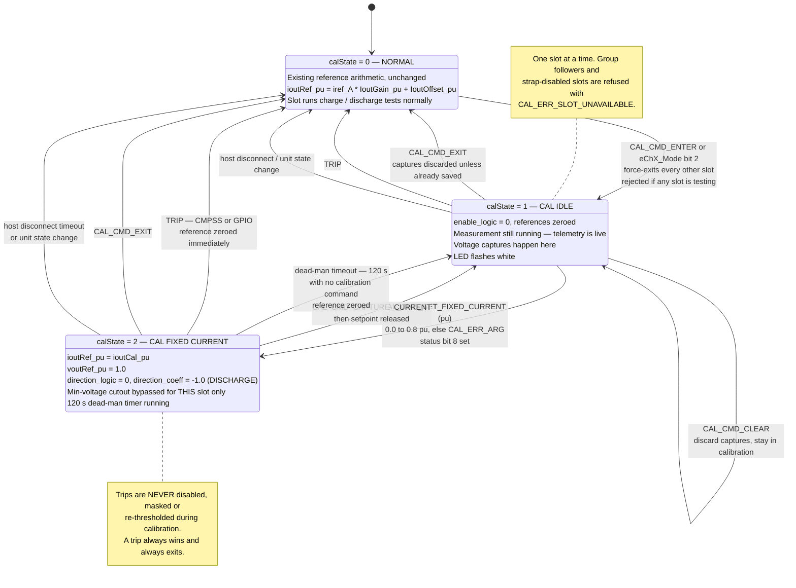
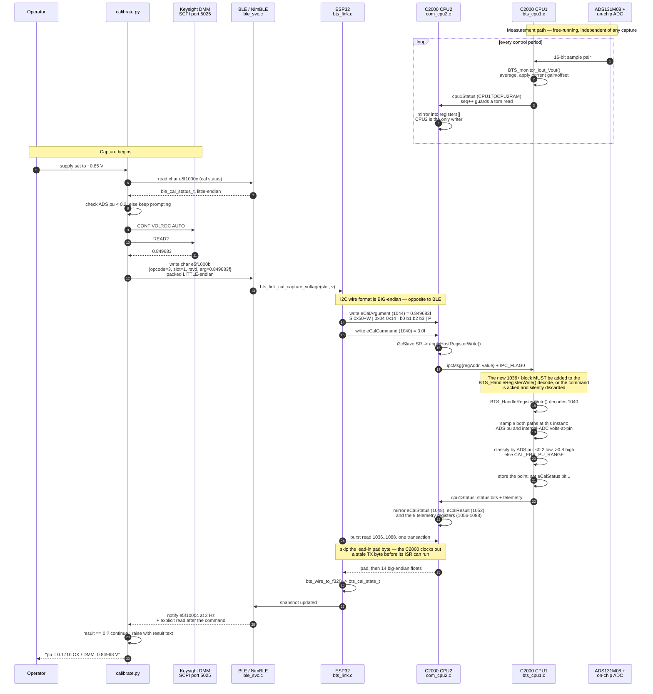
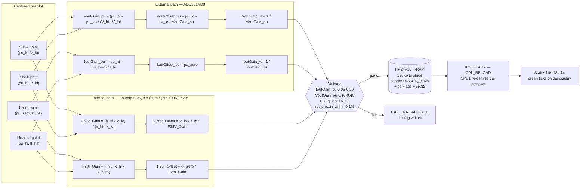

# Calibration Flow Diagrams

Diagrams for the per-slot calibration feature. The authoritative definitions
are in [`calibration-design.md`](calibration-design.md); these render its
sections 5, 7 and 12 visually. The operator procedure is in
[`README.md`](README.md).

---

## 1. Operator process flow

Design doc section 12. One pass per slot; the script walks slots 1–8.

```mermaid
flowchart TD
    START([Start calibrate.py]) --> CFG[/"Configure: DMM IP, SCPI port, BLE address<br/>persisted to calibrate.ini"/]
    CFG --> DMM["Connect DMM over TCP 5025<br/>*IDN? verified, *RST, *CLS"]
    DMM --> DMMOK{Model<br/>supported?}
    DMMOK -->|no| ABORT([Abort])
    DMMOK -->|yes| BLE["Connect BLE: BTS-Tester<br/>check chars 000b / 000c present"]
    BLE --> SLOT{{"For each slot N in 1..8"}}

    SLOT --> WIRE[/"PROMPT: connect DC supply and DMM<br/>across slot N, DMM in PARALLEL"/]
    WIRE --> ENTER["CAL_CMD_ENTER (slot N)"]
    ENTER --> ENTOK{result<br/>== 0?}
    ENTOK -->|no| FAILSLOT["Report eCalResult as text<br/>CAL_CMD_EXIT"]
    ENTOK -->|yes| VLOW

    subgraph VOLT ["VOLTAGE PHASE — DMM in parallel"]
        VLOW[/"PROMPT: set supply to ~0.85 V"/] --> VLOWW{"live ADS pu<br/>&lt; 0.2 ?"}
        VLOWW -->|no, adjust| VLOWW
        VLOWW -->|yes| VLOWR["DMM: CONF:VOLT:DC, READ? -> V_lo"]
        VLOWR --> VLOWC["CAL_CMD_CAPTURE_VOLTAGE (V_lo)<br/>status bit 1"]
        VLOWC --> VHI[/"PROMPT: raise supply to ~4.25 V"/]
        VHI --> VHIW{"live ADS pu<br/>&gt; 0.8 ?"}
        VHIW -->|no, adjust| VHIW
        VHIW -->|yes| VHIR["DMM: READ? -> V_hi"]
        VHIR --> VHIC["CAL_CMD_CAPTURE_VOLTAGE (V_hi)<br/>status bit 2"]
    end

    VHIC --> IZERO

    subgraph CURR ["CURRENT PHASE — DMM in series"]
        IZERO[/"PROMPT: supply output OFF,<br/>break the slot current path"/] --> IZC["CAL_CMD_ZERO_CURRENT<br/>status bit 3"]
        IZC --> ILOAD[/"PROMPT: DMM into SERIES, supply ~3.7 V,<br/>ITS current limit 3 A, output ON"/]
        ILOAD --> ISET["CAL_CMD_SET_FIXED_CURRENT (0.25 pu)<br/>status bit 8 — slot now driving ~2.5 A"]
        ISET --> SETTLE["settle ~2 s"]
        SETTLE --> IREAD["DMM: CONF:CURR:DC, READ? -> I_hi"]
        IREAD --> IMAG["take |I_hi| — MAGNITUDE<br/>firmware applies the discharge sign"]
        IMAG --> ICAP["CAL_CMD_CAPTURE_CURRENT (|I_hi|)<br/>status bit 4"]
    end

    ICAP --> SAVE["CAL_CMD_COMPUTE_SAVE<br/>two-point maths, validate,<br/>F-RAM write, IPC reload<br/>status bits 5, 6, 7"]
    SAVE --> SAVEOK{"bit 7 set?"}
    SAVEOK -->|no| FAILSLOT
    SAVEOK -->|yes| EXIT["CAL_CMD_EXIT — reference zeroed"]
    EXIT --> VERIFY["Read slot status bits 13 / 14<br/>both set = both green ticks"]
    VERIFY --> TABLE["Print before/after gain table"]
    TABLE --> MORE{More<br/>slots?}
    FAILSLOT --> MORE
    MORE -->|yes| SLOT
    MORE -->|no| REPORT["Write JSON report"]
    REPORT --> DONE([Done])

    classDef prompt fill:#fff4e0,stroke:#d08a2a,color:#000
    classDef danger fill:#ffe3e3,stroke:#c0392b,color:#000
    class WIRE,VLOW,VHI,IZERO,ILOAD prompt
    class ISET,SETTLE,IREAD danger
```

The red-tinted steps are the only ones where the slot is driving current.
Everything from `CAL_CMD_SET_FIXED_CURRENT` to `CAL_CMD_COMPUTE_SAVE` runs with
roughly 2.5 A flowing and the hardware trips disabled — this is the window that
must not be left unattended.

---

## 2. Per-slot calibration state machine

Design doc section 7. `calState` is a new field in `BTS_userInput`, evaluated
every millisecond in `BTS_updateReference()`.

### Exit paths, and what each guarantees

| Exit | Trigger | Reference zeroed | State after |
|---|---|---|---|
| Commanded | `CAL_CMD_EXIT` | yes, before the state change | Normal |
| Trip | CMPSS or GPIO trip zone | yes, immediately | Normal |
| Dead-man | 120 s with no calibration command in `calState == 2` | yes | Cal idle |
| Host loss | BLE/HTTP disconnect timeout | yes | Normal |
| Unit state | Input bus leaves its window | yes | Normal |

Every path zeroes the reference **before** it changes state. There is no
ordering in which the slot is left driving current with nothing supervising it.

---

## 3. One capture, end to end

What happens between the script calling `CAL_CMD_CAPTURE_VOLTAGE` and the
result coming back. The measurement path is the interesting half: the value
being captured originates on CPU1 and has already travelled the other way.

### Two things this diagram is drawn to make obvious

**The endianness flips in the middle.** BLE records are packed
**little-endian** (`ble_proto.h`, native to both the ESP32 and a browser's
`DataView`). The I2C register wire format is **big-endian** (`floatGetWireByte()`
in `com_cpu2.c`). They are opposite, and the conversion happens in `bts_regs.h`
— nothing above `bts_link` should ever see the C2000's byte order.

**CPU1 never writes `registers[]`.** The register file lives in `CPU2TOCPU1RAM`,
which only CPU2 may write. Every measurement CPU1 produces reaches a host by
travelling through `cpu1Status` under its `seq` seqlock and being mirrored by
CPU2. Calibration does not get an exception to this.

---

## 4. Where the numbers come from

The two-point fit, as data rather than as prose. Design doc section 6.

Note the **reciprocal pair**. `IoutGain_pu` converts amps to per-unit for the
control loop's setpoint; `IoutGain_A` converts per-unit back to amps for
reporting. They are stored separately and validated against each other to
within 0.1 %, which is what catches a partially-written F-RAM block. The
current *sense* side is never gain-corrected — the loop closes in raw-ADC
per-unit space and calibration is folded into the setpoint only.
