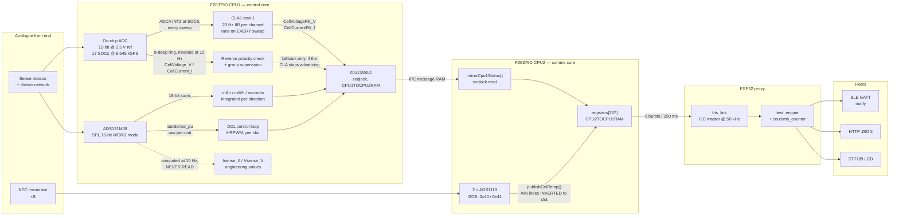
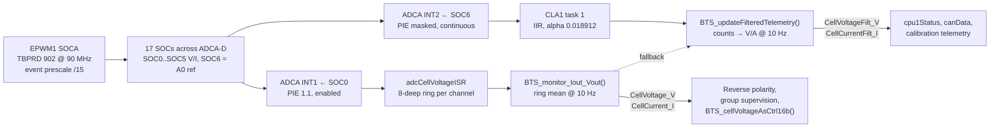
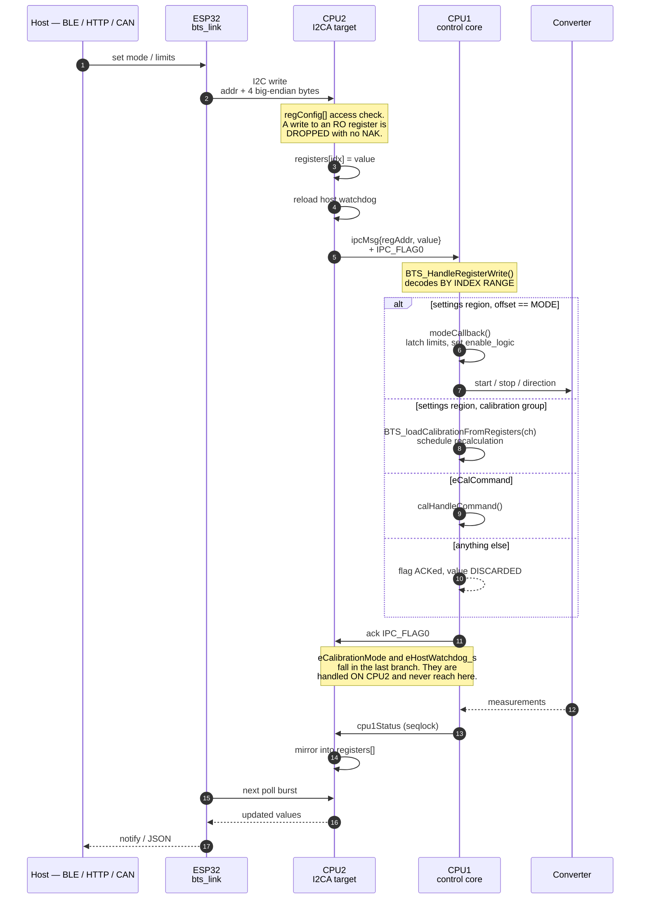
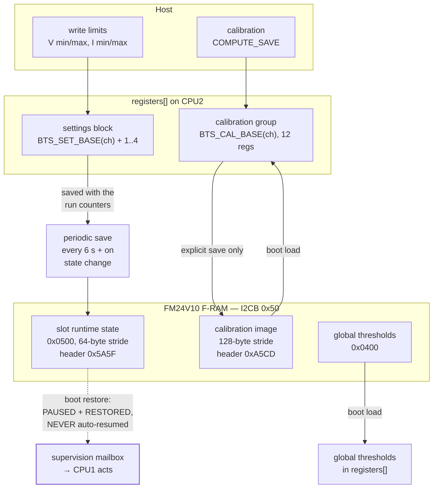
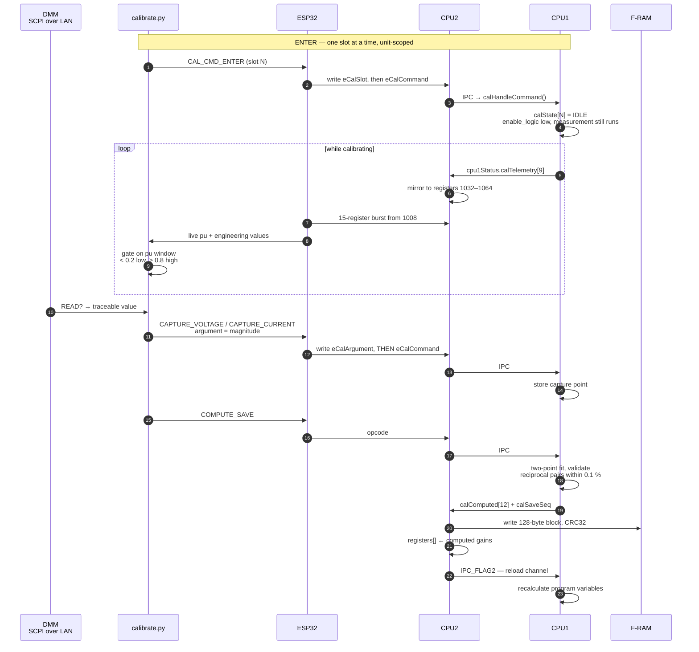
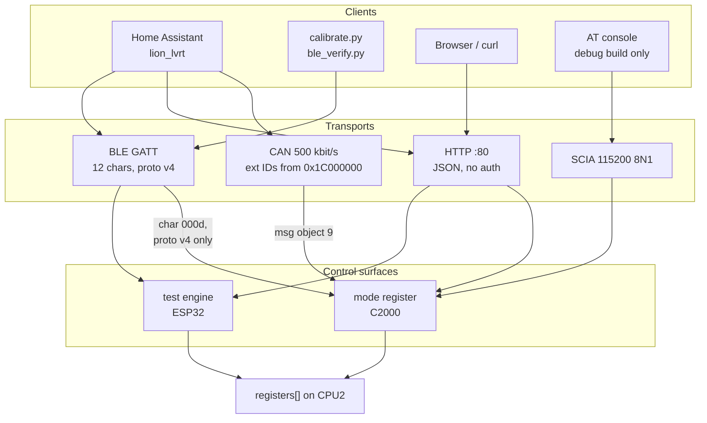

# Data Flow — measurement, control, calibration and settings

How a number gets from a sense resistor to a phone, and how a command gets
back. Four subsystems are in the path and each one changes the representation:
the C2000's two cores, the ESP32 proxy, and whatever is holding the BLE
connection.

The wire-level contracts are elsewhere and this document does not restate
them — [`api-specification.md`](api-specification.md) for the I2C register map
and the HTTP API, [`ble-specification.md`](ble-specification.md) for the GATT
service, [`calibration-design.md`](calibration-design.md) for the calibration
mathematics. This is the shape of the system those documents describe in
pieces.

Everything below is drawn from the source, not from intent. Where a path is
dead or a value is never consumed, the diagram says so rather than omitting
it — the dead paths are the ones that cost debugging time.

---

## 1. The three rules everything else follows

Read these first; every diagram in this document is a consequence of them.

**CPU1 never writes the register file.** `registers[]` lives in
`CPU2TOCPU1RAM`, which the F2837xD permits only CPU2 to write. CPU1 publishes
measurements into `cpu1Status` (in the other message RAM) under a seqlock and
CPU2 copies them across. There is one deliberate exception, `modeCallback()`
setting `eCalSlot`.

**CPU1 performs every state change.** CPU2 owns the interfaces, so it is CPU2
that notices a watchdog timeout or reads a saved slot state at boot — but it
performs neither. It publishes the event into the `supervision` mailbox and
CPU1 acts on it, because CPU1 owns `enable_logic` and the control loop.

**Endianness differs by interface.** I2C register payloads are **big-endian**
(the C2000 emits the float MSB first). BLE records are **little-endian**.
HTTP carries JSON numbers, so no byte order applies. The conversion happens
in `bts_regs.h`; nothing above `bts_link` sees the C2000's byte order.

---

## 2. Measurement path — silicon to phone

The direction almost all the traffic goes. Four converters feed it and they
do **not** all reach a host.



### What the diagram is telling you

**The 16-bit converter's engineering values are dead.**
`BTS_monitor_Iout_Vout()` computes `Isense_A` and `Vsense_V` at 10 Hz and
nothing reads them — not `cpu1Status`, not `canData`, not `registers[]`. The
ADS131M08 still matters, because its *raw per-unit* value is what closes the
control loop and what the accumulators integrate. But what a host sees in
`eChX_CellVoltage` and `eChX_CellCurrent` is the **12-bit on-chip ADC**. The
register naming suggests the opposite.

**`eChX_SenseVoltage` and `eChX_SenseCurrent` exist in the map and are
published**, so the runtime burst is self-consistent — but they come from the
same internal path, not from the dead ADS engineering values.

**The thermistor inputs are wired in reverse.** On both converters the highest
AIN carries the lowest slot: `AIN3 → slot 1`. `ADS1119_SLOT_FOR_AIN()` inverts
it at the publish call. A console `ChN` is a **slot**, not an AIN.

**A temperature of 18.32 °C is not a measurement.** `BTS_NTC_POLY_C0` is
18.323 and the Horner evaluation returns exactly C0 for a zero input, so that
value means an open input. `publishCellTemp()` is called unconditionally, so
an all-zero transfer publishes the floor as if it were valid.

### The internal ADC is filtered by the CLA, and only for telemetry

`CellVoltage_V` and `CellCurrent_I` are a **1.2 ms snapshot taken once
every 100 ms**. `adcCellVoltageISR` pushes each sweep into an 8-deep ring
(`BTS_f28AverageFactor`, `bts_user_settings.h:278`) and
`BTS_monitor_Iout_Vout()` means that ring at 10 Hz. At 6.645 kSPS eight
samples is 1.2 ms, so **98.8 % of the conversions are discarded**, and
whatever ripple happens to sit inside that window aliases straight through
to the host.

CLA1 task 1 (`bts_cla.cla`) closes that gap. It runs on *every* sweep and
folds each sample into a single-pole IIR:

```
y += alpha * (x - y)      alpha = 2*pi*fc/fs = 2*pi*20/6645 = 0.018912
```

One float32 multiply-accumulate per channel, sixteen channels plus the A0
reference, on a processor that is not the C28x. The C28x cost is zero.
`BTS_updateFilteredTelemetry()` (`bts_cpu1.c:1630`) scales the result out
of counts into volts and amps using the same gains `BTS_monitor_Iout_Vout()`
uses, and publishes it as `CellVoltageFilt_V` / `CellCurrentFilt_I`.



**The filtered values are telemetry only.** That was a deliberate scope
decision, and the split is visible in the code: the reverse-polarity check
(`bts_cpu1.c:1900`), group supervision (`bts_cpu1.c:2070`, `:2080`) and
`BTS_cellVoltageAsCtrl16b()` (`bts.h:450`) all keep reading the unfiltered
`CellVoltage_V` / `CellCurrent_I`. A 20 Hz single pole adds ~12 ms of lag,
which is fine for a display and not fine for a trip. The three sinks the
filtered pair does reach are `cpu1Status` (`bts_cpu1.c:1269-1270`), the CAN
frame (`:1287-1288`) and the calibration telemetry window (`:827-828`).

**It fails back, not silent.** `BTS_claRunCount` is incremented once per
task run. `BTS_updateFilteredTelemetry()` compares it against the value it
saw 100 ms earlier; if it has not moved — the CLA never started, LS4/LS5
were never handed over, the ADCA INT2 trigger is not reaching
`CLA1TASKSRCSEL1` — telemetry reverts to the unfiltered pair rather than
reporting a frozen number, or 0 V, with nothing to distinguish it from a
real reading. `BTS_claPrimed` covers the other end: the first task run
*loads* the filter state from the raw sample instead of converging towards
it from zero, so telemetry does not ramp up from 0 V over the first 12 ms
of every boot.

Measured on the bench at the shipped coefficient: channel 4's raw current
(SOC5 − SOC6) spread 44 counts ≈ 259 mA across five consecutive sweeps,
while the filtered output moved about 2 counts ≈ 11 mA and stayed inside
the raw cluster — roughly a 20× reduction, with the filtered value tracking
the raw mean rather than chasing individual samples.

The resource side of this — which LS RAM block, which interrupt, why the
PIE channel is masked — is in
[`hardware-resources.md` §7](hardware-resources.md#7-cla1-allocation).

### Rates

| Stage | Rate | Set by |
|---|---|---|
| Control loop ISR | per switching cycle | HRPWM |
| Converter switching | **99.67 kHz** | `BTS_DRV_EPWM_TBPRD` = 902 at EPWMCLK 90 MHz |
| On-chip ADC sweep, 17 SOCs | **6.645 kSPS** | EPWM1 SOCA, `BTS_ADC_SOC_PRESCALE` = 15 |
| `adcCellVoltageISR` (ADCA INT1 ← SOC0) | 6.645 kHz | same trigger |
| CLA1 task 1 (ADCA INT2 ← SOC6) | 6.645 kHz | same trigger |
| Task A / B / C | 1 kHz / 200 Hz / 20 Hz | `TASKA/B/C_FREQ_HZ` |
| `BTS_monitor_Iout_Vout()` | 10 Hz | Task C |
| Accumulator integration | 150 ms fixed step | Task C |
| ADS1119 conversion | DRDY-driven, 4 channels round-robin | converter |
| ESP32 poll cycle | **250 ms, 9 I2C transactions** | `s_poll_interval_ms` |
| BLE notify | 500 ms tick; slots and unit on alternate passes = 1 Hz | `notify_task()` |

The 9-transaction poll cycle is the whole point of the v2 map: eight per-slot
runtime bursts of 12 registers plus one unit burst. Under v1 the same data
cost 33 transactions.

**The 6.645 kSPS figure was read off the live device, not off the headers.**
`bts_user_settings.h` contradicted itself for a long time — the comment block
around `BTS_ADC_SOC_PRESCALE` said prescale 10 and 9.97 kSPS while the
`#define` two lines below said 15, and it assumed SYSCLK 200 MHz when this
build runs at 180 (`_LAUNCHXL_F28379D` is not defined, so `device.h` takes
the IMULT-18 branch). Five registers settle it with nothing left to infer:
`PERCLKDIVSEL` 0x51 (EPWMCLK = SYSCLK/2 = 90 MHz), `TBCTL` 0x8010 (up-count,
both dividers ÷1), `TBPRD` 902 (90e6/903 = 99.67 kHz), `ETPS` 0x0820
(`SOCPSSEL` set, so the extended divider is the live one) and `ETSOCPS`
0x005F (`SOCAPRD2` = 15). 99.67 kHz / 15 = 6.645 kSPS. Anything derived from
the old numbers — filter coefficients, ISR budgets, aliasing arguments — is
wrong by a factor of 1.5; the CLA's alpha was, and had to be corrected from
0.012605 (13.3 Hz) to 0.018912.

---

## 3. Command path — host to converter

The reverse direction, and the one with the hazard in it: **CPU1 does not
decode every register CPU2 accepts.**



### The trap

The decode on CPU1 is **by index range**, so every comparison in it is wrong
after a map change — and the failure is silent. CPU2 accepts the host write,
stores it in `registers[]`, raises the IPC flag, and CPU1 acks the flag without
acting. The host sees its value read back correctly on the next poll, because
it is genuinely in the register file. It just does nothing.

This has happened twice: once when the calibration block moved outside the
decode, and it is why `eCalCommand` has an explicit branch rather than falling
into the settings range.

**Registers handled entirely on CPU2** — and so correctly "discarded" by CPU1:
`eCalibrationMode`, `eHostWatchdog_s`, the four global voltage thresholds.

### Ordering rules that are not advisory

- **Limits before mode.** `modeCallback()` latches the four limit registers
  at start. Writing them afterwards affects nothing until the next start.
- **Argument before opcode.** `eCalCommand` is consumed on write and
  self-clears; an argument that arrives afterwards applies to nothing. A burst
  write from `eCalSlot` covering slot/command/argument delivers them in
  exactly the wrong order.

---

## 4. Settings and persistence

Two separate F-RAM images with different lifetimes, deliberately kept apart.



### Why the limits are not in the calibration image

Calibration is measured once against a traceable reference. Operating limits
change whenever someone adjusts a charge current. Keeping them in the same
F-RAM block meant rewriting the calibration image on every settings change,
which is what kept putting a measured calibration at risk of a partial write.
The limits now live in the slot's runtime-state record instead.

### The two headers, and why they were bumped

| Image | Header | Bumped because |
|---|---|---|
| Calibration | `0xA5CD` | the `calFlags`/`crc32` revision and the fixed 128-byte stride. Also fixed a collision in which channel 4's block overwrote the global voltage thresholds — which consequently had **never** persisted |
| Slot state | `0x5A5F` | the record grew to 64 bytes. The previous 20-word record ran 8 bytes into the next slot's header, so only slot 7 could ever validate |

Both bumps reject old images rather than reinterpreting them. Every slot falls
back to compiled defaults once and must be recalibrated.

### The restore rule

A slot that was mid-run when the unit reset comes back **PAUSED**, with its
counters intact, carrying `BTS_STATUS_RESTORED`, and **refuses to resume on
its own**. The cell may have been changed while the unit was off. Neither the
firmware nor the proxy will resume it; it takes an explicit command. This is
the single most safety-critical rule in the supervision design.

### I2CB is shared, and the two access styles do not mix

The F-RAM and both ADS1119 converters sit on the same bus, driven from the
same idle loop but in incompatible styles: the converters use a non-blocking
state machine that leaves a transfer **in flight** across service calls, while
the F-RAM uses blocking helpers that complete inside one call.

With no arbitration the frames interleaved, both were corrupted, and the
controller was left holding SCL with nothing running to clear it. Measured:
every F-RAM access failing, the failure and recovery counters climbing past
47 000 together, while both converters read correctly throughout.

`i2cbFramBusy` serialises them. A F-RAM acquire succeeds only while **both**
converters are parked in `eAdsIdle` or `eAdsSettle` — the only two states
holding no transaction — and a save that cannot acquire stays pending and
retries rather than being lost.

---

## 5. Calibration data flow

The operator procedure is in [`README.md`](README.md) and the state machine
and mathematics in [`calibration-design.md`](calibration-design.md) — the
diagrams for those are in [`calibration-flow.md`](calibration-flow.md). What
follows is only where the data goes.



### Three things worth keeping in mind

**Telemetry is unit-scoped, not per-slot.** Only one slot calibrates at a
time; eight copies of the nine-register window would cost 144 words of message
RAM and buy nothing.

**"Raw pre-gain" means exactly that.** The `< 0.2` / `> 0.8` capture windows
are checked against the normalised converter reading *before* any calibration
gain or offset. The two paths normalise differently, and the internal path's
quantity is **volts at the pin**, not dimensionless:

```
ADS path:       sum / (BTS_senseAverageFactor * 32768.0)
Internal path: (sum / (BTS_f28AverageFactor * 4096.0)) * 2.5
```

**Enter the DMM current as a magnitude.** Calibration runs in discharge and
the firmware applies the sign itself. Entering a negative value inverts that
slot's current reading — it will look plausible, pass validation, and be wrong
on every subsequent discharge.

---

## 6. Host interfaces — who can do what

Three transports reach the unit, and they do **not** offer the same controls,
because there are two separate control surfaces:

- **The test engine**, on the ESP32. `start` runs a whole characterisation —
  check rest, charge, rest, discharge, rest, optional recharge — and picks the
  direction itself.
- **The mode register**, on the C2000. Writing `eChX_Mode` commands the
  converter directly: run/stop and charge/discharge, nothing more.

"Test this cell" is the first. "Charge this slot" is the second.



| Transport | Test engine | Charge / discharge | Needs |
|---|:---:|:---:|---|
| **BLE** | yes | only on proto ≥ 4 | an adapter or connectable proxy in range |
| **HTTP** | yes | yes | the tester joined to your WiFi |
| **CAN** | no | yes | SocketCAN on the host, wired to the unit |
| **AT console** | no | yes | a debug build — the pins carry the LEDs in production |

The BLE register characteristic (`000d`) was added in `BLE_PROTO_VERSION` 4.
A client talking to older proxy firmware has no way to reach the mode
register, which is why the Home Assistant integration hides charge and
discharge from the mode dropdown rather than offering an action that would
fail.

### The host watchdog cuts across all of them

Any host command on **any** interface reloads it — including an I2C register
*read*, which is what a polling host actually does. If nothing talks to the
unit for 30 seconds, every running slot pauses with the converter off and
`BTS_STATUS_WD_TRIPPED` set.

It is a supervision timeout measured in seconds. It is **not** over-current
protection, and with the hardware trips disabled in this build the only fast
protection is the bench supply's own current limit.

---

## 7. CAN telemetry — read the caveat

Message objects 1–8 carry per-channel telemetry; object 9 is a host register
read/write.

The per-channel frame is 8 bytes and packs only two quantities:

| Byte | Contents |
|---|---|
| 0 | channel index |
| 1 | zero |
| 2–5 | `voltage`, all four bytes |
| 6–7 | `current`, **low word only** |

**The current field is truncated.** `sendCANData()` packs `c[0]` and stops —
the float's upper word never goes on the wire, so the value cannot be
reconstructed. `canData` also carries `mAh` and `mWh` and **neither is
transmitted at all**; the frame has no room left.

A host that needs current or the accumulators reads them through the register
mailbox on message object 9 instead. The telemetry frames are trustworthy for
voltage only.
