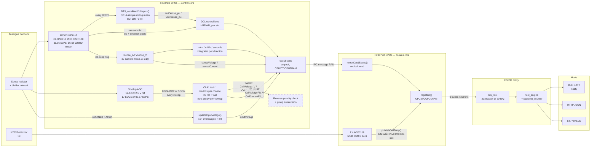
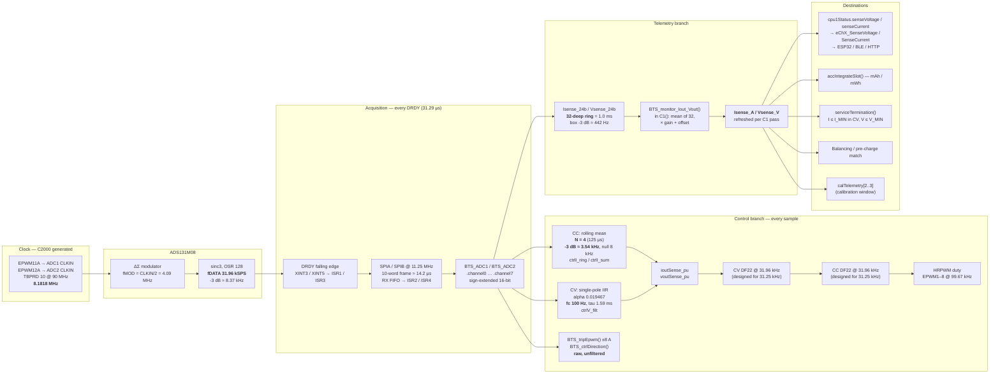
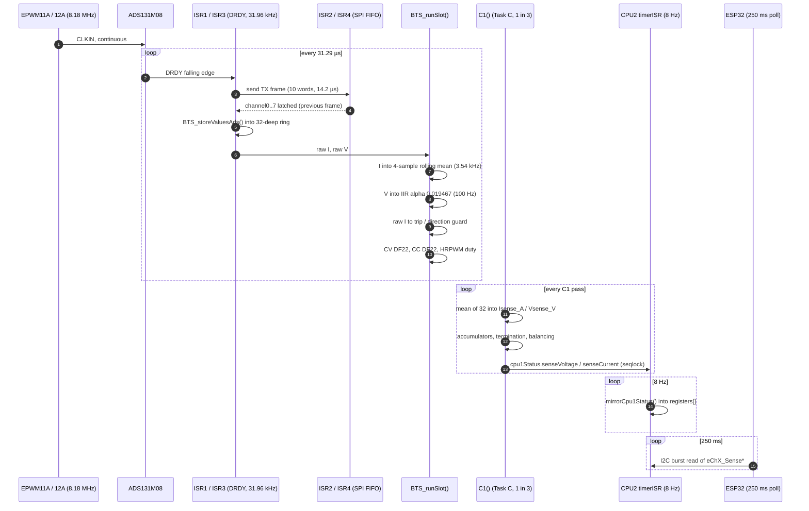
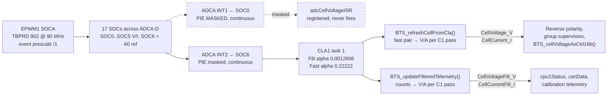
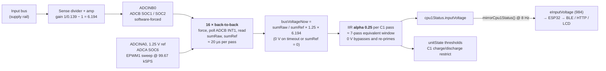
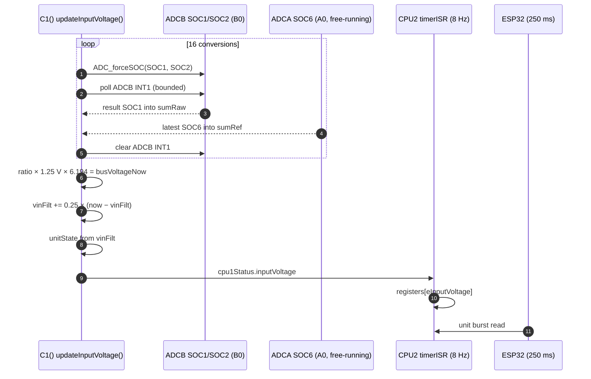
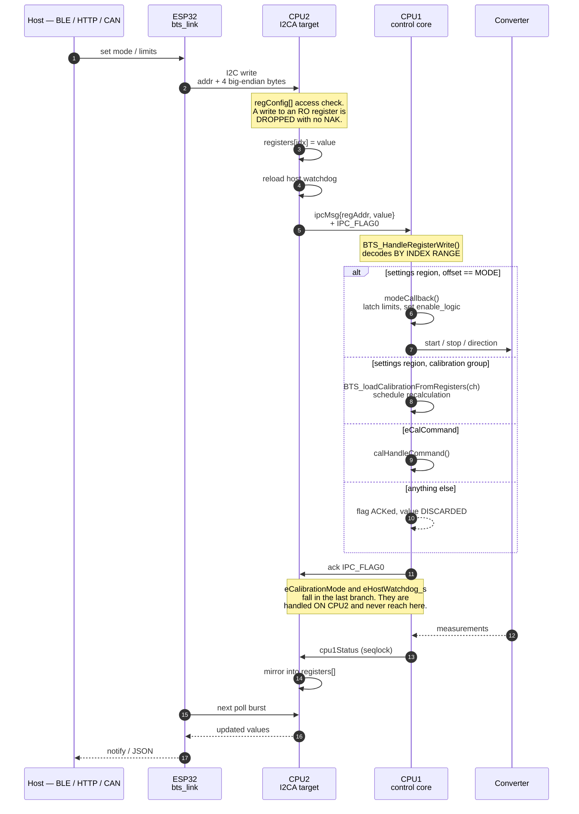
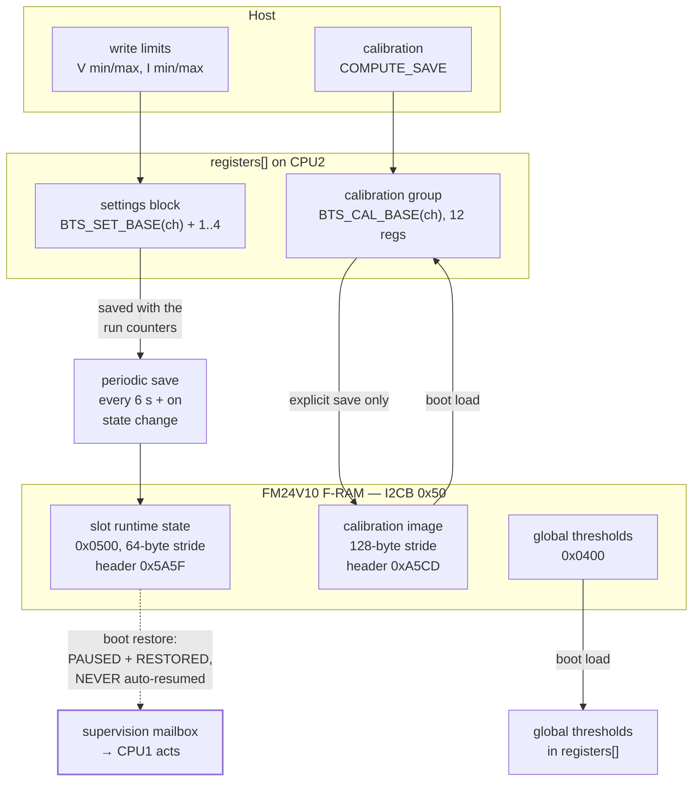
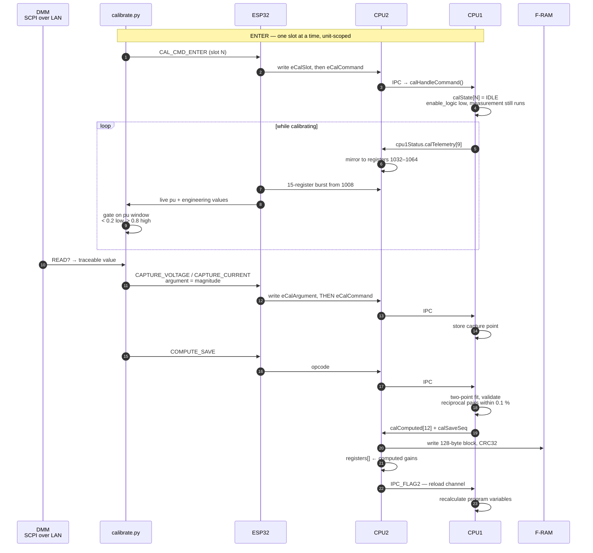
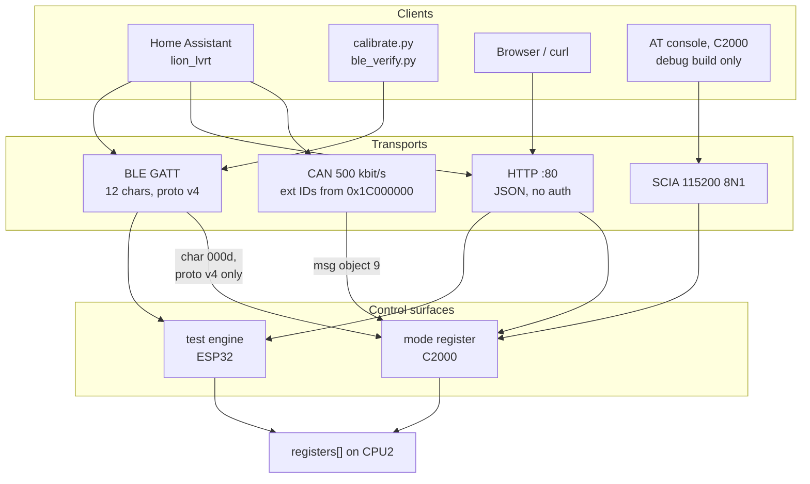

# Data Flow — measurement, control, calibration and settings

How a number gets from a sense resistor to a phone, and how a command gets
back. Four subsystems are in the path and each one changes the representation:
the C2000's two cores, the ESP32 proxy, and whatever is holding the BLE
connection.

The wire-level contracts are elsewhere and this document does not restate
them — [`api-specification.md`](api-specification.md) for the I2C register map
and the HTTP API, [`ble-specification.md`](ble-specification.md) for the GATT
service, [`calibration-design.md`](calibration-design.md) for the calibration
mathematics. This is the shape of the system those documents describe in
pieces.

Everything below is drawn from the source, not from intent. Where a path is
dead or a value is never consumed, the diagram says so rather than omitting
it — the dead paths are the ones that cost debugging time.

---

## 1. The three rules everything else follows

Read these first; every diagram in this document is a consequence of them.

**CPU1 never writes the register file.** `registers[]` lives in
`CPU2TOCPU1RAM`, which the F2837xD permits only CPU2 to write. CPU1 publishes
measurements into `cpu1Status` (in the other message RAM) under a seqlock and
CPU2 copies them across. There is one deliberate exception, `modeCallback()`
setting `eCalSlot`.

**CPU1 performs every state change.** CPU2 owns the interfaces, so it is CPU2
that notices a watchdog timeout or reads a saved slot state at boot — but it
performs neither. It publishes the event into the `supervision` mailbox and
CPU1 acts on it, because CPU1 owns `enable_logic` and the control loop.

**Endianness differs by interface.** I2C register payloads are **big-endian**
(the C2000 emits the float MSB first). BLE records are **little-endian**.
HTTP carries JSON numbers, so no byte order applies. The conversion happens
in `bts_regs.h`; nothing above `bts_link` sees the C2000's byte order.

---

## 2. Measurement path — silicon to phone

The direction almost all the traffic goes. Four converters feed it and they
do **not** all reach a host.


```mermaid
flowchart LR
    subgraph SILICON ["Analogue front end"]
        SHUNT["Sense resistor<br/>+ divider network"]
        NTC["NTC thermistor<br/>×8"]
    end

    subgraph CPU1 ["F28379D CPU1 — control core"]
        ADS["ADS131M08 ×2<br/>CLKIN 8.18 MHz, OSR 128<br/>31.96 kSPS, 16-bit WORD mode"]
        COND["BTS_conditionCtrlInputs()<br/>CC: 4-sample rolling mean<br/>CV: 100 Hz IIR"]
        INT["On-chip ADC<br/>12-bit @ 2.5 V ref<br/>17 SOCs @ 99.67 kSPS"]
        CLA["CLA1 task 1<br/>two IIRs per channel<br/>20 Hz + fast<br/>runs on EVERY sweep"]
        PROT["Reverse polarity check<br/>+ group supervision"]
        LOOP["DCL control loop<br/>HRPWM, per slot"]
        ACC["mAh / mWh / seconds<br/>integrated per direction"]
        SENSE["Isense_A / Vsense_V<br/>32-sample mean, at C1()"]
        VIN["updateInputVoltage()<br/>16× oversample + IIR"]
        PUB["cpu1Status<br/>seqlock, CPU1TOCPU2RAM"]
    end

    subgraph CPU2 ["F28379D CPU2 — comms core"]
        ADS1119["2 × ADS1119<br/>I2CB, 0x40 / 0x41"]
        MIRROR["mirrorCpu1Status()<br/>seqlock read"]
        REGS["registers[]<br/>CPU2TOCPU1RAM"]
    end

    subgraph ESP ["ESP32 proxy"]
        LINK["bts_link<br/>I2C master @ 50 kHz"]
        ENGINE["test_engine<br/>+ coulomb_counter"]
    end

    subgraph HOSTS ["Hosts"]
        BLEH["BLE GATT<br/>notify"]
        HTTPH["HTTP JSON"]
        LCD["ST7789 LCD"]
    end

    SHUNT --> ADS
    SHUNT --> INT
    NTC --> ADS1119

    SHUNT -->|"ADCINB0 ÷ A0 ref"| VIN
    ADS -->|"every DRDY"| COND
    COND -->|"ioutSense_pu / voutSense_pu"| LOOP
    ADS -->|"raw sample:<br/>trip + direction guard"| LOOP
    ADS -->|"32-deep ring"| SENSE
    SENSE --> ACC
    SENSE -->|"senseVoltage / senseCurrent"| PUB
    VIN -->|"inputVoltage"| PUB
    INT -->|"ADCA INT2 at SOC6,<br/>every sweep"| CLA
    CLA -->|"fast IIR<br/>CellVoltage_V / CellCurrent_I"| PROT
    CLA -->|"20 Hz IIR<br/>CellVoltageFilt_V<br/>CellCurrentFilt_I"| PUB
    ACC --> PUB
    LOOP --> PUB

    PUB -->|"IPC message RAM"| MIRROR
    MIRROR --> REGS
    ADS1119 -->|"publishCellTemp()<br/>AIN index INVERTED to slot"| REGS

    REGS -->|"9 bursts / 250 ms"| LINK
    LINK --> ENGINE
    ENGINE --> BLEH
    ENGINE --> HTTPH
    ENGINE --> LCD

    style PROT stroke-dasharray: 5 5
```

### What the diagram is telling you

**Each converter has more than one consumer, and they want different
filtering.** The ADS131M08 feeds the control loops on every sample through a
light filter, and feeds the reported `Isense_A` / `Vsense_V` through a
separate 32-sample ring. The internal ADC feeds protection through a fast IIR
and telemetry through a 20 Hz IIR. The per-stage rates, sample counts and
corner frequencies are in
[the ADS131M08 section](#the-ads131m08-from-clkin-to-every-consumer) and the
[CLA section](#the-internal-adc-is-filtered-by-the-cla-for-telemetry-and-protection)
below.

**The register naming points the wrong way.** `eChX_CellVoltage` /
`eChX_CellCurrent` are the **12-bit on-chip ADC** (CLA, 20 Hz).
`eChX_SenseVoltage` / `eChX_SenseCurrent` are the **ADS131M08**
`Vsense_V` / `Isense_A` — the converter the loops regulate against and the
accumulators integrate.

**The thermistor inputs are wired in reverse.** On both converters the highest
AIN carries the lowest slot: `AIN3 → slot 1`. `ADS1119_SLOT_FOR_AIN()` inverts
it at the publish call. A console `ChN` is a **slot**, not an AIN.

**A temperature of 18.32 °C is not a measurement.** `BTS_NTC_POLY_C0` is
18.323 and the Horner evaluation returns exactly C0 for a zero input, so that
value means an open input. `publishCellTemp()` is called unconditionally, so
an all-zero transfer publishes the floor as if it were valid.

### The ADS131M08, from CLKIN to every consumer

The 16-bit path, end to end. One converter serves slots 1–4 and another serves
slots 5–8. They are identical apart from the pins, ISR and ePWM involved. Each
slot uses one channel pair: even channel = current, odd channel = voltage.


```mermaid
flowchart LR
    subgraph CLK ["Clock — C2000 generated"]
        PWM["EPWM11A → ADC1 CLKIN<br/>EPWM12A → ADC2 CLKIN<br/>TBPRD 10 @ 90 MHz<br/><b>8.1818 MHz</b>"]
    end

    subgraph ADC ["ADS131M08"]
        MOD["ΔΣ modulator<br/>fMOD = CLKIN/2 = 4.09 MHz"]
        SINC["sinc3, OSR 128<br/><b>fDATA 31.96 kSPS</b><br/>-3 dB ≈ 8.37 kHz"]
    end

    subgraph FRAME ["Acquisition — every DRDY (31.29 µs)"]
        DRDY["DRDY falling edge<br/>XINT3 / XINT5 → ISR1 / ISR3"]
        SPI["SPIA / SPIB @ 11.25 MHz<br/>10-word frame ≈ 14.2 µs<br/>RX FIFO → ISR2 / ISR4"]
        RAW["BTS_ADC1 / BTS_ADC2<br/>.channel0 … .channel7<br/>sign-extended 16-bit"]
    end

    subgraph CTRL ["Control branch — every sample"]
        CCAVG["CC: rolling mean<br/><b>N = 4</b> (125 µs)<br/><b>-3 dB ≈ 3.54 kHz</b>, null 8 kHz<br/>ctrlI_ring / ctrlI_sum"]
        CVIIR["CV: single-pole IIR<br/>alpha 0.019467<br/><b>fc 100 Hz</b>, tau 1.59 ms<br/>ctrlV_filt"]
        PU["ioutSense_pu<br/>voutSense_pu"]
        DCLCV["CV DF22 @ 31.96 kHz<br/>(designed for 31.25 kHz)"]
        DCLCC["CC DF22 @ 31.96 kHz<br/>(designed for 31.25 kHz)"]
        HR["HRPWM duty<br/>EPWM1–8 @ 99.67 kHz"]
        TRIP["BTS_tripEpwm() ±8 A<br/>BTS_ctrlDirection()<br/><b>raw, unfiltered</b>"]
    end

    subgraph TEL ["Telemetry branch"]
        RING["Isense_24b / Vsense_24b<br/><b>32-deep ring</b> = 1.0 ms<br/>box -3 dB ≈ 442 Hz"]
        MON["BTS_monitor_Iout_Vout()<br/>in C1(): mean of 32,<br/>× gain + offset"]
        SV["<b>Isense_A / Vsense_V</b><br/>refreshed per C1 pass"]
    end

    subgraph OUT ["Destinations"]
        STAT["cpu1Status.senseVoltage / senseCurrent<br/>→ eChX_SenseVoltage / SenseCurrent<br/>→ ESP32 / BLE / HTTP"]
        ACCN["accIntegrateSlot() — mAh / mWh"]
        TERM["serviceTermination()<br/>I ≤ I_MIN in CV, V ≤ V_MIN"]
        BAL["Balancing / pre-charge match"]
        CALT["calTelemetry[2..3]<br/>(calibration window)"]
    end

    PWM --> MOD --> SINC --> DRDY --> SPI --> RAW
    RAW --> CCAVG --> PU
    RAW --> CVIIR --> PU
    PU --> DCLCV --> DCLCC --> HR
    RAW --> TRIP
    RAW --> RING --> MON --> SV
    SV --> STAT
    SV --> ACCN
    SV --> TERM
    SV --> BAL
    SV --> CALT
```

| Stage | Records | Rate | Corner / response | Writes |
|---|---|---|---|---|
| CLKIN from EPWM11A / EPWM12A | — | 8.1818 MHz (90 MHz / 11) | 50 % duty (toggle at ZERO and CMPA) | ADS131M08 CLKIN pin |
| sinc3 decimator, OSR 128, HR mode | 128 modulator samples | **31.96 kSPS** | -3 dB ≈ 0.262·fDATA = **8.37 kHz** | DRDY + SPI frame |
| SPI frame read (ISR2 / ISR4) | 10 words | 31.96 kHz | — | `BTS_ADC1/2.channelN` |
| `BTS_conditionCtrlInputs()` — current | **4**, rolling | 31.96 kHz | **-3 dB 3.54 kHz**, first null 8.0 kHz, delay 47 µs | `ctrlI_sum >> 2` → `ioutSense_pu` |
| `BTS_conditionCtrlInputs()` — voltage | IIR (≈ 1/alpha = 51 samples) | 31.96 kHz | **fc 100 Hz**, alpha 0.019467 | `ctrlV_filt` → `voutSense_pu` |
| CC / CV DCL DF22 | 2nd order | 31.96 kHz | coefficients designed for 31.25 kHz | HRPWM CMPA |
| Trip and direction guard | 1 (raw) | 31.96 kHz | unfiltered (sinc3 only) | trip latch, `BTS_ctrlDirection()` |
| `BTS_storeValuesAds()` ring | **32** | 31.96 kHz fill | box -3 dB **442 Hz**, null 999 Hz | `Isense_24b[]` / `Vsense_24b[]` |
| `BTS_monitor_Iout_Vout()` | 32-sample mean | once per `C1()` pass | 1.0 ms snapshot (see below) | `Isense_A` / `Vsense_V` |
| `publishStatusToCpu2()` → `mirrorCpu1Status()` | — | C1 / 8 Hz | — | `eChX_SenseVoltage` / `eChX_SenseCurrent` |
| ESP32 poll | — | 4 Hz | — | BLE (1 Hz notify), HTTP, LCD |


```mermaid
sequenceDiagram
    autonumber
    participant PWM as EPWM11A / 12A (8.18 MHz)
    participant ADS as ADS131M08
    participant ISR as ISR1 / ISR3 (DRDY, 31.96 kHz)
    participant SPI as ISR2 / ISR4 (SPI FIFO)
    participant CTL as BTS_runSlot()
    participant C1 as C1() (Task C, 1 in 3)
    participant CPU2 as CPU2 timerISR (8 Hz)
    participant ESP as ESP32 (250 ms poll)

    PWM->>ADS: CLKIN, continuous
    loop every 31.29 µs
        ADS->>ISR: DRDY falling edge
        ISR->>SPI: send TX frame (10 words, 14.2 µs)
        SPI-->>ISR: channel0..7 latched (previous frame)
        ISR->>ISR: BTS_storeValuesAds() into 32-deep ring
        ISR->>CTL: raw I, raw V
        CTL->>CTL: I into 4-sample rolling mean (3.54 kHz)
        CTL->>CTL: V into IIR alpha 0.019467 (100 Hz)
        CTL->>CTL: raw I to trip / direction guard
        CTL->>CTL: CV DF22, CC DF22, HRPWM duty
    end
    loop every C1 pass
        C1->>C1: mean of 32 into Isense_A / Vsense_V
        C1->>C1: accumulators, termination, balancing
        C1->>CPU2: cpu1Status.senseVoltage / senseCurrent (seqlock)
    end
    loop 8 Hz
        CPU2->>CPU2: mirrorCpu1Status() into registers[]
    end
    loop 250 ms
        ESP->>CPU2: I2C burst read of eChX_Sense*
    end
```

**The loops run on every sample, and only their inputs are filtered.** The
DCL biquads still execute at fDATA, so the sample period they were designed
for is kept. The CC input is lightly smoothed (3.54 kHz), which keeps the
inner loop responsive. The CV input is filtered about 35× harder (100 Hz),
which keeps the outer loop well below the inner one. The trip and the
reverse-current guard bypass both filters and see the raw sample, so neither
filter adds delay to protection.

**The coefficients assume 31.25 kHz and the converter runs at 31.96 kSPS.**
CLKIN is 90 MHz / 11 = 8.1818 MHz. The old truncating divide gave TBPRD 9,
which was 9.0 MHz and over the 8.4 MHz HR-mode limit. The nearest in-spec
value is 8.1818 MHz, so `BTS_DRV_ADC_PERIOD_TICKS` now rounds to nearest.
That leaves the loops 2.3 % fast against their design rate, which shifts each
zero and pole by the same 2.3 %. That is small, but they have not been
re-derived for it. The switching frequency is fixed at 99.67 kHz and is no
longer derived from the ADC clock.

**`Isense_A` / `Vsense_V` are a 1 ms window, not a 1 s average.** The ring
holds the most recent 32 samples. `C1()` reads it once per pass, which is
150 ms nominal and ~35 ms as measured (28.6 Hz, 2026-10-02). The reported
value is therefore a 1.0 ms box mean taken every few tens of milliseconds, so
anything slower than
~442 Hz passes straight through, and anything that shows up between snapshots
is never seen at all. The accumulators integrate those snapshots. That is
sound for DC, but a load with low-frequency ripple will read according to
where in the ripple the snapshot happened to land.

### The internal ADC is filtered by the CLA, for telemetry *and* protection

`CellVoltage_V` and `CellCurrent_I` **used to be** a 1.2 ms snapshot taken
once every 100 ms. `adcCellVoltageISR` pushed each sweep into an 8-deep ring
(`BTS_f28AverageFactor`, `bts_user_settings.h:278`) and
`BTS_monitor_Iout_Vout()` meaned that ring at 10 Hz. At the old 6.645 kSPS
eight samples was 1.2 ms, so **98.8 % of the conversions were discarded**,
and whatever ripple sat inside that window aliased straight through to the
host.

**That ISR no longer runs.** The sweep is now 1:1 with the switching period,
and an interrupt every 10.03 us would land on a core already servicing eight
ADS131M08 control loops. `INT_ADCA1` is still *registered* — so a bring-up
build can re-enable it with one line — but it is masked in the PIE
(`Interrupt_disable(INT_ADCA1)`), and ADCA INT1 is put into continuous mode
so the converter does not stall waiting for an acknowledgement that will
never come.

CLA1 task 1 (`bts_cla.cla`) absorbs the whole rate instead. It runs on
*every* sweep and folds each sample into **two** single-pole IIRs, because
the two consumers want opposite things:

```
y += alpha * (x - y)

  ...Filt   alpha = 2*pi*fc/fs = 2*pi*20/99670 = 0.0012608    20 Hz, telemetry
  ...Fast   alpha = 2/(N+1)    = 2/9           = 0.22222      protection path
```

The fast pair is what replaces the ring. `alpha = 2/(N+1)` is the
single-pole equivalent of an N-sample box mean, so its settling matches the
8-deep ring it stands in for — **~184 us at this rate, against the 1204 us
the ring spanned at the old one**. The protection path got *faster*, and it
is now refreshed every sweep rather than once per 100 ms telemetry pass.

Four float32 multiply-accumulates per channel, eight channels, plus the A0
reference subtraction, on a processor that is not the C28x. The C28x cost is
zero. `BTS_updateFilteredTelemetry()` scales the 20 Hz pair out of counts
into volts and amps using the same gains `BTS_monitor_Iout_Vout()` uses and
publishes it as `CellVoltageFilt_V` / `CellCurrentFilt_I`;
`BTS_refreshCellFromCla()`, called first in `C1()`, does the same for the
fast pair into `CellVoltage_V` / `CellCurrent_I`.


```mermaid
flowchart LR
    SOC["EPWM1 SOCA<br/>TBPRD 902 @ 90 MHz<br/>event prescale /1"]
    SWEEP["17 SOCs across ADCA-D<br/>SOC0..SOC5 V/I, SOC6 = A0 ref"]
    I1["ADCA INT1 ← SOC0<br/>PIE MASKED, continuous"]
    I2["ADCA INT2 ← SOC6<br/>PIE masked, continuous"]
    ISR["adcCellVoltageISR<br/>registered, never fires"]
    CLA1["CLA1 task 1<br/>Filt alpha 0.0012608<br/>Fast alpha 0.22222"]
    FAST["BTS_refreshCellFromCla()<br/>fast pair → V/A per C1 pass"]
    UPD["BTS_updateFilteredTelemetry()<br/>counts → V/A per C1 pass"]
    SAFE["Reverse polarity,<br/>group supervision,<br/>BTS_cellVoltageAsCtrl16b()"]
    TEL["cpu1Status, canData,<br/>calibration telemetry"]

    SOC --> SWEEP
    SWEEP -.-> I1
    I1 -.->|"masked"| ISR
    SWEEP --> I2 --> CLA1
    CLA1 --> FAST
    CLA1 --> UPD
    FAST -->|"CellVoltage_V<br/>CellCurrent_I"| SAFE
    UPD -->|"CellVoltageFilt_V<br/>CellCurrentFilt_I"| TEL

    style ISR stroke-dasharray: 5 5
    style I1 stroke-dasharray: 5 5
```

**Which pair a consumer reads is the whole design.** A 20 Hz single pole
adds ~12 ms of lag: fine for a display, not fine for a trip. So the
reverse-polarity check, group supervision and `BTS_cellVoltageAsCtrl16b()`
read `CellVoltage_V` / `CellCurrent_I` — now sourced from the **fast** pair
by `BTS_refreshCellFromCla()` rather than from the dead ring. The three
sinks the 20 Hz pair reaches are `cpu1Status`, the CAN frame and the
calibration telemetry window.

**The over-current trips read neither of them.** They run off the ADS131M08
in `BTS_tripEpwm()` and off the CMPSS comparators in hardware, and no part
of that path passes through the CLA.

**It fails back, not silent.** `BTS_claRunCount` is incremented once per
task run. `BTS_updateFilteredTelemetry()` compares it against the value it
saw on the previous pass; if it has not moved — the CLA never started,
LS4/LS5 were never handed over, the ADCA INT2 trigger is not reaching
`CLA1TASKSRCSEL1` — the 20 Hz telemetry reverts to the unfiltered pair, and
`claFastStale` latches so that `BTS_refreshCellFromCla()` **leaves the cell
readings alone** instead of zeroing them. A fabricated 0 V would read as
reverse polarity; a stale reading is the safer failure.

**That counter is 32-bit, and the width is load bearing.** It is tested for
*inequality against the previous pass*, so it must not be able to wrap back
onto that value inside one observation period. At 99.67 kSPS a 16-bit
counter wraps in 657 ms — and while `C1()`'s nominal period is 100 ms, it
was **measured on hardware at 0.69 Hz**, a ~1.45 s period, comfortably
longer than that wrap. A 16-bit counter could therefore have read the same
value twice running with the CLA perfectly healthy, latched `claFastStale`,
and frozen the very readings it exists to protect. At 32 bits the wrap is
~12 hours. Both sides access it in one instruction — `MOVL` on the C28x,
`MMOV32` on the CLA — so there is nothing to tear.

`BTS_claPrimed` covers the other end: the first task run *loads* the filter
state from the raw sample instead of converging towards it from zero, so
telemetry does not ramp up from 0 V over the opening milliseconds of a boot.

Measured on the bench at the shipped coefficient: channel 4's raw current
(SOC5 − SOC6) spread 44 counts ≈ 259 mA across five consecutive sweeps,
while the filtered output moved about 2 counts ≈ 11 mA and stayed inside
the raw cluster — roughly a 20× reduction, with the filtered value tracking
the raw mean rather than chasing individual samples.

The resource side of this — which LS RAM block, which interrupt, why the
PIE channel is masked — is in
[`hardware-resources.md` §7](hardware-resources.md#7-cla1-allocation).

### Input bus voltage (Vin_sense)

A single 12-bit conversion used to be the whole measurement. The sense chain
has a gain of ~6.2, so a few counts of ADC noise became ±0.5 V at a host.
The reading is now oversampled within each pass and smoothed across passes.


```mermaid
flowchart LR
    BUS["Input bus<br/>(supply rail)"]
    DIV["Sense divider + amp<br/>gain 1/0.139 − 1 = 6.194"]
    B0["ADCINB0<br/>ADCB SOC1 / SOC2<br/>software-forced"]
    A0["ADCINA0, 1.25 V ref<br/>ADCA SOC6<br/>EPWM1 sweep @ 99.67 kSPS"]
    OS["<b>16 × back-to-back</b><br/>force, poll ADCB INT1, read<br/>sumRaw, sumRef<br/>≈ 20 µs per pass"]
    RATIO["busVoltageNow =<br/>sumRaw / sumRef × 1.25 × 6.194<br/>(0 V on timeout or sumRef = 0)"]
    IIR["IIR <b>alpha 0.25</b> per C1 pass<br/>≈ 7-pass equivalent window<br/>0 V bypasses and re-primes"]
    STAT["cpu1Status.inputVoltage"]
    REG["eInputVoltage (984)<br/>→ ESP32 → BLE / HTTP / LCD"]
    GUARD["unitState thresholds<br/>C1 charge/discharge restrict"]

    BUS --> DIV --> B0 --> OS
    A0 --> OS
    OS --> RATIO --> IIR --> STAT
    STAT -->|"mirrorCpu1Status() @ 8 Hz"| REG
    IIR --> GUARD
```


```mermaid
sequenceDiagram
    autonumber
    participant C1 as C1() updateInputVoltage()
    participant ADCB as ADCB SOC1/SOC2 (B0)
    participant ADCA as ADCA SOC6 (A0, free-running)
    participant CPU2 as CPU2 timerISR (8 Hz)
    participant ESP as ESP32 (250 ms)

    loop 16 conversions
        C1->>ADCB: ADC_forceSOC(SOC1, SOC2)
        C1->>ADCB: poll ADCB INT1 (bounded)
        ADCB-->>C1: result SOC1 into sumRaw
        ADCA-->>C1: latest SOC6 into sumRef
        C1->>ADCB: clear ADCB INT1
    end
    C1->>C1: ratio × 1.25 V × 6.194 = busVoltageNow
    C1->>C1: vinFilt += 0.25 × (now − vinFilt)
    C1->>C1: unitState from vinFilt
    C1->>CPU2: cpu1Status.inputVoltage
    CPU2->>CPU2: registers[eInputVoltage]
    ESP->>CPU2: unit burst read
```

| Stage | Records | Rate | Response | Writes |
|---|---|---|---|---|
| ADCB conversion of ADCINB0 | 16 per pass | once per `C1()` pass | white noise ÷ 4 (√16) | `sumRaw` |
| A0 reference read | 16 per pass | same | same ÷ 4 on the denominator | `sumRef` |
| Ratiometric scale | — | per pass | ADC reference cancels | `busVoltageNow` |
| IIR across passes | alpha 0.25 (≈ 7 passes) | per pass | tau ≈ 3.5 passes: ~0.12 s at the measured 28.6 Hz, ~0.5 s at the 6.67 Hz nominal | `vinFilt` → `cpu1Status.inputVoltage` |
| CPU2 mirror | — | 8 Hz | — | `eInputVoltage` (984) |

**Measured after the change:** 54 readings via the ESP32 over 30 s spanned
14.370–14.410 V, a 40 mV span, down from about ±0.5 V before.
`adcbEocTimeouts` stayed at 0.

**A lost supply is not smoothed.** A timeout or a zero reference reports 0 V,
bypasses the IIR and re-primes it. The input-voltage guard therefore sees the
loss on the pass it happens, rather than watching it decay in over several
seconds.

### Rates

| Stage | Rate | Set by |
|---|---|---|
| ADS131M08 CLKIN | **8.1818 MHz** | EPWM11A / EPWM12A, TBPRD 10 at 90 MHz (`BTS_DRV_ADC_SWITCHING_FREQUENCY` 8.192 MHz, rounded) |
| ADS131M08 DRDY, control loop ISR | **31.96 kSPS** | CLKIN / 2 / OSR 128; CC input 4-sample mean, CV input 100 Hz IIR |
| Converter switching | **99.67 kHz** | `BTS_DRV_EPWM_TBPRD` = 902 at EPWMCLK 90 MHz, fixed (`BTS_DRV_EPWM_SWITCHING_FREQUENCY`) |
| On-chip ADC sweep, 17 SOCs | **99.67 kSPS** | EPWM1 SOCA, `BTS_ADC_SOC_PRESCALE` = 1 — 1:1 with the switching period |
| `adcCellVoltageISR` (ADCA INT1 ← SOC0) | **never fires** | PIE-masked; ADCA INT1 left in continuous mode |
| CLA1 task 1 (ADCA INT2 ← SOC6) | **99.67 kHz** | same trigger |
| Task A / B / C | 1 kHz / 200 Hz / 20 Hz | `TASKA/B/C_FREQ_HZ` |
| `C1()`: `BTS_monitor_Iout_Vout()`, `updateInputVoltage()` | 6.67 Hz nominal (Task C ÷ 3); **measured 28.6 Hz** (2026-10-02) | Task C rotation |
| Accumulator integration | measured interval (`accTick`) | `C2()` |
| ADS1119 conversion | DRDY-driven, 4 channels round-robin | converter |
| ESP32 poll cycle | **250 ms, 9 I2C transactions** | `s_poll_interval_ms` |
| BLE notify | 500 ms tick; slots and unit on alternate passes = 1 Hz | `notify_task()` |

The 9-transaction poll cycle is the whole point of the v2 map: eight per-slot
runtime bursts of 12 registers plus one unit burst. Under v1 the same data
cost 33 transactions.

**The rate chain was read off the live device, not off the headers.**
`bts_user_settings.h` contradicted itself for a long time — the comment block
around `BTS_ADC_SOC_PRESCALE` said prescale 10 and 9.97 kSPS while the
`#define` two lines below said 15, and it assumed SYSCLK 200 MHz when this
build runs at 180 (`_LAUNCHXL_F28379D` is not defined, so `device.h` takes
the IMULT-18 branch). Five registers settle it with nothing left to infer:
`PERCLKDIVSEL` 0x51 (EPWMCLK = SYSCLK/2 = 90 MHz), `TBCTL` 0x8010 (up-count,
both dividers ÷1), `TBPRD` 902 (90e6/903 = 99.67 kHz), `ETPS` 0x0820
(`SOCPSSEL` set, so the extended divider is the live one) and `ETSOCPS`
(`SOCAPRD2`, which is `BTS_ADC_SOC_PRESCALE`).

**The prescale is now 1**, so the sweep runs at the switching frequency
itself: **99.67 kSPS**. It was 15 (6.645 kSPS) before that, and the comments
claimed 10 (9.97 kSPS) before that. `BTS_CLA_ALPHA` is tied to `fs` and has
had to follow the rate each time — 0.012605 → 0.018912 → **0.0012608** —
holding the 20 Hz corner throughout. Anything else derived from an old
figure (ISR budgets, aliasing arguments) is stale by the same ratio.

**Why the higher rate is affordable:** the C28x is no longer in the fast
path at all. ADCA is the busiest converter at 7 SOCs × 622 ns = 4.36 µs
inside a 10.03 µs period, about 43 % utilisation, and the CLA — a separate
processor with its own bus to the result registers — consumes every sweep
while the C28x reads the outcome at 10 Hz.

---

## 3. Command path — host to converter

The reverse direction, and the one with the hazard in it: **CPU1 does not
decode every register CPU2 accepts.**


```mermaid
sequenceDiagram
    autonumber
    participant H as Host — BLE / HTTP / CAN
    participant E as ESP32<br/>bts_link
    participant C2 as CPU2<br/>I2CA target
    participant C1 as CPU1<br/>control core
    participant P as Converter

    H->>E: set mode / limits
    E->>C2: I2C write<br/>addr + 4 big-endian bytes

    Note over C2: regConfig[] access check.<br/>A write to an RO register is<br/>DROPPED with no NAK.

    C2->>C2: registers[idx] = value
    C2->>C2: reload host watchdog
    C2->>C1: ipcMsg{regAddr, value}<br/>+ IPC_FLAG0

    Note over C1: BTS_HandleRegisterWrite()<br/>decodes BY INDEX RANGE

    alt settings region, offset == MODE
        C1->>C1: modeCallback()<br/>latch limits, set enable_logic
        C1->>P: start / stop / direction
    else settings region, calibration group
        C1->>C1: BTS_loadCalibrationFromRegisters(ch)<br/>schedule recalculation
    else eCalCommand
        C1->>C1: calHandleCommand()
    else anything else
        C1-->>C1: flag ACKed, value DISCARDED
    end

    C1->>C2: ack IPC_FLAG0

    Note over C1,C2: eCalibrationMode and eHostWatchdog_s<br/>fall in the last branch. They are<br/>handled ON CPU2 and never reach here.

    P-->>C1: measurements
    C1->>C2: cpu1Status (seqlock)
    C2->>C2: mirror into registers[]
    E->>C2: next poll burst
    C2-->>E: updated values
    E-->>H: notify / JSON
```

### The trap

The decode on CPU1 is **by index range**, so every comparison in it is wrong
after a map change — and the failure is silent. CPU2 accepts the host write,
stores it in `registers[]`, raises the IPC flag, and CPU1 acks the flag without
acting. The host sees its value read back correctly on the next poll, because
it is genuinely in the register file. It just does nothing.

This has happened twice: once when the calibration block moved outside the
decode, and it is why `eCalCommand` has an explicit branch rather than falling
into the settings range.

**Registers handled entirely on CPU2** — and so correctly "discarded" by CPU1:
`eCalibrationMode`, `eHostWatchdog_s`, the four global voltage thresholds.

### Ordering rules that are not advisory

- **Limits before mode.** `modeCallback()` latches the four limit registers
  at start. Writing them afterwards affects nothing until the next start.
- **Argument before opcode.** `eCalCommand` is consumed on write and
  self-clears; an argument that arrives afterwards applies to nothing. A burst
  write from `eCalSlot` covering slot/command/argument delivers them in
  exactly the wrong order.

---

## 4. Settings and persistence

Two separate F-RAM images with different lifetimes, deliberately kept apart.


```mermaid
flowchart TD
    subgraph HOST ["Host"]
        SET["write limits<br/>V min/max, I min/max"]
        CAL["calibration<br/>COMPUTE_SAVE"]
    end

    subgraph RAM ["registers[] on CPU2"]
        SETR["settings block<br/>BTS_SET_BASE(ch) + 1..4"]
        CALR["calibration group<br/>BTS_CAL_BASE(ch), 12 regs"]
    end

    subgraph FRAM ["FM24V10 F-RAM — I2CB 0x50"]
        STATE["slot runtime state<br/>0x0500, 64-byte stride<br/>header 0x5A5F"]
        CALB["calibration image<br/>128-byte stride<br/>header 0xA5CD"]
        GLOB["global thresholds<br/>0x0400"]
    end

    SAVE["periodic save<br/>every 6 s + on<br/>state change"]
    RESTORE["supervision mailbox<br/>→ CPU1 acts"]
    GLOBR["global thresholds<br/>in registers[]"]

    SET --> SETR
    CAL --> CALR

    SETR -->|"saved with the<br/>run counters"| SAVE
    SAVE --> STATE
    CALR -->|"explicit save only"| CALB

    CALB -->|"boot load"| CALR
    GLOB -->|"boot load"| GLOBR

    STATE -.->|"boot restore:<br/>PAUSED + RESTORED,<br/>NEVER auto-resumed"| RESTORE

    style RESTORE stroke-width:2px
```

### Why the limits are not in the calibration image

Calibration is measured once against a traceable reference. Operating limits
change whenever someone adjusts a charge current. Keeping them in the same
F-RAM block meant rewriting the calibration image on every settings change,
which is what kept putting a measured calibration at risk of a partial write.
The limits now live in the slot's runtime-state record instead.

### The two headers, and why they were bumped

| Image | Header | Bumped because |
|---|---|---|
| Calibration | `0xA5CD` | the `calFlags`/`crc32` revision and the fixed 128-byte stride. Also fixed a collision in which channel 4's block overwrote the global voltage thresholds — which consequently had **never** persisted |
| Slot state | `0x5A5F` | the record grew to 64 bytes. The previous 20-word record ran 8 bytes into the next slot's header, so only slot 7 could ever validate |

Both bumps reject old images rather than reinterpreting them. Every slot falls
back to compiled defaults once and must be recalibrated.

### The restore rule

A slot that was mid-run when the unit reset comes back **PAUSED**, with its
counters intact, carrying `BTS_STATUS_RESTORED`, and **refuses to resume on
its own**. The cell may have been changed while the unit was off. Neither the
firmware nor the proxy will resume it; it takes an explicit command. This is
the single most safety-critical rule in the supervision design.

### I2CB is shared, and the two access styles do not mix

The F-RAM and both ADS1119 converters sit on the same bus, driven from the
same idle loop but in incompatible styles: the converters use a non-blocking
state machine that leaves a transfer **in flight** across service calls, while
the F-RAM uses blocking helpers that complete inside one call.

With no arbitration the frames interleaved, both were corrupted, and the
controller was left holding SCL with nothing running to clear it. Measured:
every F-RAM access failing, the failure and recovery counters climbing past
47 000 together, while both converters read correctly throughout.

`i2cbFramBusy` serialises them. A F-RAM acquire succeeds only while **both**
converters are parked in `eAdsIdle` or `eAdsSettle` — the only two states
holding no transaction — and a save that cannot acquire stays pending and
retries rather than being lost.

---

## 5. Calibration data flow

The operator procedure is in [`README.md`](README.md) and the state machine
and mathematics in [`calibration-design.md`](calibration-design.md) — the
diagrams for those are in [`calibration-flow.md`](calibration-flow.md). What
follows is only where the data goes.


```mermaid
sequenceDiagram
    autonumber
    participant D as DMM<br/>SCPI over LAN
    participant S as calibrate.py
    participant E as ESP32
    participant C2 as CPU2
    participant C1 as CPU1
    participant F as F-RAM

    Note over S,C1: ENTER — one slot at a time, unit-scoped

    S->>E: CAL_CMD_ENTER (slot N)
    E->>C2: write eCalSlot, then eCalCommand
    C2->>C1: IPC → calHandleCommand()
    C1->>C1: calState[N] = IDLE<br/>enable_logic low, measurement still runs

    loop while calibrating
        C1->>C2: cpu1Status.calTelemetry[9]
        C2->>C2: mirror to registers 1032–1064
        E->>C2: 15-register burst from 1008
        E->>S: live pu + engineering values
        S->>S: gate on pu window<br/>< 0.2 low, > 0.8 high
    end

    D->>S: READ? → traceable value
    S->>E: CAPTURE_VOLTAGE / CAPTURE_CURRENT<br/>argument = magnitude
    E->>C2: write eCalArgument, THEN eCalCommand
    C2->>C1: IPC
    C1->>C1: store capture point

    S->>E: COMPUTE_SAVE
    E->>C2: opcode
    C2->>C1: IPC
    C1->>C1: two-point fit, validate<br/>reciprocal pairs within 0.1 %
    C1->>C2: calComputed[12] + calSaveSeq
    C2->>F: write 128-byte block, CRC32
    C2->>C2: registers[] ← computed gains
    C2->>C1: IPC_FLAG2 — reload channel
    C1->>C1: recalculate program variables
```

### Three things worth keeping in mind

**Telemetry is unit-scoped, not per-slot.** Only one slot calibrates at a
time; eight copies of the nine-register window would cost 144 words of message
RAM and buy nothing.

**"Raw pre-gain" means exactly that.** The `< 0.2` / `> 0.8` capture windows
are checked against the normalised converter reading *before* any calibration
gain or offset. The two paths normalise differently, and the internal path's
quantity is **volts at the pin**, not dimensionless:

```
ADS path:       sum / (BTS_senseAverageFactor * 32768.0)
Internal path: (sum / (BTS_f28AverageFactor * 4096.0)) * 2.5
```

**Enter the DMM current as a magnitude.** Calibration runs in discharge and
the firmware applies the sign itself. Entering a negative value inverts that
slot's current reading — it will look plausible, pass validation, and be wrong
on every subsequent discharge.

---

## 6. Host interfaces — who can do what

Three transports reach the unit, and they do **not** offer the same controls,
because there are two separate control surfaces:

- **The test engine**, on the ESP32. `start` runs a whole characterisation —
  check rest, charge, rest, discharge, rest, optional recharge — and picks the
  direction itself.
- **The mode register**, on the C2000. Writing `eChX_Mode` commands the
  converter directly: run/stop and charge/discharge, nothing more.

"Test this cell" is the first. "Charge this slot" is the second.


```mermaid
flowchart TD
    subgraph CLIENTS ["Clients"]
        HA["Home Assistant<br/>lion_lvrt"]
        PY["calibrate.py<br/>ble_verify.py"]
        BROWSER["Browser / curl"]
        BENCH["AT console, C2000<br/>debug build only"]
    end

    subgraph TRANSPORT ["Transports"]
        BLE["BLE GATT<br/>12 chars, proto v4"]
        HTTP["HTTP :80<br/>JSON, no auth"]
        CAN["CAN 500 kbit/s<br/>ext IDs from 0x1C000000"]
        UART["SCIA 115200 8N1"]
    end

    subgraph SURFACES ["Control surfaces"]
        ENGINE["test engine<br/>ESP32"]
        MODE["mode register<br/>C2000"]
    end

    HA --> BLE
    HA --> HTTP
    HA --> CAN
    PY --> BLE
    BROWSER --> HTTP
    BENCH --> UART

    BLE --> ENGINE
    BLE -->|"char 000d,<br/>proto v4 only"| MODE
    HTTP --> ENGINE
    HTTP --> MODE
    CAN -->|"msg object 9"| MODE
    UART --> MODE

    MODE --> BTS["registers[] on CPU2"]
    ENGINE --> BTS
```

| Transport | Test engine | Charge / discharge | Needs |
|---|:---:|:---:|---|
| **BLE** | yes | only on proto ≥ 4 | an adapter or connectable proxy in range |
| **HTTP** | yes | yes | the tester joined to your WiFi |
| **CAN** | no | yes | SocketCAN on the host, wired to the unit |
| **AT console** | no | yes | a debug build — the C2000’s console is now off by choice, not by pin pressure |

The BLE register characteristic (`000d`) was added in `BLE_PROTO_VERSION` 4.
A client talking to older proxy firmware has no way to reach the mode
register, which is why the Home Assistant integration hides charge and
discharge from the mode dropdown rather than offering an action that would
fail.

**The AT console row used to read differently, and the reason it changed is
worth knowing.** A production build had no console because SCIA’s TX pin,
GPIO29, was needed to drive the WS2812B string. That string left the C2000 on
2026-10-02 (§7), `BTS_LED_DRIVER_ENABLED` is `(false)` in **both** arms of the
`BTS_DEBUG_CONSOLE` switch, and GPIO29 is now muxed to `SCITXDA` and simply
idle in production. **The pin constraint is gone**: a production build could
carry the C2000 console at no cost today. The project does not, because the
ESP32 serves the same grammar on its own UART0 and reaches the registers over
I2C — see [`at-command-specification.md`](at-command-specification.md). The
remaining claimants on SCIA are CPU2’s console in a debug build and CPU1’s
SFRA GUI, which takes the whole port when the MODE strap reads 6 or 7 and
`BTS_SFRA_ENABLED` is set. That choice is a one-shot
`SysCtl_selectCPUForPeripheral()` write at boot and cannot be revisited at
runtime.

### The host watchdog cuts across all of them

Any host command on **any** interface reloads it — including an I2C register
*read*, which is what a polling host actually does. If nothing talks to the
unit for 30 seconds, every running slot pauses with the converter off and
`BTS_STATUS_WD_TRIPPED` set.

It is a supervision timeout measured in seconds. It is **not** over-current
protection. That is the software check in `BTS_tripEpwm()` (±8 A, every
control pass) and the CMPSS hardware trips (±9.5 A, within a switching cycle)
— whose level is still untested against a real over-current, so on the bench
the supply's own current limit remains the protection to trust.

---

## 7. Slot indication — the outbound path that needs no host

Almost every path in this document ends at a host. Two do not: the ST7789
panel in §2 and the eight WS2812B pixels above the slots. Both end at **a
person standing in front of the unit**, with no client connected, no browser
open and no phone in range. The strip is the cruder of the two and the more
useful for it — each pixel sits physically above the slot it describes, so it
is read at a glance and from across the room rather than studied.


```mermaid
flowchart LR
    REGS["registers[]<br/>CPU2TOCPU1RAM"]
    LINK["bts_link poll<br/>9 bursts / 250 ms"]
    SNAP["bts_snapshot_t<br/>status_bits + decoded flags"]
    TASK["led_strip task<br/>FreeRTOS, priority 4,<br/>every 25 ms"]
    ENC["encode_pixel()<br/>RGB to GRB, brightness 64/255,<br/>4 SPI bits per WS2812B bit"]
    SPI["SPI3 / VSPI MOSI, GPIO13<br/>2.5 MHz, 96 bytes, one DMA transfer"]
    STRIP["8 x WS2812B<br/>one pixel per slot"]
    EYE["Operator"]

    REGS -->|"I2C, the same poll<br/>everything else rides"| LINK
    LINK --> SNAP
    SNAP --> TASK
    TASK --> ENC
    ENC --> SPI
    SPI -->|"307 us, then MOSI idles low<br/>and the reset latch comes free"| STRIP
    STRIP --> EYE
```

It is deliberately **not** in the clients-and-transports diagram above. Every
arrow there carries a command inbound to a control surface; this one carries
nothing but indication outbound, has no client at either end, and reaches no
register.

### Why the strip hangs off the proxy rather than the core that owns the slots

The C2000 drove this string for most of the project’s life and **never lit a
single pixel**. `LEDDriver_update()` clocked raw colour bytes out of SCIA at
800 kbaud. A WS2812B does not decode bytes — it decodes **pulse widths**,
400 ns high for a 0 and 800 ns high for a 1, inside a 1250 ns slot — and a
UART cannot produce them. It forces a low start bit before every byte and
holds each data bit for a whole bit time. The strip saw framing noise and
latched nothing.

That is a different class of fault from the ones fixed around it. The Timer 0
double-booking on CPU2 ([`hardware-resources.md` §8.2](hardware-resources.md#82-cpu-timer-0-on-cpu2-was-double-booked)),
the LED refresh starving CPU2’s I2C target ISR from inside a non-HPI
interrupt, and SCIA being stranded by an unstrapped MODE were all real bugs
and all worth fixing — but none of them was ever going to light the string.

Nor could it be fixed in place. Driving a WS2812B needs a peripheral that
emits a free-running bit pattern, which here means SPI: GPIO29 — the wire
that physically exists — has **no SPI mux option at all** (GPIO, SCITXDA,
EM1SDCKE, OUTPUTXBAR6, EQEP3B, SD2_C3), both usable SPI ports are held by the
ADS131M08 pair, and the Output X-BAR has no ePWM source. An eCAP APWM through
OUTPUTXBAR6 would have worked electrically at the cost of 192 software duty
updates per refresh — reintroducing exactly the ISR starvation that had just
been removed.

So the function moved to the ESP32, which had a spare SPI host and a free
pin, and already held a decoded copy of every slot’s state.

### What the encoding costs, and the one number that is not the obvious one

Each WS2812B bit becomes four SPI bits at **2.5 MHz** (80 MHz / 32): `1000`
is a 0 at 400 ns high, `1100` is a 1 at 800 ns high. Both sit on the part’s
exact nominal widths and the resulting 1600 ns slot is inside the 650–1850 ns
it tolerates. Two WS2812B bits pack into one SPI byte, so 24 bits of colour
is 12 bytes and the whole eight-pixel frame is **96 bytes in a single DMA
transfer, 307 us**. MOSI rests low between frames, so the reset latch — which
needs the line held low for at least 50 us — costs nothing.

**2.5 MHz and not 3.333 MHz** — the rate the commonly-cited write-up of this
technique uses — because at 3.333 MHz the `1100` symbol gives a 600 ns T1H,
**below the 650 ns minimum for a logic 1**. It works on many strips and fails
on others, which on a safety indicator means intermittently wrong colours. The
deviation is deliberate.

Refresh is a **FreeRTOS task** (`led_strip`, priority 4, 3072-byte stack) at
25 ms, not a timer ISR. That is the structural difference from the C2000
version: a scheduled task cannot starve anything the way a 360 us
interrupts-disabled transfer did.

Two smaller things the move cleaned up. Colour constants are written **RGB in
source** and reordered to GRB in `encode_pixel()`, where the C2000 stored them
pre-swapped and needed a comment on every line explaining that yellow only
looked right by accident. And flash periods are now **milliseconds**, divided
by the refresh interval to get ticks, rather than counts of an 80 Hz timer
tick that would have silently changed every flash rate if that timer were ever
retuned.

### The priority chain is unchanged, and one state is new

The order the colours are tested in came across from the C2000 untouched, and
it is **safety-first on purpose**: a fault is shown even though a faulted slot
is also, necessarily, not running. Testing "not running" first — as an early
version did — made a trip look identical to an idle slot.

```
SLOT_DISABLED -> OVERCURRENT -> REVERSE_POLARITY -> GROUP_DISCONNECT
  -> CALIBRATING -> paused -> balancing / soft start -> ready
  -> CHARGING / DISCHARGING -> ended -> idle
```

The colour and pattern for each is in
[`supervision-and-state-design.md` §2.5.1](supervision-and-state-design.md#251-slot-indication--the-ws2812b-string)
and is not restated here.

**One state exists that the C2000 never had.** When `snap.unit.online` is
false, or a slot’s `valid` flag is false, **all eight flash amber in unison**.
Unison is the whole cue: no real per-slot condition ever synchronises across
the entire strip, so an operator can tell *the proxy cannot see the unit* from
any genuine slot state without reading a colour key. The alternatives are
worse — holding the last known colours asserts slot states that may no longer
be true, and going dark is indistinguishable from the box being powered off.

### Two things this costs, stated plainly

**Latency.** Colour now derives from the 250 ms I2C poll rather than from
`registers[]` directly, so a state change can take up to roughly 250 ms longer
to reach the strip than it would have from a C2000-resident driver. For an
indicator read by eye that is acceptable; it is still a real regression
against a path that had none.

**The strip now depends on the proxy.** If the ESP32 is unplugged, crashes or
is held in reset, it sends no frames at all, and **the WS2812B latches hold
their last colour indefinitely**. That is precisely the "frozen LED showing
*running* for a slot that has since tripped" hazard that made the Timer 0
double-booking worth fixing in the first place. The amber-unison state covers
only the case where the ESP32 is **alive** and the I2C link is down; nothing
covers the ESP32 itself being dead. A slot’s true state is always
authoritative over the register bus, CAN or BLE — **the strip is an
indicator, not evidence**.

### What is left on the C2000

`BTS_LED_DRIVER_ENABLED` is `(false)` in both arms of the `BTS_DEBUG_CONSOLE`
switch, so `LEDDriver_init()`, `LEDDriver_update()` and `LEDDriver_due()` are
the no-op stubs in **every** build. `led_driver.c` and `led_driver.h` remain
in the project and still compile; the idle-loop call in `com_cpu2.c` still
runs and does nothing. `ledTimerISR` is never registered, so `INT_TIMER2` is
no longer claimed on CPU2 at all and **CPU Timer 2 is free on that core**.
Timer 0 there remains the ADS1119 settle dwell’s alone.

---

## 8. CAN telemetry

Message objects 1–8 carry per-channel telemetry; object 9 is a host register
read/write.

The per-channel frame is 8 bytes and carries the whole slot — state, both
measurements and both accumulators — as fixed-point integers:

| Byte | Contents |
|---|---|
| 0 | slot index (bits 0–3), run state (bits 4–7) |
| 1–2 | voltage, signed 16-bit **millivolts**, little-endian |
| 3–4 | current, signed 16-bit **milliamps**, little-endian |
| 5–7 | mAh and mWh, two unsigned 12-bit fields sharing byte 6 |

The two accumulator fields are scaled to reach past 12 bits:

```
mAh = (byte5 | (byte6 & 0x0F) << 8) * 4       0 .. 16380 mAh
mWh = ((byte6 >> 4) | byte7 << 4)   * 16      0 .. 65520 mWh
```

4 mAh and 16 mWh per LSB are far below any cell-level measurement interest,
while the ceilings cover a 16 Ah cell and a 65 Wh pack. Both fields
**saturate rather than wrap** — a counter that rolled over would read as a
fresh test rather than a finished one, which is the more dangerous of the two
wrong answers.

The run-state nibble is `BTS_CAN_STATE_*` in `registers.h`:

| Bit | Name | Meaning |
|---|---|---|
| 4 | `CHARGING` | slot is running in charge |
| 5 | `DISCHARGING` | slot is running in discharge |
| 6 | `PAUSED` | held; the direction bit says what a resume would do |
| 7 | `FAULT` | trip, reverse polarity, group disconnect or strap-disabled |

`PAUSED` sits **alongside** a direction bit rather than replacing it, exactly
as it does in the status word — a listener that saw only `PAUSED` could not
tell which way the slot would resume. `FAULT` is deliberately wider than an
over-current trip: all four of its sources mean the same thing to a listener,
and a host that needs to tell them apart reads the status word.

The state bits are composed on **CPU1** (`bts_cpu1.c`, in the `canData` fill)
from `ChannelStatus`, not re-derived on CPU2 from the packed status word —
one encoding, so the two cannot drift.

### What this replaced

The previous frame put raw floats on the wire and ran out of room. It packed
all four bytes of the voltage but only the **low 16-bit word** of the current,
and the sign and exponent live in the missing half — so the current was not
merely imprecise, it was unreconstructable. `mAh` and `mWh` did not fit at
all. Fixed-point removed the failure mode rather than narrowing it.

**This is a breaking wire change.** The two layouts are not distinguishable
on the wire, so a host must be updated together with the firmware. The
decoder in the Home Assistant integration
(`lion-lvrt-integration/.../protocol/can.py`, now the ha-lion-irvt submodule)
and its simulator were updated with it.
