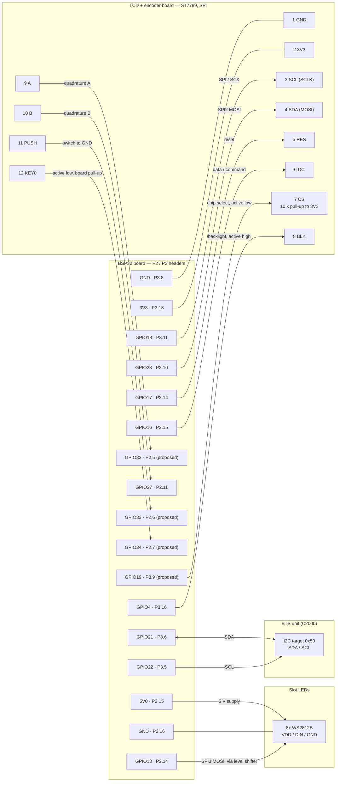

# ESP32 Hardware Connections

Which ESP32 pin goes where on the BTS proxy: the status LCD, the rotary
encoder and push switch, the extra KEY0 button and the eight slot LEDs. The
BTS I2C link and the console UART are included so the whole board is accounted
for.

**Source of truth is the firmware, with four exceptions.** Every GPIO below is
taken from `esp32-btle-proxy/main/main.c` (the `#define`s and the
`display_config_t`, `input_config_t` and `led_strip_config_t` it builds),
except the four marked **PROPOSED**:

| Signal | Pin | Status |
|---|---|---|
| LCD CS | GPIO19 | **PROPOSED.** Not in firmware yet; see [Firmware changes needed](#firmware-changes-needed) |
| KEY0 | GPIO34 | **PROPOSED.** Not in firmware yet; see [Firmware changes needed](#firmware-changes-needed) |
| Encoder A | GPIO32 | **PROPOSED.** Moved from GPIO15; firmware still uses GPIO15 |
| Encoder PUSH | GPIO33 | **PROPOSED.** Moved from GPIO2; firmware still uses GPIO2 |

The header positions (P2/P3) and the LCD board pin names come from the board
and the AliExpress module, not from the code, so they are the part to check
against the hardware if something does not respond.

Related: [`data-flow.md`](data-flow.md) for what travels over these links,
[`hardware-resources.md`](hardware-resources.md) for the C2000 side.

---

## Connection diagram

---

## LCD and rotary encoder board

ST7789 in SPI mode, 240x240. The module is the one from
<https://www.aliexpress.com/item/1005008766561044.html>.

| LCD board pin | Signal | ESP32 header | GPIO | Firmware use |
|---|---|---|---|---|
| 1 | GND | P3.8 | — | Ground |
| 2 | 3V3 | P3.13 | — | 3.3 V supply |
| 3 | SCL (SCLK) | P3.11 | **GPIO18** | SPI2 SCK |
| 4 | SDA (MOSI) | P3.10 | **GPIO23** | SPI2 MOSI. The bus is write-only; MISO is not assigned |
| 5 | RES | P3.14 | **GPIO17** | Panel reset |
| 6 | DC | P3.15 | **GPIO16** | Data / command select |
| 7 | CS | P3.9 | **GPIO19** (proposed) | Chip select, active low. External 10 k pull-up to 3V3 installed. Firmware currently passes `cs_gpio_num = -1` |
| 8 | BLK | P3.16 | **GPIO4** | Backlight, active high. Held off until the first frame is drawn |
| 9 | A | P2.5 | **GPIO32** (proposed) | Encoder channel A, decoded by PCNT. Firmware currently uses GPIO15 |
| 10 | B | P2.11 | **GPIO27** | Encoder channel B, decoded by PCNT |
| 11 | PUSH | P2.6 | **GPIO33** (proposed) | Encoder push switch, active low. Short press and 800 ms long press. Firmware currently uses GPIO2 |
| 12 | KEY0 | P2.7 | **GPIO34** (proposed) | Extra push button, active low. Not read by any firmware yet |

### Why these pins

All four proposed pins are chosen from the free pins on the P2/P3 tables, and
none is a boot strapping pin (the straps are GPIO0, 2, 5, 12 and 15).

- **CS = GPIO19 (P3.9).** CS is an output, so it needs an output-capable pin.
  GPIO19 has no boot role, and it sits in the same run of header pins as the
  other LCD signals (P3.8 to P3.16), between LCD GND and MOSI. It is VSPI's
  default MISO pad, but nothing uses MISO: the LCD bus is write-only and the
  LED driver is MOSI-only.
- **KEY0 = GPIO34 (P2.7).** KEY0 is an input, so it takes an input-only pin
  and leaves the output-capable ones free. GPIO34 supports GPIO interrupts. It
  has **no internal pull-up or pull-down**, which does not matter because KEY0
  is already pulled up to 3V3 on the LCD board. GPIO35 (P2.8) is the same kind
  of pin and is the alternate.
- **Encoder A = GPIO32 (P2.5) and PUSH = GPIO33 (P2.6).** These replace GPIO15
  and GPIO2, which are both strapping pins. Neither new pin has a boot or JTAG
  role, and both have internal pull-ups, which PUSH needs because it has no
  external one. They sit next to each other and next to KEY0 on P2.

  Moving them does not change how the encoder is clocked. PCNT routes every
  input through the GPIO matrix, so no pin is faster than another. The
  decoding limits are the glitch filter in `input.c` and the contact bounce.

Rejected: GPIO0, 5 and 12 are strapping pins. GPIO14 has no strap role but is
MTMS, which the firmware keeps clear for JTAG.

### Pull-ups

| Line | External | Internal (firmware) | Idle level |
|---|---|---|---|
| A | pulled up to 3V3 on the board | enabled | high |
| B | pulled up to 3V3 on the board | enabled | high |
| PUSH | none known | enabled (`switch_active_low = true`) | high, low when pressed |
| KEY0 | pulled up to 3V3 on the board | none available on GPIO34 | high, low when pressed |
| CS | **10 k to 3V3, required. Installed** | none | high, deselected |

The internal pull-ups on A and B are redundant with the board's, and
harmless. They are there because PCNT never enables a pull itself, and a
module without its own pull-ups would otherwise read floating inputs.

### CS wiring

The module has **no tie from CS to GND**, so CS is a real input on the panel
and has to be driven. There is nothing to remove.

The external **10 k pull-up from CS to 3V3 is required, and is installed.**
GPIO19 is high-impedance from reset until the firmware configures it, and a
floating CS would leave the panel selected, or half selected, while the SPI
pads settle at boot. The pull-up holds it deselected until the driver takes
over.

---

## Slot LEDs

| Signal | ESP32 header | GPIO | Use |
|---|---|---|---|
| WS2812B VDD | P2.15 | — | **5V0** |
| WS2812B GND | P2.16 | — | GND, shared with the ESP32 |
| WS2812B DIN | P2.14 | **GPIO13** | SPI3 (VSPI) MOSI. One data line, eight LEDs in series, one LED per BTS slot |

The strip is not on the LCD board. It has no clock line; the SPI3 bit
pattern at 2.5 MHz forms the WS2812B pulses (see `led_strip.h`).

**Level shifting.** The strip runs from 5 V, so its data input wants a high of
at least 0.7 x VDD, which is 3.5 V. The ESP32 drives 3.3 V, which is below
that. It works on some parts and fails on others, depending on temperature and
batch. Put a 5 V-powered buffer in the DIN line, such as a 74AHCT125 or
74HCT125 (one gate is enough) or a 74AHCT1G125, with a 330 ohm series resistor
at the strip end and a 100 to 470 uF capacitor across the strip supply.

**Current.** The firmware runs the strip at brightness 64 of 255, which is
roughly 120 mA for eight LEDs. At full white the strip would draw about 480
mA, as noted in `main.c`.

**Check.** On a LOLIN32 the 5V0 pin is normally the USB supply rather than a
regulated rail, so confirm the strip still has power when the board runs from
the backup cell alone.

---

## ESP32 board pin usage

`ASSIGNED` is what the firmware does with the pin. A dash means nothing is
assigned and the pin is free. Entries marked *(proposed)* are not in firmware
yet.

### P2

| P2 | IO_NAME | ASSIGNED |
|---|---|---|
| 1 | 3V3 | — |
| 2 | EN | Reset |
| 3 | VP | — (GPIO36, input only) |
| 4 | VN | — (GPIO39, input only) |
| 5 | GPIO32 | **Encoder A** *(proposed)* (LCD board pin 9) |
| 6 | GPIO33 | **Encoder PUSH** *(proposed)* (LCD board pin 11) |
| 7 | GPIO34 | **KEY0** *(proposed)* (LCD board pin 12). Input only, no internal pull |
| 8 | GPIO35 | — (input only) |
| 9 | GPIO25 | — |
| 10 | GPIO26 | — |
| 11 | GPIO27 | **Encoder B** (LCD board pin 10) |
| 12 | GPIO14 | — (MTMS, kept clear for JTAG) |
| 13 | GPIO12 | — (MTDI, strapping pin) |
| 14 | GPIO13 | **WS2812B DIN**, SPI3 MOSI |
| 15 | 5V0 | **WS2812B VDD** |
| 16 | GND | **WS2812B GND** |

### P3

| P3 | IO_NAME | ASSIGNED |
|---|---|---|
| 1 | GND | — |
| 2 | TXD0 | Console UART0 TX (AT console) |
| 3 | RXD0 | Console UART0 RX (AT console) |
| 4 | 3V3 | — |
| 5 | GPIO22 | **BTS I2C SCL** |
| 6 | GPIO21 | **BTS I2C SDA** |
| 7 | GND | — |
| 8 | GND | **LCD board GND** (pin 1) |
| 9 | GPIO19 | **LCD CS** *(proposed)* (pin 7). External 10 k pull-up to 3V3 |
| 10 | GPIO23 | **LCD SDA / MOSI**, SPI2 (pin 4) |
| 11 | GPIO18 | **LCD SCL / SCLK**, SPI2 (pin 3) |
| 12 | GPIO5 | — (strapping pin) |
| 13 | 3V3 | **LCD board 3V3** (pin 2) |
| 14 | GPIO17 | **LCD RES** (pin 5) |
| 15 | GPIO16 | **LCD DC** (pin 6) |
| 16 | GPIO4 | **LCD BLK**, backlight (pin 8) |
| 17 | GPIO0 | — (download-mode strapping pin) |
| 18 | GND | — |
| 19 | GPIO2 | — (strapping pin; was Encoder PUSH) |
| 20 | GPIO15 | — (strapping pin, MTDO; was Encoder A) |

### By peripheral

| Peripheral | Signals | GPIOs |
|---|---|---|
| ST7789 LCD, SPI2 (HSPI) | SCLK, MOSI, RES, DC, BLK | 18, 23, 17, 16, 4 |
| ST7789 LCD chip select *(proposed)* | CS | 19 |
| Rotary encoder + switch, PCNT | A *(proposed)*, B, PUSH *(proposed)* | 32, 27, 33 |
| KEY0 button *(proposed)* | KEY0 | 34 |
| Slot LEDs, SPI3 (VSPI) | DIN | 13 |
| BTS link, I2C controller | SDA, SCL | 21, 22 |
| Console, UART0 | TX, RX | 1, 3 |
| **Free** | | 25, 26, 35, VP (36), VN (39) |
| **Free, but strapping or JTAG** | | 0, 2, 5, 12, 14, 15 |

---

## Firmware changes needed

The four proposed pins are documentation only until these are done:

1. **LCD CS.** `display_config_t` has no CS field and `display.c` hard-codes
   `cs_gpio_num = -1`. Add a `cs_gpio` member, pass it through, and set
   `LCD_CS_GPIO 19` in `main.c`. The `esp_lcd` SPI driver then asserts CS
   around each transaction by itself.
2. **KEY0.** Add a fourth input to `input.c` (or a small separate one),
   `KEY0_GPIO 34`, active low, with the existing debounce. The GPIO config must
   leave pulls disabled, as GPIO34 has none. An interrupt is fine here; PCNT is
   only needed for the encoder.
3. **Encoder A and PUSH.** In `main.c`, change `ENC_A_GPIO` from 15 to 32 and
   `ENC_SW_GPIO` from 2 to 33. Update the WIRING and "A NOTE ON THESE PINS"
   comments in `input.h`, which describe GPIO15 and GPIO2 as strapping pins and
   would otherwise be wrong. `ENC_B_GPIO` (27) does not change, and `input.c`
   needs no change: it takes its pins from `input_config_t`.
4. Update the pin table in `esp32-btle-proxy/README.md`, which still lists
   the pins as they are in firmware today.

---

## Things worth knowing

**Strapping pins.** With the encoder moved, none of the pins in use on the LCD,
encoder, KEY0 or LED connections is a strapping or JTAG pin. GPIO4, 13, 19, 27,
32, 33 and 34 have no boot role. This is the state once the proposed pins are
in firmware. Until then the firmware still has Encoder A on GPIO15 (MTDO, read
at reset; held low it silences the ROM boot log) and PUSH on GPIO2 (a
download-mode strapping pin, so do not hold the button while entering download
mode by hand).

**The LCD is on SPI2 using the VSPI pads.** GPIO23 and GPIO18 are the
IO_MUX defaults for SPI3 (VSPI), but the LCD uses SPI2 (HSPI) and reaches them
through the GPIO matrix. That keeps SPI3 free for the LEDs, so an LED frame
cannot stall a panel repaint. Do not "fix" the host back to VSPI.

**Encoder B moved.** B was on GPIO13 until the WS2812B driver took that pin
for SPI3 MOSI. It is on GPIO27 now. GPIO14 would also have worked, but it is
MTMS, so it was left clear for JTAG debugging.

**The panel is a write-only bus.** A wrong SPI mode or clock shows as a blank
or speckled panel, not an error. The current settings are SPI mode 2 at
10 MHz with a boot-time colour-bar self-test; `display_config_t` in `main.c`
holds them.

**The part number.** The module is an ST7789, which is what the driver
targets. If a datasheet or order page says ST7798, that is a transposition.

---

## Unconfirmed against the hardware

- **5V0 with the backup cell.** See the check under Slot LEDs.
- **Level shifter.** The strip may work without one on the bench. It is
  recommended because it is marginal, not because it has been seen to fail.
