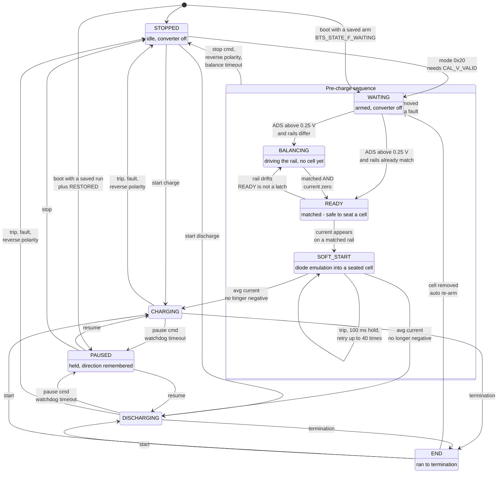
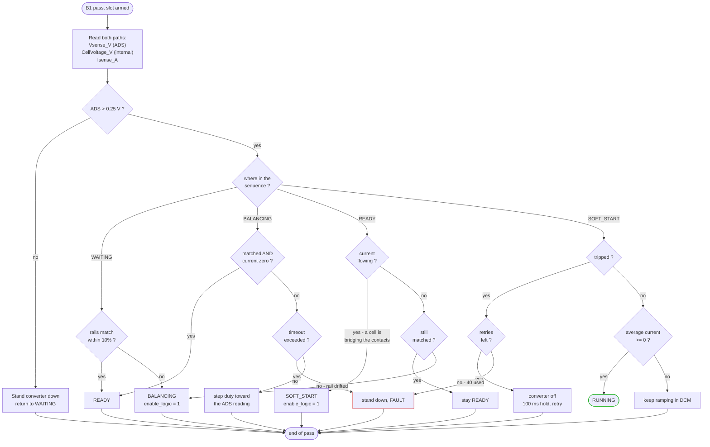
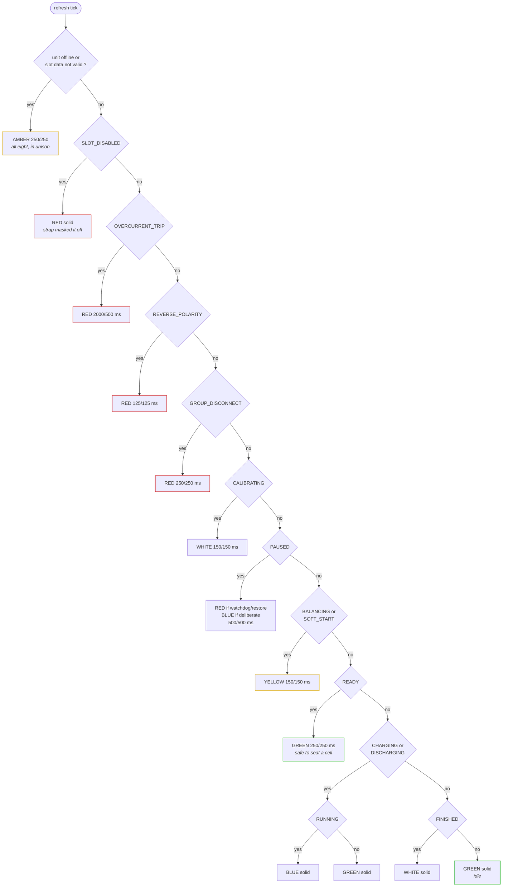

# Supervision, Pause State and Register Map v2 — Design Specification

Authoritative contract for three coupled changes to the BTS firmware and the
ESP32 proxy:

1. A **30 s host watchdog** that pauses every slot if the host stops talking.
2. A **PAUSED** slot state, with direction-scoped counters that survive it.
3. **FRAM state persistence** every 6 s, restored as PAUSED on boot.

Plus the register-map reorder that makes per-slot runtime data readable in one
burst, and per-direction run-time seconds counters.

This document is the contract. Implementations must not deviate from the
addresses, bit positions or opcodes here without updating this file first.

---

## 0. Why this exists

The instrument charges lithium cells unattended. Today, if the ESP32 loses
power or its I2C link drops, **the converters keep running** — there is no
supervision timeout anywhere in the firmware. That is the safety gap this
closes.

The persistence and pause work follows from the same requirement: a slot that
was mid-run when the BTS reset must come back knowing what it was doing and
how far it had got, without silently resuming into a cell that may have been
swapped in the meantime.

---

## 1. Register map v2 — breaking reorder

### 1.1 Why reorder at all

A slot's live data is currently spread across five blocks (control 36, stats
320, cell temp 992, sense 1092, discharge 1156). Reading eight slots costs the
ESP32 ~33 I2C transactions per cycle. Grouping each slot's runtime data
contiguously makes it **one burst per slot**.

> **This breaks every hard-coded address.** 81 defines in the ESP32 mirror and
> the superseded `esp32-controller` component. Both the C2000 and the ESP32
> must be rebuilt and flashed together — there is no compatibility window. The
> superseded `esp32-controller` is left broken; it already has two other
> defects and is documented as do-not-use.

### 1.2 Layout

Four regions. Per-slot strides are fixed and generous so a future field does
not shift everything again.

| Region | Base | Stride | Regs/slot | Range |
|---|---|---|---|---|
| **Runtime** (RO) | 0 | 48 B (12 regs) | 12 | 0 – 383 |
| **Settings** (RW) | 384 | 72 B (18 regs) | 18 | 384 – 959 |
| **Unit** | 960 | — | 27 total | 960 – 1064 |
| **Slot tuning** (RW) | 1068 | — | 13 total | 1068 – 1116 |

Verified arithmetic: runtime ch7 ends at 383, immediately before the settings
base; settings ch7 ends at 959, immediately before the unit base; the unit
block ends at 1064, immediately before the tuning base.

**Total 280 registers**, top address 1116 — the tuning block of §1.6 is part
of the map, not an appendix to it.

> **Revised 2026-09-22.** This document originally specified a 24-register
> settings stride, a unit base of 1152 and 315 registers in total. The
> settings region was then compressed to 18 registers per slot — the
> charge/discharge limit split collapsed into one direction-agnostic pair of
> each, and `eChX_MinCellTemp` and the per-slot spare were removed. The tables
> below are the current layout. Costs **560 words** of `CPU2TOCPU1RAM` for the
> register file — 280 registers at two words each. (534 was the figure before
> the 13 slot-tuning registers were appended.) Confirm against the map file after building — overflow here
> is a link-time failure (`#10099-D`).

### 1.3 Runtime block — `BTS_RT_BASE(ch)`, stride 48

Everything a host polls at 1 Hz, in one burst of 12 registers.

| Offset | Enum | Units | Source |
|---|---|---|---|
| +0 | `eChX_Status` | bitfield | §2 |
| +4 | `eChX_CellVoltage` | V | internal 12-bit ADC |
| +8 | `eChX_CellCurrent` | A | internal 12-bit ADC |
| +12 | `eChX_SenseVoltage` | V | ADS131M08 16-bit |
| +16 | `eChX_SenseCurrent` | A | ADS131M08 16-bit |
| +20 | `eChX_CellTemp` | °C | ADS1119 |
| +24 | `eChX_ChargeAcc_mAh` | mAh | §3 |
| +28 | `eChX_ChargeAcc_mWh` | mWh | §3 |
| +32 | `eChX_ChargeRuntime_s` | s | §3 |
| +36 | `eChX_DischargeAcc_mAh` | mAh | §3 |
| +40 | `eChX_DischargeAcc_mWh` | mWh | §3 |
| +44 | `eChX_DischargeRuntime_s` | s | §3 |

All `REG_ACCESS_RO`. Channel 0 at 0–47, channel 7 at 336–383.

### 1.4 Settings block — `BTS_SET_BASE(ch)`, stride 72

Everything a host writes, grouped per slot so configuring a slot is also one
burst. All 18 registers are used; there is no spare left.

| Offset | Enum | Access |
|---|---|---|
| +0 | `eChX_Mode` | RW |
| +4 | `eChX_VoltageMin` | RW |
| +8 | `eChX_VoltageMax` | RW |
| +12 | `eChX_CurrentMin` | RW |
| +16 | `eChX_CurrentMax` | RW |
| +20 | `eChX_MaxCellTemp` | RW |
| +24 | `eChX_F28V_Gain` | RW |
| +28 | `eChX_F28V_Offset` | RW |
| +32 | `eChX_F28I_Gain` | RW |
| +36 | `eChX_F28I_Offset` | RW |
| +40 | `eChX_IoutGain_pu` | RW |
| +44 | `eChX_IoutOffset_pu` | RW |
| +48 | `eChX_IoutGain_A` | RW |
| +52 | `eChX_IoutOffset_A` | RW |
| +56 | `eChX_VoutGain_pu` | RW |
| +60 | `eChX_VoutOffset_pu` | RW |
| +64 | `eChX_VoutGain_V` | RW |
| +68 | `eChX_VoutOffset_V` | RW |

**The limits are direction-agnostic.** A slot's direction comes from the mode
register, so one `VoltageMin`/`VoltageMax` and one `CurrentMin`/`CurrentMax`
pair serves both charge and discharge. The eight-register split that preceded
this — `eChX_ChargeVoltageMin` and its siblings — is gone from both headers,
along with `eChX_MinCellTemp`: only a maximum cell temperature is enforced.

The four limits are **not** stored in the calibration image. They live in the
slot's F-RAM runtime-state record (§5), so changing a charge current does not
rewrite — and cannot corrupt — a calibration measured against a reference.

The 12-register calibration block keeps its internal order, so
`BTS_CAL_F28V_GAIN`..`BTS_CAL_VOUT_OFFSET_V` remain offsets 0..11 **relative to
`eChX_F28V_Gain`**. `saveCalibration()`/`loadCalibration()` index through
`BTS_CAL_BASE(ch) = BTS_SET_BASE(ch) + 6` and need no other change.

### 1.5 Unit block — base 960

| Addr | Enum | Access |
|---|---|---|
| 960 | `eChargeDisableV` | RW |
| 964 | `eChargeRestrictV` | RW |
| 968 | `eDischargeRestrictV` | RW |
| 972 | `eDischargeDisableV` | RW |
| 976 | `eCalibrationMode` | RW |
| 980 | `eUnitState` | RO |
| 984 | `eInputVoltage` | RO |
| 988 | `eTripStatus` | RO |
| 992 | `eSlotMode` | RO |
| 996 | `eSlotEnable` | RO |
| 1000 | `eGroupSize` | RO |
| 1004 | `eHostWatchdog_s` | RW | §4 |
| 1008 | `eCalSlot` | RW |
| 1012 | `eCalCommand` | RW |
| 1016 | `eCalArgument` | RW |
| 1020 | `eCalStatus` | RO |
| 1024 | `eCalResult` | RO |
| 1028 | `eWatchdogRemaining_s` | RO | §4 |

Calibration telemetry (the 9 live values) follows at **1032–1064**, keeping its
existing internal order. 1064 is the top of the map.

`eWatchdogRemaining_s` is the live countdown, in seconds, so a host can show
how long is left rather than only that supervision is armed. It reads **0**
when the watchdog has fired **and** when it is disabled; a host distinguishes
the two by reading `eHostWatchdog_s`, which is in the same burst. CPU2 owns
it and writes it straight into `registers[]` — no IPC, since CPU2 owns both
the register file and the timebase.

### 1.6 Slot tuning block - base 1068

The DCL biquad coefficients for the CC and CV control loops, held as writable
registers instead of the compile-time `BTS_DCL_*` constants so a unit can be
tuned in the field rather than rebuilt and reflashed on both cores.

| Address | Name | Meaning |
|---|---|---|
| 1068-1084 | `DCL_CC_B0..B2`, `A1..A2` | CC loop biquad |
| 1088-1096 | `DCL_CV_Z0`, `Z1`, `P1` | CV zero/pole frequencies - provenance only |
| 1100-1116 | `DCL_CV_B0..B2`, `A1..A2` | CV loop biquad |

Four properties, each deliberate:

**Above the unit block, not inside it.** These are written once by a system
builder during slot tuning and read back only on request. The ESP32's
9-transaction poll cycle does not reach this far, so the block costs nothing
per poll.

**One set for the whole unit.** Every slot is the same converter with the same
passives, so there is no per-slot stride.

**Z0/Z1/P1 are carried but never used.** The DCL runs the biquad coefficients
directly. The frequencies record what those coefficients were derived from, so
a later re-derivation has the design intent instead of having to work backwards.

**Defaults are seeded before F-RAM can load.** `BTS_seedSlotTuningRegisters()`
runs on CPU1 at boot, before CPU2's restore arrives, and `BTS_applySlotTuning()`
rejects a set whose `b0` is zero. Both guard the same failure: `registers[]`
starts zeroed, and a biquad with every coefficient zero produces a constant
zero output - the duty would never leave its floor and **no slot would
regulate at all**. A never-tuned unit, or one whose stored record fails its
CRC, runs the shipped tuning instead.

Persistence is a single F-RAM record at `0x0700` (128 B, header + 13 floats +
CRC-32), placed after the per-slot state region that ends at `0x06FF`. A host
write to any coefficient marks the whole block for saving; the transfer runs
from `BTS_serviceDeferredWork()` on an idle bus, never from the ISR the write
arrives in. Writing all thirteen coefficients therefore costs one F-RAM
transfer, not thirteen.

### 1.6.1 Registers removed

**In the v2 reorder.** `eChX_MinVoltage` and `eChX_MaxVoltage` (v1 324/328)
were declared RO and never written on either core — 16 registers of permanent
0.0. Removing them offset most of the cost of the 16 new run-time-seconds
registers.

**In the 2026-09-22 settings compression.** Six more per slot, 48 in total:

| Removed | Replaced by |
|---|---|
| `eChX_ChargeVoltageMin`, `eChX_DischargeVoltageMin` | `eChX_VoltageMin` |
| `eChX_ChargeVoltageMax`, `eChX_DischargeVoltageMax` | `eChX_VoltageMax` |
| `eChX_ChargeCurrentMin`, `eChX_DischargeCurrentMin` | `eChX_CurrentMin` |
| `eChX_ChargeCurrentMax`, `eChX_DischargeCurrentMax` | `eChX_CurrentMax` |
| `eChX_MinCellTemp` | — only a maximum is enforced |
| `eChX_SettingsSpare` | — no spare remains |

A slot only ever runs in one direction at a time and the mode register says
which, so the split pairs were never both in force. The saving moved the unit
block down 192 bytes and the top of the unit block from 1256 to 1064. The slot
tuning block (§1.6) was added above it afterwards, so the map now tops out at
**1116**.

**There is no spare register left in any region.** A new per-slot field now
means another stride change, which moves every address below it and breaks
every host — the thing the generous strides were chosen to avoid. Budget for
that before adding one.

---

## 2. Slot state model

### 2.1 The states

Five run states, plus the four-state pre-charge sequence that precedes a run.

| State | Meaning |
|---|---|
| **STOPPED** | Idle. Converter off. Counters hold their last values. |
| **CHARGING** | Running, delivering charge. |
| **DISCHARGING** | Running, drawing charge. |
| **PAUSED** | Was charging or discharging; converter off, direction remembered, counters frozen and intact. |
| **END** | Test finished normally. Converter off, counters hold final values. |

The pre-charge states, detailed in [§2.5](#25-pre-charge-balance--how-a-cell-is-seated-safely):

| State | Meaning |
|---|---|
| **WAITING** | Armed and watching for a cell. Converter off. |
| **BALANCING** | Driving the rail to match the approaching cell. No cell connected yet. |
| **READY** | Rails matched — safe to seat a cell. Re-verified, not latched. |
| **SOFT_START** | Diode-emulation start into a cell that has just made contact. |

`PAUSED` is **not** a direction of its own. A paused slot keeps its
`CHARGING` or `DISCHARGING` status bit set alongside `PAUSED`, so a host can
see both that it is paused and what it will resume into.

**None of the pre-charge states is `running`.** Every supervisor that keys off
`slotIsRunning()` — the accumulators chief among them — therefore ignores a
balancing slot, which is deliberate: it is charging capacitors, not a cell.
The protections that must apply anyway are listed in §2.5.

### 2.2 Status bits

Bits 0–14 keep their current meaning and positions. Append:

```c
#define BTS_STATUS_PAUSED            15U
#define BTS_STATUS_END      BTS_STATUS_FINISHED  /* bit 2 - see below */
#define BTS_STATUS_WD_TRIPPED        17U  /* paused *by the watchdog*      */
#define BTS_STATUS_RESTORED          18U  /* paused by a FRAM boot restore */
```

Bits 17 and 18 distinguish *why* a slot is paused, which a host needs to decide
whether resuming is safe. Both are cleared on resume.

> **Ceiling is bit 23.** The word crosses to hosts as a float32 whose 24-bit
> significand is exact only to bit 23. Do not go past it.

The existing `BTS_STATUS_FINISHED` (bit 2), never written to date, becomes the
`END` indicator and is now driven — keep both the old name and the new
semantic, do not add a second bit for the same thing.

> **Actually driven as of the CCCV work.** Bit 2 was published from
> `status[].finished` from the moment this document was written, but nothing
> ever *set* that field — it was only cleared on a start and restored from
> F-RAM. `serviceTermination()` (§2.5) is the writer the design always
> assumed. Bits **6 (CONST_VOLTAGE)** and **7 (CONST_CURRENT)** became real at
> the same time and for the same reason: they were copied from
> `ctrlMode_logic`, which the CC-only control law pinned to 0.

> **Corrected 2026-09-19.** An earlier revision of this table defined
> `BTS_STATUS_END` as bit **16** while the paragraph above required bit 2 to
> carry the meaning — the two could not both be true. Resolved in favour of
> the paragraph: `BTS_STATUS_END` is an **alias for bit 2**, and **bit 16 is
> unused and free**. A host must read bit 2 for END. Anything that polled bit
> 16 will read a constant 0.

### 2.3 Transitions

The whole slot lifecycle, including the pre-charge sequence that precedes a
run. The pre-charge states are detailed in [§2.5](#25-pre-charge-balance--how-a-cell-is-seated-safely);
they are shown here so the one place a reader looks for "what can a slot do"
is complete.



**Entering PAUSED always zeroes the converter reference first**, then clears
`enable_logic`. Same ordering as a trip exit — and the same ordering every
pre-charge helper uses.

**PAUSED is not a direction.** A paused slot keeps its `CHARGING` or
`DISCHARGING` bit, which is how a resume knows which way to go. A **stop**
clears them; a pause does not.

**The pre-charge states are not `running`.** Only `SOFT_START` leads into a
run, and the transition sets `running` at the moment it happens. This matters
to every supervisor that keys off `slotIsRunning()` — see §2.5.

### 2.5 Pre-charge balance — how a cell is seated safely

A lithium cell is a stiff voltage source. Dropping one onto a flat output
capacitor dumps charge through the contacts, and closing the synchronous
rectifier onto a pre-biased cell drives current backwards through the power
stage. The pre-charge sequence drives the rail to match the cell *before*
contact, so the connection closes across near-zero volts.

What the supervisor does on each pass, for one armed slot. This runs in `B1`,
so every decision below is re-evaluated a few hundred times a second.



**Why the current reading is what decides it.** The output capacitors sit
*after* the current sense resistor, so the shunt only sees current the
switching FETs produce — never charge moving between a cell and the rail
through the contacts. That single fact makes the sequence decidable:

| Voltages | Current | Meaning |
|---|---|---|
| match | zero | rail balanced, no cell yet → READY |
| match | flowing | a cell is bridging the contacts → SOFT_START |
| differ | — | rail needs driving → BALANCING |

Without it, "balanced successfully" and "cell inserted" would be the same
reading and the sequence could not be sequenced at all.

**READY is not a latch.** An unloaded output capacitor drifts — leakage, the
divider network, self-discharge — and an operator may take a while to seat the
cell. The supervisor re-verifies every pass and drops back to BALANCING if the
differential re-opens.

**Soft start is diode emulation.** The synchronous rectifier is held off so
current cannot flow backwards out of the cell, and the converter runs in DCM
until the average current is no longer negative. A trip is expected rather
than exceptional — inrush into a pre-biased cell is exactly what this exists
to survive — so a trip holds for ~100 ms and retries, up to 40 times before
faulting.

**Removing the cell clears a fault.** If the ADS path falls below 0.25 V the
slot returns to WAITING from any point in the sequence, including a fault.
Pull the cell, re-seat it, and the sequence runs again.

**Entry is guarded on calibration.** The two sense paths are independently
calibrated, so on an uncalibrated slot the differential between them is
meaningless — and this sequence drives the power stage based on exactly that
differential. `BTS_MODE_WAITING` is refused unless `CAL_V_VALID` is set. An
uncalibrated slot still runs normally; it just does not get the pre-charge.

**Grouped modes balance as one converter.** The members' outputs are
physically paralleled onto a single rail, so the leader balances for all of
them and the state propagates to every member. Followers have no control loop
of their own to run.

**Protection is live throughout.** `enable_logic` is set while balancing, so
the hardware trip zones are armed exactly as they are for a running slot, and
the reverse-polarity check stops a balancing slot as readily as a running one.
The accumulators are the one exception: they key off `running`, which the
pre-charge states never set, so no charge is counted while capacitors are
being filled.

**Only WAITING survives a power cycle.** It is carried in the F-RAM state
record as `BTS_STATE_F_WAITING`, so a slot an operator armed comes back armed.
The other three are transient and the supervisor re-derives them within a few
passes from readings that are current rather than remembered.

#### Where it runs, and why not in C1

The supervisor lives in **B1**, which was empty.

B1 dispatches at `TASKB_FREQ_HZ` and each of its three sub-tasks therefore
runs three times faster than a C sub-task. That margin is what makes the
brief's 100 ms trip retry expressible at all: the retry hold is counted in
supervisor passes, so it needs a timebase comfortably finer than 100 ms.

The C chain would now *almost* do — it was re-measured at 28.6 Hz per
sub-task on 2026-10-02, having been 0.69 Hz before a missed-clock detection
fix — but C1 already carries the input-voltage guard, the reverse-polarity
sweep, group integrity and termination. B1 was empty, and a supervisor that
drives FETs is better placed where it is not queued behind four other
passes.

#### Divergence fault while RUNNING

A rapid rise on the converter rail that the ADS path does not follow means the
cell is no longer bridging the contacts — pulled mid-test, or a contact that
has opened — and the converter is driving its own output capacitor with the
loop still asking for current. More than 20% divergence for three consecutive
passes stops the slot and its whole group.

#### Status bits

| Bit | Name | Set while |
|---|---|---|
| 16 | `BTS_STATUS_WAITING` | anywhere in the sequence |
| 19 | `BTS_STATUS_BALANCING` | driving the rail |
| 20 | `BTS_STATUS_READY` | matched; safe to seat |
| 21 | `BTS_STATUS_SOFT_START` | DCM start into a connected cell |

MONITORING from the original brief is deliberately absent: an armed slot is by
definition watching, so it would never be observably distinct from WAITING,
and only bits 22 and 23 now remain below the float32 ceiling.

### 2.5.1 Slot indication — the WS2812B string

Eight WS2812B pixels, one per slot, driven by the **ESP32 proxy** over SPI3
and refreshed every 25 ms. The C2000 no longer touches them.

#### The C2000 version never lit a pixel

This is not a regression that was repaired — the function moved because it
could never have worked where it was. `LEDDriver_update()` clocked **raw
colour bytes out of SCIA at 800 kbaud**. A WS2812B does not decode bytes; it
decodes **pulse widths** — 400 ns high is a 0, 800 ns high is a 1, each inside
a 1250 ns slot. A UART cannot produce them. It forces a LOW start bit before
every byte and holds each data bit for a full bit time, so the strip saw
framing noise and latched nothing.

Three real bugs were found in this area before anyone questioned the
transport: the Timer 0 double-booking
([`hardware-resources.md`](hardware-resources.md) §8.2), the LED ISR's ~360 us
of masked interrupts starving CPU2's I2C target, and SCIA being stranded by an
unstrapped MODE strap. All three were genuine and all three were worth fixing.
**None of them could ever have lit the string**, because what arrived at the
first pixel was never a WS2812B symbol to begin with.

#### Why it could not be fixed on the C2000

Driving a WS2812B needs a peripheral that emits a **free-running bit
pattern**, which on this device means SPI. Three constraints close the door
together:

- **GPIO29 — the wire that physically exists — has no SPI mux option.** Its
  choices are GPIO, SCITXDA, EM1SDCKE, OUTPUTXBAR6, EQEP3B and SD2_C3.
- **Both usable SPI ports are held by the ADS131M08 pair**, SPIA and SPIC.
- **The Output X-BAR carries no ePWM source.** That kills the one remaining
  idea — an eCAP APWM routed out through OUTPUTXBAR6 — on cost rather than on
  wiring: it works electrically, but needs **192 software duty updates per
  refresh**, which is the ISR starvation that had just been fixed, rebuilt
  from scratch.

#### How the ESP32 drives it

Implemented in
[`led_strip.c`](../esp32-btle-proxy/components/led_strip/led_strip.c), started
from [`main.c`](../esp32-btle-proxy/main/main.c).

| | |
|---|---|
| Bus | `SPI3_HOST` (VSPI), MOSI on **GPIO13** |
| Clock | **2.5 MHz** — 80 MHz / 32 |
| Encoding | four SPI bits per WS2812B bit: `1000` = 0, `1100` = 1 |
| Frame | 12 bytes per LED, **96 bytes for all eight in one DMA transfer**, 307 us |
| Refresh | FreeRTOS task `led_strip`, priority 4, 3072-byte stack, every 25 ms |
| Brightness | 64/255, scaled linearly per channel |

**Neither SCLK nor CS is routed.** The WS2812B is a one-wire part and its
clock is implicit in the bit pattern, so routing either would burn a pin to
drive nothing.

**SPI3 and not SPI2.** The ST7789 panel holds SPI2, which *is* HSPI. It sits
on GPIO23/GPIO18 — VSPI's IO_MUX default pads — but reaches them through the
GPIO matrix, so SPI3 was the genuinely free host. Sharing one host would let
an LED frame stall a panel repaint and vice versa.

**2.5 MHz, not the 3.333 MHz the commonly-cited article uses.** At 2.5 MHz an
SPI bit is 400 ns, so `1000` gives T0H = 400 ns and `1100` gives T1H = 800 ns
— both *exactly* the WS2812B's nominal widths, with the resulting 1600 ns slot
well inside the 650–1850 ns the part tolerates. At 3.333 MHz the same `1100`
symbol gives **T1H = 600 ns, under the 650 ns minimum for a logic 1**. That
works on some strips and fails on others, which is the worst failure mode
available here: intermittently wrong colours on a safety indicator. The
deviation from the article is deliberate.

**The reset latch comes free.** Every symbol ends in a 0 bit, so MOSI rests
low between frames and the >50 us the part needs to latch is covered many
times over by the 25 ms until the next refresh.

**It is a scheduled task, not a timer ISR.** That is the structural difference
from the C2000 driver, which blocked with interrupts masked. A task at
priority 4 cannot starve the I2C poll, the BLE stack or the panel — the
scheduler simply runs them.

#### Priority is safety-first, and the order is load bearing

**The per-slot chain is preserved exactly** from the C2000 version.
`colour_for()` is the same single if/else-if ladder in the same order: the
**first** condition that matches wins, so a slot that is both tripped and
calibrating shows the trip. Reading down the chain is reading the priority.

One gate is new, and it sits **above** the whole chain: if the proxy cannot
see the unit, no per-slot colour is trustworthy, so no per-slot colour is
shown.



#### Why the new states sit where they do

**Above the direction states.** A slot that has ever run keeps its
`CHARGING`/`DISCHARGING` bit until it is stopped, so anything ranked below
that branch is unreachable for such a slot. Balancing and ready are tested
first.

**Below every fault.** A slot that trips while balancing must still read as
tripped — the same reasoning the calibration flash already carried.

**READY flashes rather than sitting solid**, because solid green is already
the idle colour and the final fallback. An operator has to be able to tell a
slot that is ready to accept a cell from one doing nothing at all. Yellow was
free on the unit, so balancing and soft start share it — they are one
operation from the operator's side: *the slot is preparing itself, do not
seat a cell yet*.

| Meaning | Colour | Pattern |
|---|---|---|
| **Link down — proxy cannot see the unit** | **amber** | **250/250, all eight in unison** |
| Strap-disabled | red | solid |
| Over-current trip | red | 2000 ms on / 500 off |
| Reverse polarity | red | 125/125 |
| Group disconnect | red | 250/250 |
| Calibrating | white | 150/150 |
| Paused (watchdog or restore) | red | 500/500 |
| Paused (deliberate) | blue | 500/500 |
| **Balancing / soft start** | **yellow** | **150/150** |
| **Ready — seat a cell now** | **green** | **250/250** |
| Running | blue | solid |
| Finished | white | solid |
| Idle | green | solid |

Patterns are quoted **on / off in milliseconds** throughout.

#### Link down — all eight amber, in unison

Taken when `!snap.unit.online`, meaning the last I2C poll cycle did not
complete, or when an individual slot's `valid` is still false because it has
never been read successfully.

**Unison is the cue, and it is the whole point.** No real per-slot condition
ever synchronises across the entire strip, so eight pixels blinking together
is a pattern the hardware cannot otherwise produce. An operator can read
*"the proxy cannot see the unit"* from across a bench without consulting a
colour key.

The two obvious alternatives were both rejected, for the same reason:

- **Holding the last known colours** would keep asserting slot states that may
  no longer be true — a green idle pixel for a slot that has since tripped.
- **Going dark** is indistinguishable from the box being powered off.

#### Two sharp edges the port removed

**Colour tables are written RGB in source and reordered at encode time.**
`encode_pixel()` emits green, red, blue — the WS2812B's wire order — from an
`rgb_t` that reads normally. The C2000 tables were stored **pre-swapped into
GRB**, so `COLOR_RED` was literally `{0, 255, 0}` and every line needed a
comment explaining that yellow only looked right by coincidence. Any new
colour written the obvious way was silently wrong.

**Flash periods are in milliseconds.** They are divided by `refresh_ms` to get
a tick count, so they stay in real time whatever the refresh rate is. The
C2000 version expressed them in units of an 80 Hz timer tick, which meant
retuning that timer would have silently changed every flash rate in the table.

#### What this costs

Two trade-offs, both real and neither hidden:

**Indication now lags by up to one poll interval.** Colour derives from
`bts_link_get_snapshot()` — the ESP32's existing **250 ms** I2C poll — rather
than from `registers[]` directly. A state change can therefore take up to
~250 ms longer to reach the strip than a C2000-resident driver would have
needed. Against an operator's reaction time this is nothing; it is recorded
because it is a genuine difference, not because it is a problem.

**The strip now depends on the proxy being alive.** If the ESP32 is unplugged,
crashes, or is held in reset, it sends no frames at all — and a WS2812B latch
holds its last colour **indefinitely**. That is precisely the *"frozen LED
showing running for a slot that has since tripped"* hazard that
[`hardware-resources.md`](hardware-resources.md) §8.2 called actively
misleading, and it has not been eliminated, only moved. The amber-unison state
covers the case where the ESP32 is **alive but cannot reach the unit**; by
construction it cannot cover the ESP32 itself being dead. **Treat the strip as
an indicator, never as evidence that a slot is safe.**

#### What is left on the C2000

`BTS_LED_DRIVER_ENABLED` is `(false)` in **both** arms of the
`BTS_DEBUG_CONSOLE` switch in
[`bts_user_settings.h`](../tida-010086/bts_F2837xD_8ch/bts_user_settings.h), so
`LEDDriver_init()`, `LEDDriver_update()` and `LEDDriver_due()` are the no-op
stubs in **every** build.
[`led_driver.c`](../tida-010086/bts_F2837xD_8ch/led_driver.c) and its header
remain in the project and still compile; the idle-loop call
`if (LEDDriver_due()) LEDDriver_update();` at
[`com_cpu2.c:4297`](../tida-010086/bts_F2837xD_8ch/com_cpu2.c) still exists and
now does nothing.

Two consequences worth recording:

**CPU Timer 2 on CPU2 is now free.** `ledTimerISR` is never registered and
`INT_TIMER2` is no longer claimed on that core at all. This makes the Timer 0
double-booking in [`hardware-resources.md`](hardware-resources.md) §8.2
**historical** — worth keeping as a record of what broke and why, but it no
longer describes a live allocation. Timer 0 on CPU2 remains the ADS1119 settle
dwell's alone.

**GPIO29 is idle in a production build.** It is still muxed to
`GPIO_29_SCITXDA` unconditionally in `BTS_HAL_setupCpu2Pins()`
([`bts_hal.c:1394`](../tida-010086/bts_F2837xD_8ch/bts_hal.c)) and simply
drives nothing. See [§2.7](#27-mode-strap---slot-grouping-and-slot-tuning) for
what that frees up.

#### A fix that came with this work

`slotStop()` did not clear the direction bits, so a stopped slot kept
whichever direction it last ran. Two consequences, both visible here: the
`FINISHED` branch was unreachable for any slot that had ever run, and a
stopped slot reached idle-green through the wrong branch. Fixed — a **stop**
clears the direction bits; a **pause** still keeps them, because a resume
needs to know which way to go.

### 2.6 Termination — how a slot reaches END

The `──termination──> END` arrow above was specified from the start and had no
implementation until the firmware moved to CCCV
(`BTS_LAB_TYPE = BTS_LAB_CLOSED_LOOP_CCCV`). Under the previous CC-only law
there was no constant-voltage phase to taper out of, so there was nothing for
a charge to terminate *on*.

`serviceTermination()` runs in `C1()`, immediately before the group-integrity
check so a slot that has just ended is no longer treated as a running group
member.

| Direction | Terminates when | Disabled by |
|---|---|---|
| **CHARGE** | the loop is **in CV** *and* `|I| <= I_MIN` | `I_MIN == 0` |
| **DISCHARGE** | `V <= V_MIN` | **`V_MIN == 0`** |

Three rules are load bearing:

**A charge must be in CV before its current is tested.** Current ramps from
zero at the start of a charge, so `|I|` is below `I_MIN` at the very moment
the slot starts. Being in CV is what separates "current has fallen away
because the cell is full" from "current has not risen yet". Without this guard
every charge would end immediately.

**`V_MIN == 0` disables discharge termination entirely.** A zero floor is how
an operator asks to run a cell down with no voltage cutoff — it is not a
request to terminate at 0 V.

**The sensor is the ADS131M08**, `Isense_A` / `Vsense_V` — the converter the
CC loop regulates against and the one the counters integrate, not the 12-bit
internal ADC. A slot therefore ends on the same measurement that set its
current, and the check works for every MODE strap rather than only those with
`btsSlotUsesIntAdc` set.

Both conditions must hold for `BTS_TERM_DWELL_PASSES` consecutive C1 passes.
Current is the noisiest quantity measured here and a single sample dipping
under `I_MIN` is not a finished charge. The dwell is expressed in **passes,
not seconds**, because the C-task rate has moved twice: it was measured at
0.69 Hz per sub-task in September 2025, and **re-measured at 28.6 Hz on
2026-10-02** after a latent missed-clock detection — which had been holding
the PLL off full speed — was fixed. Five passes is therefore ~0.17 s today,
against the ~7 s the earlier figure implied. Short against a real charge
either way, which is the point of expressing it in passes.

**In a group, only the leader decides, and it ends the whole group.**
Followers mirror the leader's duty and run no controller, so a follower's own
reading is not a control input and must not end anything by itself. This is
the same propagation start and stop already use.

`slotFinish()` is deliberately distinct from `slotStop()`: same converter
shutdown, but it sets `finished` and leaves `stopped` clear, so a host can
tell a charge that reached its termination current from one an operator
halted. END persists until the slot is started again.

#### Verified on hardware, 2026-10-08

**Discharge termination works.** Slot 1 discharging at 1 A from an external
supply, `V_MIN` 0.5 V; the supply was wound down to 0 V and the slot ended in
END (`FINISHED` + `DISCHARGING`, status 36) - not STOPPED, and not a trip.

Two observations from the same session, both the rule working as written:

- **The cutoff bites at start-up if the source collapses.** A 100 mA discharge
  against a bench supply in current limit ended at once in END, reading
  exactly 0.50 V. The supply folded back as the converter began to draw;
  raising its limit let the same run proceed. The only guard is the 0.17 s
  dwell - there is no start-up hold-off - so a source that sags on load for
  longer than that ends the run.
- **A 1 A discharge into a 3.46 V supply ran 206 s** without ending early.

**Charge termination is NOT yet verified.** The charge test was into a short,
which never reaches CV, so the `I_MIN`-in-CV branch has not run on hardware.
Neither has the CV loop itself: these coefficients have still never
regulated a voltage on a real cell.

### 2.7 MODE strap - slot grouping and slot tuning

| MODE | Meaning | Group size | Voltage loop |
|---|---|---|---|
| 0 | 8 independent slots | 1 | ADS131M08 |
| 1 | pairs: 1+2, 3+4, 5+6, 7+8 | 2 | ADS131M08 |
| 2 | quads: 1-4, 5-8 | 4 | ADS131M08 |
| 3 | octet: 1-8 as one group | 8 | ADS131M08 |
| 4 | 8 independent slots | 1 | internal ADC |
| 5 | pairs | 2 | internal ADC |
| **6** | **slot tuning (SFRA) - open-loop PLANT** | **1** | **ADS131M08** |
| **7** | **slot tuning (SFRA) - CLOSED loop** | **1** | **ADS131M08** |

Modes 6 and 7 replaced the grouped internal-ADC modes (`eModeQuadsIntAdc`,
`eModeOctetIntAdc`), which were never used.

**Both tuning modes sweep the ADS131M08 loop.** The two values select what is
being *measured*, not which converter:

| Mode | Injects at | Measures | Purpose |
|---|---|---|---|
| 6 `eModeSfraAds131Plant` | duty cycle | sensed current | characterises the converter with the loop **open** - the measurement new DCL coefficients are derived **from** |
| 7 `eModeSfraAds131Closed` | current setpoint | sensed current | characterises the **tuned closed loop** - the measurement that **confirms** coefficients once installed |

Both collect the same signal, so only the injection point moves.

**The internal ADC is not swept at all.** It is a 12-bit converter feeding a
telemetry filter, not a control loop worth tuning; the ADS131M08 is what the
CC loop regulates against. An earlier revision had mode 6 sweeping the
internal-ADC loop, which is why `BTS_MODE_USES_INT_ADC()` carried a special
case for it - that case is gone now that neither tuning mode uses it.

**The choice must be made before the sweep starts.** The injection point is
part of the control ISR, so it is selected from the latched strap rather than
by a command mid-sweep. It is a runtime branch rather than the `#if` it used
to be, so one tuning binary serves both sweeps - otherwise a system builder
would have to reflash between measuring the plant and checking the result.

**Mode 0 was NOT taken for SFRA, despite the original spec.** The MODE and
ENABLE straps are pulled high, so an unstrapped board reads `0b111`, which
the SN74HC148 truth table maps to **mode 0**. Mode 0 is therefore both a real
mode and the unstrapped default - putting slot tuning there would have sent
every unstrapped unit into a calibration sweep at power-on, with no slot
running and the AT console replaced by the SFRA serial port. The tuning modes
sit at the far end of the table instead, where they require a deliberate
strap.

**The slot under test comes from the ENABLE straps.** ENABLE normally names
the highest enabled slot; in a tuning mode there is only one slot under test,
so the same three pins name it directly.

#### The mode is not purely a bit field any more

Modes 0-5 encode group size in the low two bits and the converter in bit 2,
and `BTS_MODE_GROUP_SIZE()` / `BTS_MODE_USES_INT_ADC()` were pure bit
arithmetic over all eight values. The tuning modes break that pattern and both
macros now special-case them:

- **Group size is forced to 1.** By bit pattern mode 6 would be a group of 4
  and mode 7 a group of 8 - their old quads/octet meanings. A sweep drives one
  slot, so without the override `BTS_HAL_setupGroupPhase()`,
  `BTS_HAL_setupTripRouting()` and `BTS_GROUP_LEADER()` would each be set up
  for a grouping the sweep does not use: interleaved ePWM phases, trips routed
  to a leader, and followers mirroring a duty the injection is perturbing.
- **Bit 2 no longer decides the converter.** Both tuning modes have bit 2 set,
  but **neither** sweeps the internal ADC - both tune the ADS131M08 loop.
  Reporting otherwise would inject into one loop and measure on the other,
  producing a plausible Bode plot of nothing.

#### SFRA is selected at runtime, not compiled in per sweep

`BTS_SFRA_ENABLED` still decides whether the SFRA **library** is compiled in -
it is real flash and RAM that a production unit has no reason to carry. What
is no longer a build switch is whether a sweep **runs**: that is
`BTS_SFRA_IS_ACTIVE()`, which is the strap-latched `btsSfraActive` in a tuning
build and the literal `0` in a production one, so a production binary carries
no test at all in its control ISR.

**And it is no longer chosen by editing a header.** `BTS_SFRA_ENABLED` is
derived from `BTS_SFRA_BUILD` through an `#ifndef` guard, and the build
configuration supplies it:

| Configuration | Defines | SFRA library | Flash-based |
|---|---|---|---|
| `cpu1` | - | absent | yes |
| `cpu1_sfra` | `BTS_SFRA_BUILD=1` | compiled in | yes |
| `cpu2` | - | n/a | yes |

The two CPU1 configurations are otherwise identical - same linker command
file, same `--ram_model`, same `_FLASH` define, same include paths - so a
tuning image and a production image come from one source tree with no
working-tree change between them. `-DBTS_SFRA_BUILD=1` on a command line works
the same way.

One tuning binary therefore serves every slot and both loops. Strapped to a
normal mode it behaves exactly like a production unit.

**SCIA ownership rides on the same strap.** It used to be contended four ways.
Two of those claimants are gone: the WS2812B LED driver moved to the ESP32
([§2.5.1](#251-slot-indication--the-ws2812b-string)) and channel 1's GPIO trip
on GPIO28 is hard-coded `(false)` in both arms, because channel 1 keeps its
CMPSS over-current trip either way and the GPIO path was only ever a second,
slower one. What remains is two:

| Claimant | Pins | Selected by |
|---|---|---|
| CPU2's AT console | GPIO28 RX, GPIO29 TX | `BTS_DEBUG_CONSOLE == true` |
| CPU1's SFRA GUI | the whole port | MODE strap 6 or 7 |

The first is a build-time switch. The second is resolved at **boot** by
`SysCtl_selectCPUForPeripheral()`
([`bts_cpu1.c:1382`](../tida-010086/bts_F2837xD_8ch/bts_cpu1.c)), a one-shot
ownership write: CPU1 keeps SCIA only when the straps selected a tuning mode,
otherwise it hands it to CPU2 as before. This is why the selection has to ride
on a strap latched at reset rather than on a host register: the ownership
cannot be changed once the unit is running.

**A production build no longer has to give up its console.** The reason it
lost one was that the LED string needed GPIO29; that constraint is gone, and
the C2000 AT console could now be carried at no cost. The project keeps
`BTS_DEBUG_CONSOLE` false deliberately and uses the ESP32's console instead -
this is recorded because the trade-off no longer exists, not as a reason to
change the switch.

### 2.7.1 Mode register

`eChX_Mode` gains two command bits alongside the existing run/direction bits:

| Bit | Meaning |
|---|---|
| 0 | run (1) / stop (0) |
| 1 | charge (1) / discharge (0) |
| 2 | enter calibration (existing) |
| 3 | **pause** — write 1 to pause a running slot |
| 4 | **resume** — write 1 to resume a paused slot |

Bits 3 and 4 are edge commands: acted on at the write and not retained. Writing
resume to a slot that is not paused returns without effect. Writing bit 0 = 1
to a paused slot is also a resume, so a host that only knows the old protocol
still works.

---

## 3. Counters

### 3.1 What accumulates

Per slot, two independent sets:

| Set | mAh | mWh | seconds |
|---|---|---|---|
| Charge | `eChX_ChargeAcc_mAh` | `eChX_ChargeAcc_mWh` | `eChX_ChargeRuntime_s` |
| Discharge | `eChX_DischargeAcc_mAh` | `eChX_DischargeAcc_mWh` | `eChX_DischargeRuntime_s` |

Both accumulate **positive magnitude into their own direction**, so a charge
followed by a discharge yields two separate positive totals rather than
cancelling.

Integrate `Isense_A`/`Vsense_V` — the 16-bit ADS131M08 pair, the sensor the CC
loop regulates against. The run-time seconds counter advances by the same
timestep, so all three of a direction's counters stay consistent.

### 3.2 When they advance

Only while the slot is **actually running**: `CHARGING` or `DISCHARGING`, not
`PAUSED`, not `STOPPED`, not `END`, not calibrating. A paused slot's counters
freeze and resume exactly where they left off — that is the point of the state.

### 3.3 When they reset

**Only on a fresh start**, and only the set for the direction starting:

- `STOPPED → CHARGING` zeroes the charge set. Discharge set untouched.
- `STOPPED → DISCHARGING` zeroes the discharge set. Charge set untouched.
- `END → CHARGING` / `END → DISCHARGING` likewise.
- `PAUSED → resume` zeroes **nothing**.
- A trip, a fault or a watchdog pause zeroes **nothing**.

So a full charge-then-discharge cycle ends with both sets populated, which is
the intended result.

---

## 4. Host watchdog

### 4.1 Behaviour

A countdown, default **30 s**, reloaded by **any** host command on any
interface. When it reaches zero, every slot that is `CHARGING` or
`DISCHARGING` transitions to `PAUSED` with `WD_TRIPPED` set.

The timeout is configurable at `eHostWatchdog_s` (1196), RW, in seconds.
Writing **0 disables** the watchdog — necessary for bench work where nothing is
polling, and it must be logged loudly when it happens.

### 4.2 What reloads it

Every host command on every interface: I2C register write, I2C register
**read** (a polling host proves it is alive by reading), UART AT command, CAN
register access. All three write paths already funnel through
`applyHostRegisterWrite()` (`com_cpu2.c:2174`), reached from
`BTS_serviceDeferredWork()` for I2C, `canISR()` and `uartRxISR()`. Reads need
their own hook in the I2C target path.

Reload the counter from the **one** place each interface touches, not scattered
through the parsers.

### 4.3 Where it runs

CPU2 owns it — it owns the interfaces and the timebase. Decrement in the
existing `timerISR()` (CPU Timer 1, already running), and signal CPU1 through a
new field in the register file, which CPU1 already polls. CPU1 performs the
actual pause, because CPU1 owns `enable_logic` and the control loop.

**CPU2 must never write to a slot's control state directly** — the single-writer
rule stands. It sets a flag; CPU1 acts on it.

### 4.4 Not a substitute for the trip system

The watchdog is a supervision timeout measured in seconds. It is not, and must
not be described as, over-current protection. Say so in the documentation:
hardware over-current trips are currently disabled and the software check in
`BTS_tripEpwm()` remains the only fast protection.

---

## 5. FRAM state persistence

### 5.1 What is saved

Every **6 s**, and additionally on any state transition, CPU2 writes a
per-slot record:

```c
typedef struct {
    uint32_t  header;      /* 0x5A5E0000 | channel                      */
    uint32_t  stateFlags;  /* running direction + END, at save time      */
    float32_t chargeMah;
    float32_t chargeMwh;
    float32_t chargeSeconds;
    float32_t dischargeMah;
    float32_t dischargeMwh;
    float32_t dischargeSeconds;
    uint32_t  saveCounter;  /* increments every save; staleness/wear info */
    uint32_t  crc32;        /* over all preceding fields                  */
} BTS_slotRuntimeState;
```

### 5.2 FRAM map

Existing content is untouched. The new block starts clear of it:

```
0x0000 - 0x03FF   calibration, 8 channels x 128 B stride
0x0400 - 0x040F   global voltage thresholds
0x0500 - 0x05FF   slot runtime state, 8 slots x 32 B stride   <-- new
```

`#define STATE_FRAM_BASE 0x0500U`, `#define STATE_FRAM_STRIDE 32U`. A fixed
stride decoupled from `sizeof`, for the same reason as the calibration block —
adding a field must not move every slot.

### 5.3 Write discipline

- **Never from an ISR.** Set a pending flag; `BTS_serviceDeferredWork()` does
  the write, exactly as `calibrationSavePending` already does.
- Stagger the eight slots across the 6 s window rather than writing all eight
  in one pass, so a save never blocks the I2C controller for long.
- FM24V10 F-RAM has no write-endurance concern at this rate (10^14 cycles), so
  a periodic unconditional write is fine. Do not add wear-levelling.

### 5.4 Boot restore

In `loadCalibration()`'s boot path, after calibration:

1. Read each slot's record; validate header and CRC.
2. **Invalid or absent** → slot starts `STOPPED`, counters zeroed. This is the
   normal first-boot case and must not be logged as an error.
3. **Valid, saved state was STOPPED or END** → restore the counters, restore
   that state. Nothing was running, so nothing to resume.
4. **Valid, saved state was CHARGING or DISCHARGING** → restore the counters
   **and** set `PAUSED` + `RESTORED`, with the saved direction bit. The
   converter stays off. The slot resumes only on an explicit command.

Rule 4 is the safety-critical one: **a slot never resumes power by itself after
a reset.** The cell may have been changed while the unit was off.

Publish the restored state to CPU1 through the existing calibration-reload IPC
pattern — one flag after the whole file is consistent, not one per slot.

---

## 6. ESP32 work

### 6.1 `bts_regs.h`

Rewrite for the v2 map: `BTS_RT_BASE`/`STRIDE`/`ADDR`, `BTS_SET_BASE`/etc, the
new unit addresses, the four new status bits, the two mode command bits.

> In this file the offsets are **byte** offsets and `BTS_STATUS_*` are
> **masks**, where the C2000 header uses register **indices** and bit
> **positions**. The warning block above `BTS_STATUS_RUNNING` explains it. Do
> not transcribe C2000 lines directly.

### 6.2 `bts_link.c`

- Poll each slot's runtime block as **one 12-register burst**. That takes the
  cycle from ~33 transactions to ~10 (8 slots + unit + calibration window).
- Preserve the lead-in pad byte handling in `bus_read_block()`.
- Extend `bts_channel_state_t` with the paused/end/watchdog/restored flags and
  the six counters.
- Add `bts_link_pause_channel()` / `bts_link_resume_channel()`.
- **Feed the watchdog**: the existing 250 ms poll already reads registers, which
  reloads it. Verify that is true of the *read* path, not just writes.

### 6.3 Boot-restore handling

On startup, and whenever a slot appears with `RESTORED` set, the test engine
must **not** auto-resume. Surface it: the slot shows as paused-restored with its
counters, and resuming is a user action over HTTP or BLE.

### 6.4 HTTP and BLE

- `POST /api/slot/<n>/pause` and `/resume`.
- BLE: extend `ble_cmd_t` opcodes with PAUSE and RESUME; add the paused/end/
  watchdog/restored flags and the six counters to `ble_slot_status_t`. Bump
  `BLE_PROTO_VERSION` to 3. Packed little-endian; do not renumber existing
  characteristics.
- `GET /api/status` reports the watchdog's remaining seconds and configured
  timeout.

### 6.5 Display

Show `PAUSE` for a paused slot in `state_letter()`, distinctly from stopped —
and flag a watchdog pause differently from a user pause, since one means the
link died and the other was deliberate.

### 6.6 LED

A paused slot flashes. Rank it below the fault states and above running, the
same way the calibration flash is ranked.

---

## 7. AT commands

The register names follow the map automatically through `uartRegConfig[]`, so
the new registers are addressable as soon as the table is updated. Add explicit
short names for the new runtime registers (`C0CHS` charge seconds, `C0DHS`
discharge seconds, `WD` watchdog) following the existing convention.

Pause/resume are reachable by writing the mode register, but add
`AT+C0PAUSE` / `AT+C0RESUME` as well — an operator at a serial console should
not have to compute a bitmask to stop a cell safely.

> The AT console is **conditional**: `BTS_DEBUG_CONSOLE` must be `true`. It no
> longer costs anything to enable — the WS2812B string moved to the ESP32
> ([§2.5.1](#251-slot-indication--the-ws2812b-string)) and channel 1's GPIO
> trip is hard-coded off in both arms, so nothing else wants GPIO28/29. Serial
> testing and LED testing can now happen in the same build. The unit still
> ships with `BTS_DEBUG_CONSOLE` false and uses the ESP32's console instead.

---

## 8. Verification

Build and load both cores plus the ESP32, then:

1. **Watchdog.** Start a slot, pull the ESP32's I2C or power it down, confirm
   the slot pauses within 30 s with `WD_TRIPPED` set and the converter off.
   Confirm the counters froze and did not reset.
2. **Resume.** Reconnect, resume over I2C, confirm the counters continue from
   where they stopped rather than restarting.
3. **AT path.** Over the serial console: query a slot, pause it, resume it,
   read the counters. Confirm the watchdog is fed by AT traffic alone.
4. **Counter reset rule.** `STOPPED → charge → stop → discharge` must leave the
   charge set intact while only the discharge set zeroes at its start.
5. **Persistence.** Start a slot, wait past 6 s, reset the BTS. Confirm the slot
   comes back `PAUSED|RESTORED` with its counters and that it does **not**
   deliver current until resumed.
6. **First boot.** Erase the state block; confirm a clean `STOPPED` start with
   no error spam.
7. **BLE.** Verify the new opcodes and the extended status record, and that a
   stale client sees a clean version mismatch rather than garbage.

Bench preconditions that otherwise waste time: input supply above
`eChargeDisableV` or nothing starts; a latched `TZOSTFLG` cannot be cleared
while its source is asserted; and with hardware trips disabled, do not leave
high-current tests unattended.
