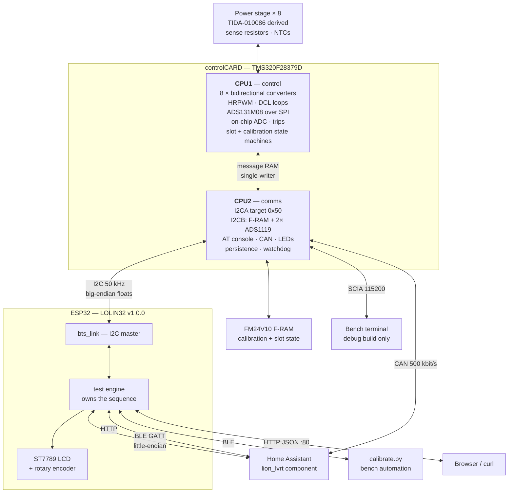

# Lion-IRVT

An eight-channel bidirectional battery test system (BTS) — charge and discharge,
constant-current and constant-voltage — for testing and characterising
18650-class lithium cells. The workspace file is `18650-Tester-Project.DsnWrk`;
that is what the instrument is for.

The power stage and control card derive from Texas Instruments reference design
**TIDA-010086**, a 10 A battery formation and test design that TI documents as
scalable to eight channels. Here it is built out to all eight, retargeted to the
**TMS320F28379D**, and split across both of its cores. An ESP32 sits on top as
host controller.

| Layer | Device | Job |
|---|---|---|
| Control | F28379D **CPU1** | Eight independent synchronous bidirectional converters. HRPWM, DCL control loops, external SPI ADC (ADS131M08), on-chip ADC, trip handling. |
| Communication | F28379D **CPU2** | I2C slave register file for the host, I2C master for F-RAM and the ADS1119 temperature converters, UART AT console, CAN telemetry, WS2812B status LEDs, calibration persistence. |
| Supervision | **ESP32** (LOLIN32 v1.0.0) | I2C master. Owns the test sequence and cell limits, integrates mAh/mWh, records results, and exposes BLE GATT, a JSON HTTP API and an ST7789 LCD with a rotary encoder. |

The current ESP32 firmware talks BLE and HTTP directly. **Home Assistant
support is now a custom component**, `Hardware/source/lion-lvrt-integration/`,
which speaks BLE, HTTP or CAN from the HA side — the tester itself carries no
MQTT or native-API client, and does not need one. The superseded ESPHome
`esp32-controller/` variant was the only firmware that ever reported to HA
directly.



The two C2000 cores share data through the message RAMs under a single-writer
rule: **CPU1 never writes the register file.** It publishes measurements into
`cpu1Status` under a seqlock and CPU2 mirrors them into `registers[]`. Every
data-flow decision in the firmware follows from that — including supervision:
CPU2 detects a watchdog timeout and reads the saved slot state at boot, but
**CPU1 performs every state change**, because CPU1 owns the control loop.

[`Docs/data-flow.md`](Hardware/source/Docs/data-flow.md) draws all of this —
the measurement path from shunt to phone, the command path back, calibration,
settings persistence and what each transport can actually control.

### Unattended-operation safety

The instrument charges lithium cells unattended, so three coupled mechanisms
decide what happens when something stops going right:

- **A 30 s host watchdog.** Any host command on any interface reloads it —
  including an I2C register *read*, which is what a polling host actually
  does. If nothing talks to the unit for 30 seconds, every running slot
  pauses with the converter off. It is a supervision timeout measured in
  seconds, **not** over-current protection.
- **A PAUSED slot state.** A paused slot keeps its direction and its six
  per-direction counters — mAh, mWh and elapsed seconds for each of charge and
  discharge — frozen but intact, and resumes exactly where it stopped. The
  status word says *why* it is paused, which is what decides whether resuming
  is safe.
- **F-RAM state persistence.** Each slot's run state and counters are saved
  every 6 s and restored at boot. A slot that was mid-run when the unit reset
  comes back **paused, with its counters, and refuses to resume on its own** —
  the cell may have been changed while the unit was off. That rule is
  deliberate and hardware-verified; do not script around it.

---

## Repository layout

| Path | Contents |
|---|---|
| `Design/` | Pre-layout analysis, not build inputs: TINA-TI simulations (`.TSC`) of the current loop and the synchronous buck, the inductor/LC selection spreadsheet, and vendor app notes. |
| `Hardware/schematics/` | Altium projects. `TIDA-010086/` is the modified TI reference design, `TIDA-010086_exTrip/` the added external trip logic, `Lion-IRVT/` the front-end and cell-holder sheets, `controlCARD/` the F28379D controlCARD reference. |
| `Hardware/mechanical/` | DXF/DWG for the 4-wire 18650 slot jig and the enclosure, plus laser-cut sheet layouts. |
| `Hardware/publish/` | A generated output set from Feb 2021 — Gerbers, drills, BOM, pick-and-place, assembly drawings, 3D/STEP. A snapshot, not regenerated on every change. |
| `Hardware/source/` | **All firmware.** See below. |
| `References/` | Component libraries, footprints, vendor 3D models and datasheets. **Entirely gitignored** (`References/*`) — the directory exists locally but nothing in it is tracked. Expect it to be empty on a fresh clone. |

Inside `Hardware/source/`:

| Path | Contents |
|---|---|
| `tida-010086/bts_F2837xD_8ch/` | The C2000 dual-core firmware. This is the instrument. |
| `esp32-btle-proxy/` | **Current** ESP32 host firmware (ESP-IDF). |
| `esp32-controller/` | Superseded ESPHome-based controller (2025), which reported to Home Assistant. |
| `esp32-bridge/` | Superseded Arduino WiFi bridge (2024). |
| `lion-lvrt-integration/` | **Home Assistant custom component**, plus a firmware-accurate simulator and its pytest suite. Speaks BLE, HTTP or CAN. |
| `Docs/` | The authoritative interface and calibration specifications. Start here. |
| `references/` | Datasheets and manuals used while writing the firmware: F2837xD TRM, controlCARD guide, ADS131M08, ADS1119, the LOLIN32 schematic, and the XTIDA-010086E3 schematic PDF. |
| `.claude/` | Agent skills and project notes. |

### Documents

`Hardware/source/Docs/` is source-verified and is the thing to read before the
code:

| File | What it is |
|---|---|
| [`README.md`](Hardware/source/Docs/README.md) | Operator bench procedure for slot calibration. Wiring, safety, step by step, troubleshooting. |
| [`api-specification.md`](Hardware/source/Docs/api-specification.md) | Part 1 the HTTP API; Part 2 the complete I2C register map — **267 registers in three regions** — with the transaction shapes, the supervision watchdog and the slot-state persistence contract. **The authority for any register address.** |
| [`ble-specification.md`](Hardware/source/Docs/ble-specification.md) | The full GATT service: 12 characteristics, packed layouts, notify behaviour, protocol versioning. |
| [`data-flow.md`](Hardware/source/Docs/data-flow.md) | **New.** How measurements, commands, settings and calibration move between CPU1, CPU2, the ESP32 and a host — as diagrams. Includes the dead measurement paths and the traps in the IPC decode. |
| [`supervision-and-state-design.md`](Hardware/source/Docs/supervision-and-state-design.md) | The design contract for the PAUSED state, the host watchdog and F-RAM state persistence. |
| [`calibration-design.md`](Hardware/source/Docs/calibration-design.md) | The calibration mathematics, opcodes, state machine and F-RAM layout. **Its register addresses predate the v2 map and are stale** — take addresses from `api-specification.md`. |
| [`calibration-flow.md`](Hardware/source/Docs/calibration-flow.md) | The calibration procedure and state machine as Mermaid flow, state and sequence diagrams. |
| [`hardware-resources.md`](Hardware/source/Docs/hardware-resources.md) | PIE vectors, ACK groups, XINT, X-BAR and ADC base allocation across both cores. The authority for interrupt resources. |

---

## The three ESP32 projects — build the right one

There are three, and only one is live.

| Directory | Added | Toolchain | Status |
|---|---|---|---|
| `esp32-bridge/` | Aug 2024 | Arduino `.ino` | **Superseded.** A WiFi/OSC bridge over a packet-oriented I2C protocol that predates the float register map. |
| `esp32-controller/` | Apr 2025 | ESPHome YAML + C++ components | **Superseded.** Built on ESPHome, so it surfaced the unit to **Home Assistant** as sensors, switches and selects - the only variant that ever did. Adds a HID barcode scanner and a `bts_i2c` component. Its I2C layer is wrong in two ways: `bytes_to_float()` assembles the float in host order under a comment asserting "BTS uses little-endian float", when the wire format is big-endian; and `read_register()` requests four bytes where five are needed, so it never discards the lead-in pad byte. Do not copy from it. |
| `esp32-btle-proxy/` | Sep 2026 | ESP-IDF v6.1 | **Current.** Everything else in this README refers to this one. |

The two superseded trees are retained for the pin assignments and the
barcode-scanner work, not as a starting point.

---

## Building

### C2000 firmware

TI Code Composer Studio, installed here at `C:/ti/ccs2101`. The dependency is
the **C2000Ware Digital Power SDK** (`C:/ti/c2000/C2000Ware_DigitalPower_SDK_5_03_00_00`)
for driverlib, DCL, the SFO HRPWM calibration library and SFRA.

Open the project `bts_F2837xD_8ch` from
`Hardware/source/tida-010086/bts_F2837xD_8ch`. It has **two build
configurations, `cpu1` and `cpu2`, and both must be built** — they compile the
same sources with `--define=CPU1` or `--define=CPU2` and link against different
`.cmd` files, producing `bts_F2837xD_8ch_cpu1.out` and `..._cpu2.out`.

- `cpu1` is the active configuration; CCS's own build tooling handles it, and
  inside CCS that is the only supported way to build it.
- `cpu2` is built from its generated `cpu2/makefile`, which the CCS build
  produced and which carries the full `--define=CPU2` command line.

After building, check the `.map` files. Every shared symbol must land at the
same address in both, and `CPU2TOCPU1RAM` must not overflow. There are
**eight** shared symbols: `registers`, `ipcMsg`, `calValidFlags`,
`supervision`, `canData`, `cpu1Status`, `startup_mode` and `startup_enable`.

The current tree builds clean on both cores, all eight symbols resolve
identically in the two map files, and `CPU2TOCPU1RAM` has **330 words free of
1024** after the settings compression. `CPU1TOCPU2RAM` has 516 free.

> **Both cores now have their own complete flash bank, and this was wrong
> before.** On the F2837xD each CPU has its *own* full bank, both mapped at the
> same addresses — 0x080000–0x0BFFFF is CPU1's flash when CPU1 fetches it and
> CPU2's when CPU2 does. Proved on hardware: 0x090000 returns real code on CPU1
> and `0xFFFF` on CPU2. The project previously split one bank between the cores
> (CPU1 = A–I, CPU2 = J–N) with CPU2's `codestart` at 0x0B0000, which wasted
> most of each core's flash and left **CPU2's boot-to-flash entry at 0x080000
> erased** — a standalone boot would have sent CPU2's boot ROM into an illegal
> opcode. Both linkers now name the full bank with `BEGIN` at 0x080000, as TI's
> reference linkers do.

> **Do not run code from a GSx RAM block on one core while the other can be
> flashed.** CCS programs flash by staging its algorithm in target RAM, and for
> a CPU2 `loadProgram` it stages in **RAMGS0**. The GSx blocks are shared
> silicon, so that overwrote CPU1's `ramfuncs` and dropped CPU1 into the
> illegal-operation handler the instant CPU2 was loaded — before CPU2 executed
> a single instruction. CPU1's ramfuncs now run from RAMLS0, which is per-core.
> Load order is no longer significant and both cores run together.

> **Loading both cores.** Starting a debug session loads only the active
> configuration (`cpu1`). CPU2 is left running whatever was in its memory, and
> because CPU2 owns I2CA, a CPU1-only reload leaves the ESP32 link dead while
> CPU1 looks perfectly healthy. Worse, the console and every clock-derived
> divisor on CPU2 stay built for the *previous* clock configuration — which is
> what produced the long-running "the AT console is at the wrong baud rate"
> false trail. **Rebuild and reload both cores after any clock change.**

Both configurations define `_FLASH` and boot from flash. The clock is a 20 MHz
crystal, ×18 /2 = **180 MHz SYSCLK**, LSPCLK 45 MHz; measured on hardware at
179.7 MHz by `BTS_HAL_getMeasuredSysclkKHz()`, which counts SYSCLK against
INTOSC1 on a timer pair rather than trusting a register read. Prefer it to any
JTAG register read or baud-rate inference — `ClkCfgRegs` reads all-zero on this
part while the core is running, and every earlier clock estimate that came
through the console baud rate shared a single confound.

### ESP32 firmware

ESP-IDF **v6.1**, target `esp32`, on the LOLIN32 v1.0.0 (ESP-WROOM-32, 4 MB).

**The stock `export.ps1` does not work on this machine.** It resolves `python`
from `PATH` and finds the system Anaconda 3.6 interpreter before the IDF venv.
`idf_env.ps1` sets the same variables directly, taken from the paths the
editor's ESP-IDF extension is configured with, and additionally sets
`ESP_IDF_VERSION`, which `idf_component_manager` reads unconditionally and
crashes on `None` if it is unset.

```powershell
cd Hardware\source\esp32-btle-proxy
. .\idf_env.ps1
idf.py build
idf.py -p COM6 flash monitor
```

Configuration lives in `sdkconfig.defaults`; regenerate `sdkconfig` from it
rather than hand-editing. The partition table is custom (`partitions.csv`):
dual OTA slots plus a second NVS partition for the result history, so filling
it with test records cannot displace the WiFi credentials or chemistry
overrides.

> This board has no auto-program circuit that works reliably. If `esptool`
> reports `Wrong boot mode detected (0x13)`, use the BOOT button, or see
> `tools/enter_download.py`.

---

## Tools

`Hardware/source/esp32-btle-proxy/tools/`.

> **Python on this machine:** the system `python` is **3.6** and too old for
> every script here. Use the IDF venv interpreter:
> `C:\Espressif\tools\python\v6.1\venv\Scripts\python.exe` (3.11).

### Bench automation

| Script | |
|---|---|
| **`calibrate.py`** | The significant one. Guided two-point slot calibration, walking slots 1–8 and prompting at each connection change. Drives the tester over **BLE** (`bleak`) and an Agilent/Keysight **DMM over LAN SCPI on TCP 5025** as the traceable reference. Refuses to advance until the live per-unit reading is inside the required window, prints a before/after gain table, and writes a JSON report. Config is prompted once and persisted to `calibrate.ini`. Flags: `--slots 3,5` or `--slots 2-4`, `--dry-run` (full flow against a simulated tester and DMM, **no hardware needed**), `--reconfigure`, `--report`, `--allow-unknown-dmm`. Every exit path — normal, Ctrl-C, or an unhandled exception — issues `CAL_CMD_EXIT`, so a slot is never left driving current. |

### BLE bring-up

| Script | |
|---|---|
| `ble_scan.py` | Scan and dump anything that looks like the tester. Confirms it is advertising before you try to connect. |
| `ble_verify.py` | Connect and verify the whole GATT interface against the packed structs in `ble_proto.h`, subscribing to both notify characteristics. Non-zero exit on failure, so it works as a bench smoke test. |

### Serial and flashing

These exist because the LOLIN32's reset circuit cannot reliably self-enter
download mode on this host. They are a diagnostic chain, roughly in the order
they were written, and each one's docstring records what the previous
established.

| Script | |
|---|---|
| `probe_reset.py` | Determines which DTR/RTS combination drives EN and IO0, by reading the ROM's own `boot:0x..` banner rather than guessing polarity. |
| `probe_io0.py` | Given that RTS drives EN, tests whether DTR reaches IO0 at all. |
| `probe_dtr_alone.py` | Characterises DTR on its own. |
| `sweep_reset.py` | Sweeps the EN-release / IO0-assert timing gap looking for a window that works. |
| `enter_download.py` | The result: drives DTR/RTS directly to enter download mode, after which `idf.py -p COM6 --before no-reset flash`. |
| `try_download_hard.py` | Last-resort strategies, each verified by a real esptool SYNC. |

### Code generation

| Script | |
|---|---|
| `gen_font.py` | Generates `components/display/ui_font.c`, the 5×7 UI font table. The output is committed; re-run only if the glyph set changes. |

---

## Interfaces

Five host interfaces. Register tables are **not** duplicated here — the
specifications are authoritative.

> **Endianness differs by interface and this is the detail most likely to cost
> you an afternoon.** The I2C register wire format is **big-endian** (the
> C2000's `floatGetWireByte()` emits the float MSB first). The BLE records are
> **little-endian**. HTTP carries JSON numbers, so no byte order applies. The
> conversion happens in `bts_regs.h`; nothing above `bts_link` sees the C2000's
> byte order.

| Interface | Where | Authority |
|---|---|---|
| **I2C register map** | C2000 CPU2 as target at `0x50` on I2CA (GPIO32/33); the ESP32 is master. **267 float registers in three regions** — runtime (base 0, stride 48 B, read-only), settings (base 384, stride 72 B), unit (960–1064). The two per-slot strides **differ** — always derive through the base macros. A slot's live data is one 12-register burst, which is why a poll cycle costs 9 transactions rather than the 33 it used to. A read must fetch `1 + count×4` bytes and **discard the first**: the target clocks out a stale byte before its ISR can run. The bus runs at 50 kHz. | [`api-specification.md`](Hardware/source/Docs/api-specification.md) Part 2 |
| **BLE GATT** | ESP32, NimBLE. One primary service `e5f10001-…`, **12 characteristics**, advertised as `BTS-Tester`. The 128-bit service UUID is in the **scan response**, not the advertising payload, because it will not fit alongside the name. `BLE_PROTO_VERSION` (currently **4**) is published so a client can refuse a firmware it cannot decode; v4 added the register-access characteristic `000d`, which is what lets a BLE client reach the C2000 mode register at all. Disconnecting does **not** abort running tests. | [`ble-specification.md`](Hardware/source/Docs/ble-specification.md) |
| **HTTP API** | ESP32, port 80, JSON, **no authentication and no encryption**. Unit and per-slot status, slot config and control, result history, the cell catalogue, raw register access for bring-up, and the calibration endpoints. WiFi comes up APSTA: stored station credentials are joined if present and the SoftAP stays up either way. | [`api-specification.md`](Hardware/source/Docs/api-specification.md) Part 1 |
| **UART AT console** | C2000 CPU2, SCIA on the controlCARD FTDI backchannel, **115200 8N1**. `AT+<name>?` and `AT+<name>=<value>` against short or long register names, plus `AT+C<n>PAUSE` / `AT+C<n>RESUME`. **Only available in the debug build** (`BTS_DEBUG_CONSOLE == true`): the console takes GPIO28/29, which in production carry the WS2812B LED string and channel 1's GPIO trip. A bare `AT` is ignored by design — probe with `AT+InputVoltage?`. | `.claude/skills/bts-c2000-interfaces-skill/references/uart-at-commands.md` |
| **CAN** | C2000 CPU2, CANA, 500 kbit/s, extended IDs from `0x1C000000`. Message objects 1–8 are per-channel telemetry; object 9 is a host register read/write. The telemetry frame carries voltage in full but **only the low word of the current float**, and no accumulators — read those through object 9. | [`data-flow.md`](Hardware/source/Docs/data-flow.md) §7 |

Data flow across all five, including what each one can actually control, is in
[`Docs/data-flow.md`](Hardware/source/Docs/data-flow.md).

---

## Calibration

Each slot's measurement error is calibrated out against a **traceable external
reference** — your DMM — at two points per quantity, replacing what used to be
compile-time constants in `bts_user_calibration.h` with per-slot runtime values
persisted to the on-board FM24V10 F-RAM and reloaded at every boot.

Both measurement paths are calibrated from the same physical stimulus at the
same instant: the 16-bit ADS131M08 and the 12-bit on-chip ADC. They therefore
agree with each other as well as with the meter.

Read [`Docs/README.md`](Hardware/source/Docs/README.md) before running it —
that is the operator procedure. The sequence and state machine are drawn in
[`Docs/calibration-flow.md`](Hardware/source/Docs/calibration-flow.md), where
the data goes in [`Docs/data-flow.md`](Hardware/source/Docs/data-flow.md) §5,
and the mathematics in
[`Docs/calibration-design.md`](Hardware/source/Docs/calibration-design.md)
(whose **register addresses are stale** — take those from the API
specification).

Two things belong here rather than only in the procedure:

> ### Hardware over-current protection is disabled in this build
>
> All eight hardware trips are `(false)` in `bts_user_settings.h:113-120`. The
> only over-current protection left is a software check that runs once per
> control pass — fast enough for a gradual overload, **not** fast enough for a
> genuine short. Calibration deliberately drives about 2.5 A.
>
> **Do not run calibration unattended, and set the bench supply's own current
> limit (3 A) before you start.** The supply's limit is your fast protection,
> because the unit's is not armed.

> **Enter the DMM current as a magnitude.** Calibration runs in discharge and
> the firmware applies the sign itself. Entering `-2.4991` where `2.4991` was
> wanted inverts that slot's current reading — it will look plausible, pass
> validation, and be wrong on every subsequent discharge.

---

## Home Assistant

`Hardware/source/lion-lvrt-integration/` is a custom component: eight slot
devices plus a unit device, with mode selects, start/stop/pause/resume buttons,
measurements, status binary sensors, configuration numbers and the BTS's own
per-direction counters. Services cover slot configuration, serial assignment,
mode, resume, calibration commands and result retrieval.

Copy `custom_components/lion_lvrt/` into your HA `config/custom_components/`
and restart, or add the repository to HACS. The tester advertises as
`BTS-Tester`, so HA discovers it automatically if a **connectable** Bluetooth
adapter or proxy is in range.

> **Choose the transport deliberately — it decides which controls appear.**
> There are two separate control surfaces. The **test engine** on the ESP32
> runs a whole characterisation and picks the direction itself; the **mode
> register** on the C2000 commands the converter directly. "Test this cell" is
> the first, "charge this slot" the second, and they are reached differently:
>
> | Transport | Test engine | Charge / discharge |
> |---|:---:|:---:|
> | Bluetooth | yes | only on `BLE_PROTO_VERSION` ≥ 4 |
> | HTTP | yes | yes |
> | CAN | no | yes |
>
> The register characteristic that makes charge and discharge reachable over
> BLE arrived in proto 4. Against older proxy firmware the integration hides
> those modes rather than offering an action that would fail — add the CAN
> interface or the HTTP address during setup (either one is enough) to get them
> back.

The `tests/` directory carries a firmware-accurate simulator and a pytest
suite, so the component can be exercised without hardware. Note that a dry run
cannot catch a **struct-layout** mismatch: the Python `struct` formats must be
verified against `ble_proto.h` by hand whenever the BLE records change.

---

## TODO and known limitations

Verified against the source, not aspirational. Split by whether it is a
decision or a gap.

### By design — do not "fix" these without reading why

- **The ESP32 owns the test sequence, not the BTS.** The C2000 regulates;
  termination, capacity integration, cell limits and state are the proxy's job.
  Two of the gaps below follow from this rather than being defects.
- **The build is CC-only.** `BTS_LAB_TYPE = BTS_LAB_CLOSED_LOOP_ACMC_IOUT`
  (`bts_user_settings.h:326`) selects `BTS_ISR_CL_MODE_CC`, which compiles out
  the CV loop and the CC-CV crossover in `bts.h` entirely. `voutRef_pu` is
  computed every millisecond and ignored. CV termination is done by the ESP32
  against measured cell voltage.
- **Calibration telemetry is unit-scoped, not per-slot.** Only one slot
  calibrates at a time; eight copies of the nine-register window would cost 144
  words of message RAM and buy nothing.
- **The ESP32 keeps its own coulomb counting even though the BTS now has
  accumulators.** `coulomb_counter.c` integrates against the actual elapsed
  time between polls, which is finer than the BTS's fixed 150 ms step, so it
  stays the reported figure. The BTS totals are read alongside it for
  comparison.
- **A restored slot is never auto-resumed.** After a reset, a slot that was
  running comes back `PAUSED` + `RESTORED` and waits for an explicit command,
  because the cell may have been swapped while the unit was off. Neither the
  firmware nor the proxy will resume it for you. This is the single most
  safety-critical rule in the supervision work.
- **CPU2 detects the watchdog timeout but does not act on it.** It bumps a
  counter in the `supervision` mailbox and CPU1 performs the pause. The
  single-writer rule covers control state, not just memory.
- **The F-RAM and the ADS1119s are serialised on I2CB, and deliberately so.**
  They share the bus with incompatible access styles — a non-blocking converter
  state machine that leaves a transfer in flight across service calls, and
  blocking F-RAM helpers that complete inside one. `i2cbFramBusy` grants the
  F-RAM the bus only while **both** converters are parked in `eAdsIdle` or
  `eAdsSettle`, and a save that cannot acquire stays pending and retries rather
  than being dropped. Removing the flag reproduces the original failure: both
  frames corrupted and the controller left holding SCL with nothing running to
  free it.
- **The per-slot limits live with the run state, not in the calibration
  image.** Calibration is measured once against a traceable reference;
  operating limits change whenever someone adjusts a charge current. Keeping
  them together meant rewriting the calibration block on every settings change.
- **Thermistor AIN indices are inverted to slots in firmware.** The hardware is
  wired `AIN3 → slot 1` on both converters. `ADS1119_SLOT_FOR_AIN()` corrects
  it at the publish call, so a console `ChN` is a **slot**, not an AIN.

### Resolved since the last revision

| | |
|---|---|
| ~~The AT console's baud rate is wrong, and the cause is unknown~~ | **Resolved — the console works at 115200.** It was never a hardware fault. The console is served by **CPU2**, whose `SCI_setConfig()` derives BRR from `DEVICE_LSPCLK_FREQ`; the clock config was edited repeatedly with only CPU1 rebuilt, so CPU2 kept a divisor built for the previous clock and the apparent baud moved every time. Every "independent" clock measurement came through that same console and shared the confound. SYSCLK measures **179.7 MHz** against a configured 180 MHz. A bare `AT` producing no reply is separate and **by design** — `uartRxISR()` matches only `"AT+"`. |
| ~~SYSCLK is running at 10 MHz, not 160~~ | **Never true.** Same confound as above. `BTS_HAL_getMeasuredSysclkKHz()` now measures the clock on-core against INTOSC1, and `BTS_HAL_setupDevice()` halts on a result outside ±5 %. A real defect was found on the way: `SysCtl_setClock()` returns false on a latched MCD **having touched no PLL register**, and `device.c` discarded the return value — a genuine silent 10 MHz failure mode with perfect-looking registers. MCD is now cleared before `Device_init()` and the return checked. |
| ~~The flash layout splits one bank between the cores~~ | **Fixed.** Each core's linker now names its own complete bank with `BEGIN` at 0x080000, as TI's reference linkers do. CPU2's boot-to-flash entry is no longer erased. |
| ~~A CPU2 load traps CPU1 in the illegal-operation handler~~ | **Fixed.** CCS stages its flash algorithm in **RAMGS0**, which is shared silicon, and it was overwriting CPU1's `ramfuncs`. CPU1's ramfuncs now run from RAMLS0, which is per-core. Load order is no longer significant. |
| ~~The ADS1119 temperature readings land on the wrong slot~~ | **Fixed.** The thermistors are wired in reverse on both converters — the highest AIN carries the lowest slot. `ADS1119_SLOT_FOR_AIN()` inverts the index at the publish call. Verified with a thermistor taped to the ESP32: it moved from `Ch3` to `Ch0`. |
| ~~Every F-RAM access fails while the converters read fine~~ | **Fixed.** The F-RAM and both ADS1119s share I2CB with incompatible access styles — a non-blocking converter state machine that leaves a transfer in flight, and blocking F-RAM helpers. The frames interleaved, both corrupted, and the controller was left holding SCL. `i2cbFramBusy` serialises them; a save that cannot acquire stays pending and retries rather than being lost. Verified: a global threshold survives a full CPU2 restart, and bus recoveries stayed at 0 through repeated 8-channel calibration writes. |
| ~~`INT_ADCB1` faults CPU1 into the unhandled-interrupt handler~~ | **Fixed** in `bts_hal.c`. |
| ~~The trip zones all trip EPWM1~~ | **Fixed.** |
| ~~The ESP32 mirror is one register short~~ | **Fixed** 2026-09-20, and brought across again with the 2026-09-22 settings compression. Both headers now agree on 267 registers, a 960 unit base and the 1032–1064 telemetry window. There is still **no build coupling**, so it can drift again. |
| ~~The mAh/mWh accumulators are never written~~ | **Live.** Six counters per slot — mAh, mWh and elapsed seconds for each direction — integrated on CPU1, contiguous in the runtime block, and **persisted to F-RAM across a reset**. Each direction's set is zeroed only when that direction starts. |
| ~~The per-run min/max voltage trackers are never written~~ | **Deleted from the map.** They were RO and never assigned — 16 registers of permanent 0.0. |
| ~~The BTS never signals end-of-test~~ | **Bit 2 is now driven.** `BTS_STATUS_END` is an alias for `BTS_STATUS_FINISHED` (bit 2) rather than a new bit. Cleared on start, pause and stop, and **restored from F-RAM at boot**. Wired end to end — but see below for what still does not assert it. |
| ~~There is no supervision timeout anywhere in the firmware~~ | **Closed.** A 30 s host watchdog, reloaded by any command on any interface including an I2C read, pauses every running slot if the host goes quiet. |

### Not yet implemented

| | |
|---|---|
| **Nothing asserts end-of-test yet.** | Status bit 2 is now driven and persisted, but no C2000 path sets it: termination remains the ESP32 engine's job, against its own `state == COMPLETE`. The bit is only ever observed non-zero across a boot restore. A future C2000-side termination will light it with no host change. |
| **No current-taper termination.** | `iref_cuttout_A` is loaded from `eChX_CurrentMin` and propagated across a slot group, then **never read**. CC-to-cutoff taper is done on the ESP32 against the configured `charge_term_c`. This is the missing half of the entry above. |
| **A spurious `WARNING: host watchdog DISABLED` on the AT console.** | Printed periodically even though `eHostWatchdog_s` reads 30.0 and the countdown is healthy. `hostWdDisableWarn` is set only where a write of `0.0` arrives at that register, and it reads 0 when sampled, so the trigger has not been identified. Cosmetic — supervision is verifiably armed — but alarming and wrong. Confirm with `AT+WD?`, which answers `+WD=30.00`. |
| **All hardware over-current trips are disabled.** | `BTS_TRIP_HW_CH1..8_ENABLED (false)`, `bts_user_settings.h:113-120`. Only the software check in `BTS_tripEpwm()` is active — one control pass, not one switching cycle. The trip links need wiring and the X-BAR routing needs fixing before these go back to `true`; `bts_hal.c` records exactly what is wrong with the current routing (the one-shot zones read TZ1/TZ2, not TRIPIN9–12, and INPUT15/16 do not exist on this device). |
| **`eTripStatus` (988) is always zero, and so is status bit 3.** | The bits are set only in `epwmTripISR()`, whose trip-zone interrupt is enabled per channel only when that channel's `BTS_TRIP_HW_CHn_ENABLED` is true. The software trip path sets the trip-zone flags itself and does not go through the ISR. **Do not use `eTripStatus` as a fault indicator against this firmware.** |
| **The ADS1119 state machine stalls after a JTAG load.** | After `loadProgram` + `continue` the state machine sits in `eAdsIdle` with `adsPending[]` at 0, even though the XINT counters still increment — edges reach the counter but the ISR does not run, and `PIEIFR1` never latches. A System Reset does not clear it; only a power cycle does. Poking `adsPending[unit]=1` drives a full correct acquisition, so only edge-to-ISR delivery is affected. **A flash-booted image is unaffected** — do not judge this path from a JTAG session. |
| **A cell temperature of 18.32 °C is not a measurement.** | `BTS_NTC_POLY_C0` is 18.323 and the Horner evaluation returns exactly C0 for a zero input, so 18.32–18.90 means an **open input**. `publishCellTemp(..., true)` is called unconditionally, so an all-zero transfer publishes the floor as if valid and `adsFailCount` stays 0. |
| **`bts_regs.h` is a hand-maintained mirror of `registers.h` with no build coupling.** | Adding a register means editing both, and they have drifted twice. Worse, the two files use the **same identifiers for different things**: `BTS_STATUS_*` and `BTS_CAL_ST_*` are bit *positions* on the C2000 and bit *masks* on the ESP32; the `BTS_RT_*`, `BTS_SET_*` and `BTS_CAL_*` offsets are register *indices* on one side and *byte* offsets on the other; and `BTS_RT_BASE` / `BTS_SET_BASE` are function-like macros returning an index on the C2000 and bare byte-address constants on the ESP32. `BTS_RT_STATUS` is `0` in both files, while `BTS_RT_CELL_VOLTAGE` is `1` on the C2000 and `4` on the ESP32. Copying a line between the files compiles and is wrong. |
| **There is no spare register left in any region.** | The 2026-09-22 compression spent the settings region's slack. A new per-slot field now means another stride change, which moves every address below it and breaks every host — the thing the generous strides were chosen to avoid. `CPU2TOCPU1RAM` is no longer the binding constraint (330 of 1024 words free); the map layout is. |
| **Every slot must be recalibrated, and the saved state was invalidated too.** | Both F-RAM headers were bumped: the calibration image `0xA5CC` → `0xA5CD` for the `calFlags`/`crc32` revision and the fixed 128-byte stride, and the slot-state record `0x5A5E` → `0x5A5F` for the 64-byte layout. The calibration change also fixed a collision in which channel 4's block overwrote the global voltage thresholds — which consequently had *never* persisted. The state change fixed a 20-word record running 8 bytes into the next slot's header, so that only slot 7 could ever validate. |
| **The C2000 and the ESP32 must be flashed together.** | The 2026-09-22 compression moved every settings and unit address. A mismatched pair reads plausible-looking garbage rather than failing loudly, because every address in this map is a valid float somewhere else in it. |
| **No mDNS.** | Nothing in the firmware registers a `.local` name. Use the IP address the device logs on connect (`idf.py monitor`). |

---

## Working on this codebase

`Hardware/source/CLAUDE.md` holds the agent guidelines — most importantly, that
`C:/ti/ccs2101/ccs/theia/resources/ai/CCS.md` must be read before touching any
CCS tooling, and that CCS projects are built through the project MCP server
rather than by invoking `gmake` directly.

`Hardware/source/.claude/skills/bts-c2000-interfaces-skill/` is the system
overview and the interface authority for the C2000 side: the IPC contract and
core responsibilities, the I2C specification, the UART AT command set and the
calibration EEPROM process. `.claude/README.md` alongside it is a
feature-by-feature summary of what the firmware implements.

Rules the whole firmware design rests on, and that are easy to break:

- **Never insert a register mid-map.** External hosts hard-code byte addresses.
  **There is no spare register left in any region** — the 2026-09-22 settings
  compression spent the slack — so any new field now means a stride change,
  which moves every address below it. Update the `registers.h` enum, the
  `NUM_*` counts, `TOTAL_REGISTERS`, `regConfig[]` and `uartRegConfig[]`
  **together** (the tables are sized by `TOTAL_REGISTERS` and must stay
  index-aligned), plus the ESP32 `bts_regs.h` mirror, which has no build
  coupling and has drifted twice.
- **The two per-slot regions have different strides**, 12 registers and 18.
  Always index through `BTS_RT_BASE(ch)` / `BTS_SET_BASE(ch)`. Mixing them
  produces silent cross-channel corruption rather than an error.
- **CPU1 does not decode every register it is sent.** `BTS_HandleRegisterWrite()`
  handles the settings region's mode register and calibration group, plus
  `eCalCommand`. Anything else — including `eCalibrationMode` and
  `eHostWatchdog_s` — has its IPC flag acked and is silently discarded, so a
  new register needs an explicit entry or it will be accepted by CPU2 and
  quietly ignored by CPU1. The decode is **by index range**, so it has to be
  re-derived every time the map moves.
- **Rebuild and reload both cores after any clock or register-map change.**
  Each core is a separate binary and CPU2 keeps whatever divisors and addresses
  it was last built with. A CPU1-only reload leaves a plausible-looking system
  that is lying to you — this is what produced the long "the console is at the
  wrong baud rate" and "SYSCLK is at 10 MHz" false trails, both of which came
  through a stale CPU2 binary.
- **Do not run code from a GSx RAM block on one core while the other can be
  flashed.** CCS stages its flash programming algorithm in target RAM, and for
  a CPU2 load it stages in RAMGS0 — shared silicon. LS blocks are per-core; GS
  blocks are not.
- **Do not halt CPU2 in the debugger mid-I2C-transaction.** The recovery for a
  wedged I2C target runs from CPU2's own idle loop, so stopping that core part
  way through a transfer leaves the target holding SCL with nothing running to
  clear it. The ESP32 link does not come back without a reload or a power
  cycle. A debugging artefact rather than a firmware fault, but it costs a
  bring-up session every time.
- **Do not judge a peripheral from a JTAG session alone.** Register reads over
  JTAG are stale and differ per core view — `ClkCfgRegs` reads all-zero on this
  part while the core is running, and the ADS1119 state machine stalls after a
  `loadProgram` in a way a flash boot never shows. Prove a path is live with a
  sentinel value and the AT console instead.

---

## Licence and provenance

Licensed under the **GNU General Public License v3** — see [`LICENSE`](LICENSE).

The power stage, control card and the original firmware derive from TI
reference design **TIDA-010086**, whose own firmware descends from the TI
`TIDM-DC-DC-BUCK` PowerSUITE example. TI's notice and disclaimer is retained
in `Hardware/schematics/TIDA-010086/`. The build-out to eight channels, the
split across both cores, the host interfaces and the runtime calibration are
this project's.
