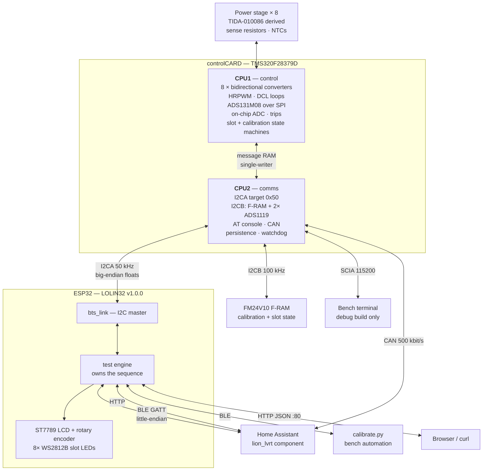

# Lion-IRVT

An eight-channel bidirectional battery test system (BTS) — charge and discharge,
constant-current and constant-voltage — for testing and characterising
18650-class lithium cells. The workspace file is `18650-Tester-Project.DsnWrk`;
that is what the instrument is for.

The power stage and control card derive from Texas Instruments reference design
**TIDA-010086**, a 10 A battery formation and test design that TI documents as
scalable to eight channels. Here it is built out to all eight, retargeted to the
**TMS320F28379D**, and split across both of its cores. An ESP32 sits on top as
host controller.

| Layer | Device | Job |
|---|---|---|
| Control | F28379D **CPU1** | Eight independent synchronous bidirectional converters. HRPWM, DCL control loops, external SPI ADC (ADS131M08), on-chip ADC, trip handling. |
| Communication | F28379D **CPU2** | I2C target register file for the host, I2C controller for F-RAM and the ADS1119 temperature converters, UART AT console (debug build), CAN telemetry, calibration and slot-state persistence. |
| Supervision | **ESP32** (LOLIN32 v1.0.0) | I2C controller. Owns the test sequence and cell limits, integrates mAh/mWh, records results, drives the eight WS2812B slot LEDs, and exposes BLE GATT, a JSON HTTP API with a setup page, WiFi firmware update, and an ST7789 LCD with a rotary encoder. |

## Status — 2026-10-08

What has run on hardware, as opposed to what compiles. One slot - slot 1 -
has been exercised; the other seven run the same firmware but have not been
driven yet.

| | |
|---|---|
| **Standalone boot** | Both cores boot from flash with the debugger unplugged; CPU1 starts CPU2 and confirms that CPU2's boot ROM took the command |
| **Charge** | 1 A into a short: 205 s, regulated at 1.00 A, 57.0 mAh, no trip |
| **Discharge** | 1 A from a 3.46 V supply: 206 s, 57.7 mAh. 100 mA: steady. No trip on enable |
| **Discharge termination** | `V_MIN` 0.5 V, supply wound down to 0 V: the slot ended in END (`FINISHED`), not as a trip |
| **F-RAM** | Calibration, slot state and the global thresholds load at boot with 0 read failures, and save with 0 failures |
| **Temperatures** | All eight slots read live from both ADS1119s |
| **ESP32** | BLE GATT, the setup page, saving WiFi credentials, and over-the-air update with rollback - verified on a bare ESP32 |
| **Home Assistant** | Installs from HACS; the HACS validator and hassfest pass on GitHub |

**Not yet verified on hardware:** charge termination and the CV loop (the
charge test ran into a short, which never leaves constant current); the
±9.5 A hardware trip *level* against a real over-current; slots 2–8 under
load; and an over-the-air update confirming itself on a live BTS link rather
than through its 180 s fallback. Details:
[`Docs/supervision-and-state-design.md`](Hardware/source/Docs/supervision-and-state-design.md)
§2.6 and [`Docs/README.md`](Hardware/source/Docs/README.md).

The current ESP32 firmware talks BLE and HTTP directly. **Home Assistant
support is now a custom component**, in its own repository
[ha-lion-irvt](https://github.com/ArakniD/ha-lion-irvt) and checked out here as
the submodule `Hardware/source/lion-lvrt-integration/`. It speaks BLE, HTTP or
CAN from the HA side — the tester itself carries no
MQTT or native-API client, and does not need one. The superseded ESPHome
`esp32-controller/` variant was the only firmware that ever reported to HA
directly.


```mermaid
flowchart TB
    subgraph CARD ["controlCARD — TMS320F28379D"]
        direction LR
        C1["<b>CPU1</b> — control<br/>8 × bidirectional converters<br/>HRPWM · DCL loops<br/>ADS131M08 over SPI<br/>on-chip ADC · trips<br/>slot + calibration state machines"]
        C2["<b>CPU2</b> — comms<br/>I2CA target 0x50<br/>I2CB: F-RAM + 2× ADS1119<br/>AT console · CAN<br/>persistence · watchdog"]
        C1 <-->|"message RAM<br/>single-writer"| C2
    end

    POWER["Power stage × 8<br/>TIDA-010086 derived<br/>sense resistors · NTCs"]
    FRAM["FM24V10 F-RAM<br/>calibration + slot state"]

    subgraph PROXY ["ESP32 — LOLIN32 v1.0.0"]
        LINK["bts_link — I2C master"]
        ENG["test engine<br/>owns the sequence"]
        UI["ST7789 LCD + rotary encoder<br/>8× WS2812B slot LEDs"]
    end

    HA["Home Assistant<br/>lion_lvrt component"]
    CLI["calibrate.py<br/>bench automation"]
    WEB["Browser / curl"]
    TERM["Bench terminal<br/>debug build only"]

    POWER <--> C1
    C2 <-->|"I2CB 100 kHz"| FRAM
    C2 <-->|"I2CA 50 kHz<br/>big-endian floats"| LINK
    LINK <--> ENG
    ENG --> UI

    ENG <-->|"BLE GATT<br/>little-endian"| HA
    ENG <-->|"BLE"| CLI
    ENG <-->|"HTTP JSON :80"| WEB
    ENG <-->|"HTTP"| HA
    C2 <-->|"CAN 500 kbit/s"| HA
    C2 <-->|"SCIA 115200"| TERM
```

The two C2000 cores share data through the message RAMs under a single-writer
rule: **CPU1 never writes the register file.** It publishes measurements into
`cpu1Status` under a seqlock and CPU2 mirrors them into `registers[]`. Every
data-flow decision in the firmware follows from that — including supervision:
CPU2 detects a watchdog timeout and reads the saved slot state at boot, but
**CPU1 performs every state change**, because CPU1 owns the control loop.

[`Docs/data-flow.md`](Hardware/source/Docs/data-flow.md) draws all of this —
the measurement path from shunt to phone, the command path back, calibration,
settings persistence and what each transport can actually control.

### Unattended-operation safety

The instrument charges lithium cells unattended, so three coupled mechanisms
decide what happens when something stops going right:

- **A 30 s host watchdog.** Any host command on any interface reloads it —
  including an I2C register *read*, which is what a polling host actually
  does. If nothing talks to the unit for 30 seconds, every running slot
  pauses with the converter off. It is a supervision timeout measured in
  seconds, **not** over-current protection.
- **A PAUSED slot state.** A paused slot keeps its direction and its six
  per-direction counters — mAh, mWh and elapsed seconds for each of charge and
  discharge — frozen but intact, and resumes exactly where it stopped. The
  status word says *why* it is paused, which is what decides whether resuming
  is safe.
- **F-RAM state persistence.** Each slot's run state and counters are saved
  every 6 s and restored at boot. A slot that was mid-run when the unit reset
  comes back **paused, with its counters, and refuses to resume on its own** —
  the cell may have been changed while the unit was off. That rule is
  deliberate and hardware-verified; do not script around it.

---

## Repository layout

| Path | Contents |
|---|---|
| `Design/` | Pre-layout analysis, not build inputs: TINA-TI simulations (`.TSC`) of the current loop and the synchronous buck, the inductor/LC selection spreadsheet, and vendor app notes. |
| `Hardware/schematics/` | Altium projects. `TIDA-010086/` is the modified TI reference design, `TIDA-010086_exTrip/` the added external trip logic, `Lion-IRVT/` the front-end and cell-holder sheets, `controlCARD/` the F28379D controlCARD reference. |
| `Hardware/mechanical/` | DXF/DWG for the 4-wire 18650 slot jig and the enclosure, plus laser-cut sheet layouts. |
| `Hardware/publish/` | A generated output set from Feb 2021 — Gerbers, drills, BOM, pick-and-place, assembly drawings, 3D/STEP. A snapshot, not regenerated on every change. |
| `Hardware/source/` | **All firmware.** See below. |
| `References/` | Component libraries, footprints, vendor 3D models and datasheets. **Entirely gitignored** (`References/*`) — the directory exists locally but nothing in it is tracked. Expect it to be empty on a fresh clone. |

Inside `Hardware/source/`:

| Path | Contents |
|---|---|
| `tida-010086/bts_F2837xD_8ch/` | The C2000 dual-core firmware. This is the instrument. |
| `esp32-btle-proxy/` | **Current** ESP32 host firmware (ESP-IDF). |
| `esp32-controller/` | Superseded ESPHome-based controller (2025), which reported to Home Assistant. |
| `esp32-bridge/` | Superseded Arduino WiFi bridge (2024). |
| `lion-lvrt-integration/` | **Home Assistant custom component** — a git **submodule**, [ha-lion-irvt](https://github.com/ArakniD/ha-lion-irvt). Plus a firmware-accurate simulator and its pytest suite. Speaks BLE, HTTP or CAN. |
| `Docs/` | The authoritative interface and calibration specifications. Start here. |
| `references/` | Datasheets and manuals used while writing the firmware: F2837xD TRM, controlCARD guide, ADS131M08, ADS1119, the LOLIN32 schematic, and the XTIDA-010086E3 schematic PDF. |
| `.claude/` | Agent skills and project notes. |

### Documents

`Hardware/source/Docs/` is source-verified and is the thing to read before the
code:

| File | What it is |
|---|---|
| [`README.md`](Hardware/source/Docs/README.md) | Operator bench procedure for slot calibration. Wiring, safety, step by step, troubleshooting. |
| [`api-specification.md`](Hardware/source/Docs/api-specification.md) | Part 1 the HTTP API; Part 2 the complete I2C register map — **280 registers in four regions** — with the transaction shapes, the supervision watchdog and the slot-state persistence contract. **The authority for any register address.** |
| [`ble-specification.md`](Hardware/source/Docs/ble-specification.md) | The full GATT service: 12 characteristics, packed layouts, notify behaviour, protocol versioning. |
| [`data-flow.md`](Hardware/source/Docs/data-flow.md) | **New.** How measurements, commands, settings and calibration move between CPU1, CPU2, the ESP32 and a host — as diagrams. Includes the dead measurement paths and the traps in the IPC decode. |
| [`supervision-and-state-design.md`](Hardware/source/Docs/supervision-and-state-design.md) | The design contract for the PAUSED state, the host watchdog and F-RAM state persistence. |
| [`calibration-design.md`](Hardware/source/Docs/calibration-design.md) | The calibration mathematics, opcodes, state machine and F-RAM layout. A design document: its addresses track the v2.1 map, but where the two disagree **`api-specification.md` §2.8 is the authority**. |
| [`calibration-flow.md`](Hardware/source/Docs/calibration-flow.md) | The calibration procedure and state machine as Mermaid flow, state and sequence diagrams. |
| [`hardware-resources.md`](Hardware/source/Docs/hardware-resources.md) | PIE vectors, ACK groups, XINT, X-BAR and ADC base allocation across both cores, and the two I2C buses (§10). The authority for interrupt resources and bus speeds. |

---

## The three ESP32 projects — build the right one

There are three, and only one is live.

| Directory | Added | Toolchain | Status |
|---|---|---|---|
| `esp32-bridge/` | Aug 2024 | Arduino `.ino` | **Superseded.** A WiFi/OSC bridge over a packet-oriented I2C protocol that predates the float register map. |
| `esp32-controller/` | Apr 2025 | ESPHome YAML + C++ components | **Superseded.** Built on ESPHome, so it surfaced the unit to **Home Assistant** as sensors, switches and selects - the only variant that ever did. Adds a HID barcode scanner and a `bts_i2c` component. Its I2C layer is wrong in two ways: `bytes_to_float()` assembles the float in host order under a comment asserting "BTS uses little-endian float", when the wire format is big-endian; and `read_register()` requests four bytes where five are needed, so it never discards the lead-in pad byte. Do not copy from it. |
| `esp32-btle-proxy/` | Sep 2026 | ESP-IDF v6.1 | **Current.** Everything else in this README refers to this one. |

The two superseded trees are retained for the pin assignments and the
barcode-scanner work, not as a starting point.

---

## Building

Clone with the submodule, or the Home Assistant integration directory is
empty:

```bash
git clone --recurse-submodules https://github.com/ArakniD/Lion-IRVT.git
# or, in an existing clone:
git submodule update --init
```

### C2000 firmware

TI Code Composer Studio, installed here at `C:/ti/ccs2101`. The dependency is
the **C2000Ware Digital Power SDK** (`C:/ti/c2000/C2000Ware_DigitalPower_SDK_5_03_00_00`)
for driverlib, DCL, the SFO HRPWM calibration library and SFRA.

Open the project `bts_F2837xD_8ch` from
`Hardware/source/tida-010086/bts_F2837xD_8ch`. It has **two build
configurations, `cpu1` and `cpu2`, and both must be built** — they compile the
same sources with `--define=CPU1` or `--define=CPU2` and link against different
`.cmd` files, producing `bts_F2837xD_8ch_cpu1.out` and `..._cpu2.out`.

- `cpu1` is the active configuration; CCS's own build tooling handles it, and
  inside CCS that is the only supported way to build it.
- `cpu2` is built from its generated `cpu2/makefile`, which the CCS build
  produced and which carries the full `--define=CPU2` command line.

After building, check the `.map` files. Every shared symbol must land at the
same address in both, and `CPU2TOCPU1RAM` must not overflow. There are
**eight** shared symbols: `registers`, `ipcMsg`, `calValidFlags`,
`supervision`, `canData`, `cpu1Status`, `startup_mode` and `startup_enable`.

The current tree builds clean on both cores, all eight symbols resolve
identically in the two map files, and `CPU2TOCPU1RAM` has **304 words free of
1024** (`0x2D0` used). `CPU1TOCPU2RAM` has 516 free.

> **Both cores now have their own complete flash bank, and this was wrong
> before.** On the F2837xD each CPU has its *own* full bank, both mapped at the
> same addresses — 0x080000–0x0BFFFF is CPU1's flash when CPU1 fetches it and
> CPU2's when CPU2 does. Proved on hardware: 0x090000 returns real code on CPU1
> and `0xFFFF` on CPU2. The project previously split one bank between the cores
> (CPU1 = A–I, CPU2 = J–N) with CPU2's `codestart` at 0x0B0000, which wasted
> most of each core's flash and left **CPU2's boot-to-flash entry at 0x080000
> erased** — a standalone boot would have sent CPU2's boot ROM into an illegal
> opcode. Both linkers now name the full bank with `BEGIN` at 0x080000, as TI's
> reference linkers do.

> **Do not run code from a GSx RAM block on one core while the other can be
> flashed.** CCS programs flash by staging its algorithm in target RAM, and for
> a CPU2 `loadProgram` it stages in **RAMGS0**. The GSx blocks are shared
> silicon, so that overwrote CPU1's `ramfuncs` and dropped CPU1 into the
> illegal-operation handler the instant CPU2 was loaded — before CPU2 executed
> a single instruction. CPU1's ramfuncs now run from RAMLS0, which is per-core.
> Load order is no longer significant and both cores run together.

> **Loading both cores.** Starting a debug session loads only the active
> configuration (`cpu1`). CPU2 is left running whatever was in its memory, and
> because CPU2 owns I2CA, a CPU1-only reload leaves the ESP32 link dead while
> CPU1 looks perfectly healthy. Worse, the console and every clock-derived
> divisor on CPU2 stay built for the *previous* clock configuration — which is
> what produced the long-running "the AT console is at the wrong baud rate"
> false trail. **Rebuild and reload both cores after any clock change.**

Both configurations define `_FLASH` and boot from flash. The clock is a 20 MHz
crystal, ×18 /2 = **180 MHz SYSCLK**, LSPCLK 45 MHz; measured on hardware at
179.7 MHz by `BTS_HAL_getMeasuredSysclkKHz()`, which counts SYSCLK against
INTOSC1 on a timer pair rather than trusting a register read. Prefer it to any
JTAG register read or baud-rate inference — `ClkCfgRegs` reads all-zero on this
part while the core is running, and every earlier clock estimate that came
through the console baud rate shared a single confound.

### ESP32 firmware

ESP-IDF **v6.1**, target `esp32`, on the LOLIN32 v1.0.0 (ESP-WROOM-32, 4 MB).

**The stock `export.ps1` does not work on this machine.** It resolves `python`
from `PATH` and finds the system Anaconda 3.6 interpreter before the IDF venv.
`idf_env.ps1` sets the same variables directly, taken from the paths the
editor's ESP-IDF extension is configured with, and additionally sets
`ESP_IDF_VERSION`, which `idf_component_manager` reads unconditionally and
crashes on `None` if it is unset.

```powershell
cd Hardware\source\esp32-btle-proxy
. .\idf_env.ps1
idf.py build
idf.py -p COM6 flash monitor
```

Configuration lives in `sdkconfig.defaults`; regenerate `sdkconfig` from it
rather than hand-editing. The partition table is custom (`partitions.csv`):
dual OTA slots plus a second NVS partition for the result history, so filling
it with test records cannot displace the WiFi credentials or chemistry
overrides.

> This board has no auto-program circuit that works reliably. If `esptool`
> reports `Wrong boot mode detected (0x13)`, use the BOOT button, or see
> `tools/enter_download.py`.

**After the first USB flash, update over WiFi.** Upload
`build/bts_btle_proxy.bin` from the setup page at `http://<tester>/`, or post
it to `/api/ota` with `curl --data-binary` and an `X-OTA-Key` header. The new
image is on trial until the BTS link answers a register poll, and rolls back
by itself if it is rebooted before then. The **first** flash of any board
must be a full USB flash, because rollback lives in the bootloader. See the
[ESP32 README](Hardware/source/esp32-btle-proxy/README.md#firmware-update-over-wifi).

---

## Tools

`Hardware/source/esp32-btle-proxy/tools/`.

> **Python on this machine:** the system `python` is **3.6** and too old for
> every script here. Use the IDF venv interpreter:
> `C:\Espressif\tools\python\v6.1\venv\Scripts\python.exe` (3.11).

### Bench automation

| Script | |
|---|---|
| **`calibrate.py`** | The significant one. Guided two-point slot calibration, walking slots 1–8 and prompting at each connection change. Drives the tester over **BLE** (`bleak`) and an Agilent/Keysight **DMM over LAN SCPI on TCP 5025** as the traceable reference. Refuses to advance until the live per-unit reading is inside the required window, prints a before/after gain table, and writes a JSON report. Config is prompted once and persisted to `calibrate.ini`. Flags: `--slots 3,5` or `--slots 2-4`, `--dry-run` (full flow against a simulated tester and DMM, **no hardware needed**), `--reconfigure`, `--report`, `--allow-unknown-dmm`. Every exit path — normal, Ctrl-C, or an unhandled exception — issues `CAL_CMD_EXIT`, so a slot is never left driving current. |

### BLE bring-up

| Script | |
|---|---|
| `ble_scan.py` | Scan and dump anything that looks like the tester. Confirms it is advertising before you try to connect. |
| `ble_verify.py` | Connect and verify the whole GATT interface against the packed structs in `ble_proto.h`, subscribing to both notify characteristics. Non-zero exit on failure, so it works as a bench smoke test. |

### Serial and flashing

These exist because the LOLIN32's reset circuit cannot reliably self-enter
download mode on this host. They are a diagnostic chain, roughly in the order
they were written, and each one's docstring records what the previous
established.

| Script | |
|---|---|
| `probe_reset.py` | Determines which DTR/RTS combination drives EN and IO0, by reading the ROM's own `boot:0x..` banner rather than guessing polarity. |
| `probe_io0.py` | Given that RTS drives EN, tests whether DTR reaches IO0 at all. |
| `probe_dtr_alone.py` | Characterises DTR on its own. |
| `sweep_reset.py` | Sweeps the EN-release / IO0-assert timing gap looking for a window that works. |
| `enter_download.py` | The result: drives DTR/RTS directly to enter download mode, after which `idf.py -p COM6 --before no-reset flash`. |
| `try_download_hard.py` | Last-resort strategies, each verified by a real esptool SYNC. |

### Code generation

| Script | |
|---|---|
| `gen_font.py` | Generates `components/display/ui_font.c`, the 5×7 UI font table. The output is committed; re-run only if the glyph set changes. |

---

## Interfaces

Five host interfaces. Register tables are **not** duplicated here — the
specifications are authoritative.

> **Endianness differs by interface and this is the detail most likely to cost
> you an afternoon.** The I2C register wire format is **big-endian** (the
> C2000's `floatGetWireByte()` emits the float MSB first). The BLE records are
> **little-endian**. HTTP carries JSON numbers, so no byte order applies. The
> conversion happens in `bts_regs.h`; nothing above `bts_link` sees the C2000's
> byte order.

| Interface | Where | Authority |
|---|---|---|
| **I2C register map** | C2000 CPU2 as target at `0x50` on I2CA (GPIO32/33); the ESP32 is master. **280 float registers in four regions** — runtime (base 0, stride 48 B, read-only), settings (base 384, stride 72 B), unit (960–1064) and slot tuning (1068–1116, the DCL biquad coefficients, one set for the whole unit). The map tops out at **1116**, not at the end of the unit block. The two per-slot strides **differ** — always derive through the base macros. A slot's live data is one 12-register burst, which is why a poll cycle costs 9 transactions rather than the 33 it used to. A read must fetch `1 + count×4` bytes and **discard the first**: the target clocks out a stale byte before its ISR can run. The bus runs at **50 kHz** — see [Hardware notes](#hardware-notes). | [`api-specification.md`](Hardware/source/Docs/api-specification.md) Part 2 |
| **BLE GATT** | ESP32, NimBLE. One primary service `e5f10001-…`, **12 characteristics**, advertised as `BTS-Tester`. The 128-bit service UUID is in the **scan response**, not the advertising payload, because it will not fit alongside the name. `BLE_PROTO_VERSION` (currently **7**) is published so a client can refuse a firmware it cannot decode. The interface is **append-only**, so a newer firmware only adds characteristics and appends fields: v4 added the register-access characteristic `000d`, which is what lets a BLE client reach the C2000 mode register at all, and v7 appended the pre-charge balance flags to the slot record. Disconnecting does **not** abort running tests. | [`ble-specification.md`](Hardware/source/Docs/ble-specification.md) |
| **HTTP API** | ESP32, port 80, JSON, **no authentication and no encryption**, except a key on firmware upload. A setup page at `/` (live unit state, WiFi credentials, firmware update), unit and per-slot status, slot config and control, result history, the cell catalogue, raw register access for bring-up, and the calibration endpoints. WiFi comes up APSTA: saved station credentials are joined if present and the `BTS-Tester` SoftAP stays up either way. | [`api-specification.md`](Hardware/source/Docs/api-specification.md) Part 1 |
| **UART AT console** | C2000 CPU2, SCIA on the controlCARD FTDI backchannel, **115200 8N1**. `AT+<name>?` and `AT+<name>=<value>` against short or long register names, plus `AT+C<n>PAUSE` / `AT+C<n>RESUME`. **Only available in the debug build** (`BTS_DEBUG_CONSOLE == true`; it is `false` today). The production build leaves GPIO28/29 idle — the WS2812B string that used to share GPIO29 is driven by the ESP32 now. The ESP32 runs an AT console of its own on its USB port, which proxies the same commands to the unit. A bare `AT` is ignored by design — probe with `AT+InputVoltage?`. | `.claude/skills/bts-c2000-interfaces-skill/references/uart-at-commands.md` |
| **CAN** | C2000 CPU2, CANA, 500 kbit/s, extended IDs from `0x1C000000`. Message objects 1–8 are per-channel telemetry; object 9 is a host register read/write. The telemetry frame carries voltage in full but **only the low word of the current float**, and no accumulators — read those through object 9. | [`data-flow.md`](Hardware/source/Docs/data-flow.md) §7 |

Data flow across all five, including what each one can actually control, is in
[`Docs/data-flow.md`](Hardware/source/Docs/data-flow.md).

---

## Hardware notes

### The two I2C buses

Both buses have only **10 kΩ pull-ups** on the board, and that decides their
speed. The rise time of an RC pull-up is about 0.85 × R × C: with 10 k that is
424 ns at an optimistic 50 pF and 847 ns at 100 pF. **Fast mode (400 kHz)
allows 300 ns**, so at 400 kHz both buses are out of spec at any real
capacitance. **Standard mode (100 kHz) allows 1000 ns**, which 10 k meets up to
about 118 pF. Running faster needs ~2.2 kΩ pull-ups — and nothing here needs
the bandwidth.

| | Host bus (I2CA) | Peripheral bus (I2CB) |
|---|---|---|
| **C2000 pins** | GPIO32 SDA, GPIO33 SCL — target | GPIO40 SDA, GPIO41 SCL — controller |
| **Devices** | the C2000 at **0x50** | FM24V10 F-RAM **0x50**, ADS1119 **0x40** (slots 1–4) and **0x41** (slots 5–8) |
| **Clocked by** | the ESP32 (GPIO21 SDA, GPIO22 SCL) | the C2000 |
| **Speed** | **50 kHz** | **100 kHz** |
| **Why that speed** | Runs over a ribbon to the ESP32, and the C2000's target ISR does real work per byte | The pull-ups — see above |
| **Pull-ups** | 10 k on the board, plus the ESP32's internal pull-ups | 10 k on the board |

**I2CB was at 400 kHz until 2026-10-08.** It produced about 327 F-RAM save
failures and roughly one ADS1119 bus stall a second; at 100 kHz both are 0.
The poll bounds in `com_cpu2.c` were raised 4× at the same time, so a slower
but healthy transfer cannot trip them (`BTS_I2C_TIMEOUT_ITERATIONS`). The
longest transfer on the bus — a 162-byte calibration record — takes ~15 ms and
happens once, at boot.

**Neither bus can be faster than it is without a hardware change.** If the
pull-ups are ever reduced, the full reasoning and the measurements are in
[`hardware-resources.md` §10](Hardware/source/Docs/hardware-resources.md#10-i2c-buses).

What protects each bus from a stuck transfer:

- **I2CB** — every transfer records who started it, which device, how far it
  got and how it ended. The first failure is frozen in `i2cbFaultSnap`, and
  `i2cbHist[]` holds the last 16. A held bus is freed by clocking SCL nine
  times (the standard recovery) and resetting the module. `i2cbFramBusy`
  keeps the F-RAM and the ADS1119s from interleaving.
- **I2CA** — the C2000 resets its target if the bus sits busy with no address
  match for too long (`serviceI2CTargetWatchdog()`). The ESP32 resets its own
  controller after any failed transfer.
- **Never halt CPU2 in the debugger mid-transfer.** It leaves the host bus
  wedged with SCL held low, and the recovery runs on the core you halted.

### Boot

- **SW1 off = boot from flash** (the boot-mode switch on the controlCARD).
  When programming, load CPU1 first, then CPU2: loading CPU1 resets CPU2.
- **A cold power-up with the XDS100 attached will not boot.** A powered probe
  holds TRSTn high, so the boot ROM takes the emulation path and ignores SW1.
  Unplug the probe for a standalone boot.
- CPU1 starts CPU2 itself and waits a bounded time for CPU2's boot ROM to
  acknowledge, resending the command if it does not. CPU1's control tasks,
  supervision and trip arming run even if CPU2 never comes up.

### Straps

MODE and ENABLE are DIP switches read once at power-on, through an SN74HC148
priority encoder. **DIP switch *n* selects setting *n* − 1**: DIP 1 is 0, DIP 8
is 7. Turn on **one switch at a time** — with more than one on, the encoder
reports only one of them.

**All switches off reads the same as DIP 4, which is setting 3.** The encoder
outputs the same code for "no switch on" as for its input 0, which is where
DIP 4 is wired, and the board does not bring out the GS pin that would tell
them apart. So an unstrapped board comes up in MODE 3 (one group of eight)
with ENABLE 3 (slots 1–4) — a part-populated group that cannot run a test.
Always set both straps.

| DIP switch on | 1 | 2 | 3 | 4 or none | 5 | 6 | 7 | 8 |
|---|---|---|---|---|---|---|---|---|
| **Setting** | 0 | 1 | 2 | 3 | 4 | 5 | 6 | 7 |

The switches are not wired to the encoder in order — DIP 1–4 reach its inputs
3–0, DIP 5–8 its inputs 4–7 — and `truth_table[]` in `bts_hal.c` maps them
back. The full derivation is in [`hardware-resources.md` §11](Hardware/source/Docs/hardware-resources.md#11-mode-and-enable-straps).
Check a setting against what the unit reports (`slot_mode` and
`slots_enabled` in `GET /api/status`, or `AT+SMD?` and `AT+SEN?` on the
ESP32's console) rather than trusting the switch position.

- **MODE** sets the grouping: 0 = eight independent slots, 1 = pairs,
  2 = quads, 3 = all eight as one group; 4 and 5 are 0 and 1 with the voltage
  loop on the C2000's internal ADC; 6 and 7 run an SFRA loop sweep on one
  slot instead of a test.
- **ENABLE** is the index of the **highest enabled slot**: 0 enables slot 1
  alone, 7 enables all eight.

So **all slots, independent** is MODE DIP 1 and ENABLE DIP 8. **Slot 1
alone** is MODE DIP 1 and ENABLE DIP 1.

### Which comparator watches which slot

Each slot's hardware over-current trip (±9.5 A) is a CMPSS comparator on the
pin its current-sense net reaches. The device fixes each comparator's pins and
the board routes the sense nets for layout, so **slot *n* is not `CMPSSn`**:

| Slot | Current sense | Device pin | Comparator | Voltage sense | Device pin |
|---|---|---|---|---|---|
| 1 | `IoutS1` | `ADCINA2` | **CMPSS1** | `VoutS1` | `ADCINA3` |
| 2 | `IoutS2` | `ADCINB2` | **CMPSS3** | `VoutS2` | `ADCINB3` |
| 3 | `IoutS3` | `ADCINA4` | **CMPSS2** | `VoutS3` | `ADCINA5` |
| 4 | `IoutS4` | `ADCIN14` | **CMPSS4** | `VoutS4` | `ADCIN15` |
| 5 | `IoutS5` | `ADCIND0` | **CMPSS7** | `VoutS5` | `ADCIND1` |
| 6 | `IoutS6` | `ADCINC2` | **CMPSS6** | `VoutS6` | `ADCINC3` |
| 7 | `IoutS7` | `ADCIND2` | **CMPSS8** | `VoutS7` | `ADCIND3` |
| 8 | `IoutS8` | `ADCINC4` | **CMPSS5** | `VoutS8` | `ADCINC5` |

The voltage pin is the same comparator's negative input and is not used by
it: both comparators compare against their internal DAC. The binding is
`BTS_TRP_CMPSS_CH1..8` in `bts_user_settings.h`. The full table, with each
net's 0-ohm link, `J5` pin, comparator input and ADC SOC, is in
[`hardware-resources.md` §5.0](Hardware/source/Docs/hardware-resources.md#50-which-comparator-watches-which-slot).

---

## Calibration

Each slot's measurement error is calibrated out against a **traceable external
reference** — your DMM — at two points per quantity, replacing what used to be
compile-time constants in `bts_user_calibration.h` with per-slot runtime values
persisted to the on-board FM24V10 F-RAM and reloaded at every boot.

Both measurement paths are calibrated from the same physical stimulus at the
same instant: the 16-bit ADS131M08 and the 12-bit on-chip ADC. They therefore
agree with each other as well as with the meter.

Read [`Docs/README.md`](Hardware/source/Docs/README.md) before running it —
that is the operator procedure. The sequence and state machine are drawn in
[`Docs/calibration-flow.md`](Hardware/source/Docs/calibration-flow.md), where
the data goes in [`Docs/data-flow.md`](Hardware/source/Docs/data-flow.md) §5,
and the mathematics in
[`Docs/calibration-design.md`](Hardware/source/Docs/calibration-design.md)
(a design document — where it and the API specification disagree on an
address, **the API specification wins**).

Two things belong here rather than only in the procedure:

> ### Hardware over-current protection is disabled in this build
>
> All eight hardware trips are `(false)` in `bts_user_settings.h:113-120`. The
> only over-current protection left is a software check that runs once per
> control pass — fast enough for a gradual overload, **not** fast enough for a
> genuine short. Calibration deliberately drives about 2.5 A.
>
> **Do not run calibration unattended, and set the bench supply's own current
> limit (3 A) before you start.** The supply's limit is your fast protection,
> because the unit's is not armed.

> **Enter the DMM current as a magnitude.** Calibration runs in discharge and
> the firmware applies the sign itself. Entering `-2.4991` where `2.4991` was
> wanted inverts that slot's current reading — it will look plausible, pass
> validation, and be wrong on every subsequent discharge.

---

## Home Assistant

The integration lives in its own repository,
[ha-lion-irvt](https://github.com/ArakniD/ha-lion-irvt), so it can be installed
through HACS without the firmware. It is checked out here as the submodule
`Hardware/source/lion-lvrt-integration/`, at the same path as before, so its
test suite finds the firmware's C headers beside it and checks every wire
layout against them.

To change it: commit inside the submodule and push to ha-lion-irvt, then commit
the new submodule pointer here.

It is a custom component: eight slot
devices plus a unit device, with mode selects, start/stop/pause/resume buttons,
measurements, status binary sensors, configuration numbers and the BTS's own
per-direction counters. Services cover slot configuration, serial assignment,
mode, resume, calibration commands and result retrieval.

Copy `custom_components/lion_lvrt/` into your HA `config/custom_components/`
and restart, or add the repository to HACS. The tester advertises as
`BTS-Tester`, so HA discovers it automatically if a **connectable** Bluetooth
adapter or proxy is in range.

> **Choose the transport deliberately — it decides which controls appear.**
> There are two separate control surfaces. The **test engine** on the ESP32
> runs a whole characterisation and picks the direction itself; the **mode
> register** on the C2000 commands the converter directly. "Test this cell" is
> the first, "charge this slot" the second, and they are reached differently:
>
> | Transport | Test engine | Charge / discharge |
> |---|:---:|:---:|
> | Bluetooth | yes | only on `BLE_PROTO_VERSION` ≥ 4 |
> | HTTP | yes | yes |
> | CAN | no | yes |
>
> The register characteristic that makes charge and discharge reachable over
> BLE arrived in proto 4. Against older proxy firmware the integration hides
> those modes rather than offering an action that would fail — add the CAN
> interface or the HTTP address during setup (either one is enough) to get them
> back.

The `tests/` directory carries a firmware-accurate simulator and a pytest
suite, so the component can be exercised without hardware. Note that a dry run
cannot catch a **struct-layout** mismatch: the Python `struct` formats must be
verified against `ble_proto.h` by hand whenever the BLE records change.

---

## TODO and known limitations

Verified against the source, not aspirational. Split by whether it is a
decision or a gap.

### By design — do not "fix" these without reading why

- **The ESP32 owns the test sequence, not the BTS.** The C2000 regulates;
  termination, capacity integration, cell limits and state are the proxy's job.
  Two of the gaps below follow from this rather than being defects.
- **The C2000 terminates; the ESP32 decides what a test is.** The build is
  CC-CV (`BTS_LAB_TYPE = BTS_LAB_CLOSED_LOOP_CCCV`). A slot ends itself in
  END: a discharge when the ADS131M08 reads at or below `V_MIN`, a charge
  only once the CV loop holds `V_MAX` and the current has tapered to `I_MIN`.
  Either condition must hold for 5 consecutive passes of the C1 task — about
  0.17 s at the 28.6 Hz measured on 2026-10-02 — and a group leader ends its
  whole group. `V_MIN = 0` disables the discharge
  check. The ESP32 engine still sequences charge, rest and discharge around
  that.
- **Calibration telemetry is unit-scoped, not per-slot.** Only one slot
  calibrates at a time; eight copies of the nine-register window would cost 144
  words of message RAM and buy nothing.
- **The ESP32 keeps its own coulomb counting even though the BTS now has
  accumulators.** `coulomb_counter.c` integrates against the actual elapsed
  time between polls, which is finer than the BTS's fixed 150 ms step, so it
  stays the reported figure. The BTS totals are read alongside it for
  comparison.
- **A restored slot is never auto-resumed.** After a reset, a slot that was
  running comes back `PAUSED` + `RESTORED` and waits for an explicit command,
  because the cell may have been swapped while the unit was off. Neither the
  firmware nor the proxy will resume it for you. This is the single most
  safety-critical rule in the supervision work.
- **CPU2 detects the watchdog timeout but does not act on it.** It bumps a
  counter in the `supervision` mailbox and CPU1 performs the pause. The
  single-writer rule covers control state, not just memory.
- **The F-RAM and the ADS1119s are serialised on I2CB, and deliberately so.**
  They share the bus with incompatible access styles — a non-blocking converter
  state machine that leaves a transfer in flight across service calls, and
  blocking F-RAM helpers that complete inside one. `i2cbFramBusy` grants the
  F-RAM the bus only while **both** converters are parked in `eAdsIdle` or
  `eAdsSettle`, and a save that cannot acquire stays pending and retries rather
  than being dropped. Removing the flag reproduces the original failure: both
  frames corrupted and the controller left holding SCL with nothing running to
  free it.
- **The per-slot limits live with the run state, not in the calibration
  image.** Calibration is measured once against a traceable reference;
  operating limits change whenever someone adjusts a charge current. Keeping
  them together meant rewriting the calibration block on every settings change.
- **Thermistor AIN indices are inverted to slots in firmware.** The hardware is
  wired `AIN3 → slot 1` on both converters. `ADS1119_SLOT_FOR_AIN()` corrects
  it at the publish call, so a console `ChN` is a **slot**, not an AIN.

### Resolved since the last revision

| | |
|---|---|
| ~~Nothing asserts end-of-test; no current-taper termination~~ | **Fixed, and discharge termination verified on hardware.** The CC-CV build drives END in both directions (above). Slot 1 discharging at 1 A with `V_MIN` 0.5 V ended in END when its supply was wound to 0 V. Charge termination is implemented but **not yet run** — the charge test was into a short, which never reaches CV. |
| ~~All hardware over-current trips are disabled~~ | **Enabled, and the path proven end to end.** All eight CMPSS comparators trip at ±9.5 A, reach the trip zones through the Digital Compare submodule, and arm on a slot's first run rather than at boot. They latched on every discharge enable while the deadband took its two delays from different sources (`DBCTL` IN_MODE 2); with both from EPWMA, no run since has tripped. The **level** has not been tested against a real over-current. |
| ~~The unit never boots without the debugger~~ | **Fixed.** `_STANDALONE` is defined beside `_FLASH`, so CPU1 starts CPU2, with a bounded wait and a resend if CPU2's boot ROM does not acknowledge. A cold power-up with the XDS100 **attached** still cannot boot: a powered probe holds TRSTn high and the boot ROM ignores the boot switch. Unplug it. |
| ~~F-RAM reads fail at every boot~~ | **Fixed.** A stop bit left armed in `I2CMDR` by an earlier transfer rode into the read's address phase, so calibration and slot state silently fell back to defaults on every boot. `I2CMDR` is now written outright, and boot reads retry up to 8 times. 0 read failures since. |
| ~~Temperatures read 0.00 °C after a cold boot~~ | **Fixed.** A lost DRDY edge left the ADS1119 state machine idle forever. A converter quiet for 1 s is now read anyway, and one disabled after repeated failures is re-armed after 10 s. This also retires the old "the ADS1119 state machine stalls after a JTAG load" entry. |
| ~~The over-current indication never clears~~ | **Fixed 2026-10-09** (build only, no hardware yet). `eTripStatus` and status bit 3 clear when the slot is handed back — clearing the fault on the ESP32 (it sends the unit a new clear-fault mode command, `0x40`), a fresh start, a `WAITING` re-arm, or removing the cell. Deliberately **not** on a stop: the ESP32 sends a stop as its first reaction to a trip, and clearing there would wipe the fault before anyone saw it. |
| ~~The comparator that trips a slot watched a different slot's current, on slots 2, 3, 5, 7 and 8~~ | **Fixed 2026-10-09, and the routing read back from the board.** Each comparator's input pins are fixed by the device, and the board routes each slot's sense nets for layout, so slot *n* is not watched by `CMPSSn`: slot 2 is `CMPSS3`, slot 3 `CMPSS2`, slot 5 `CMPSS7`, slot 7 `CMPSS8` and slot 8 `CMPSS5`. The firmware assumed `CMPSSn`, so slots 2 and 3 tripped on each other's current and 5, 7 and 8 in a ring — in the ungrouped and pair modes; quads and the octet were unaffected. Each slot is now bound to the comparator on its own current pin (`BTS_TRP_CMPSS_CH1..8`), and on the board slot 2's trip now reads `CMPSS3`. No trip has been forced. See [Which comparator watches which slot](#which-comparator-watches-which-slot). |
| ~~The MODE and ENABLE straps read 0 after a power cycle, whatever the switches said~~ | **Fixed 2026-10-09, and verified on the board.** The decode table was an initialised array, and this project links with `--ram_model`, so only a debugger load ever wrote it: after a standalone boot from flash it held zeros, and every switch position decoded to MODE 0 / ENABLE 0. It is `const` now, in flash. The table itself was also corrected against the schematic, so each DIP switch selects the setting printed beside it (see [Straps](#straps)). The value reaches the ESP32 correctly: the unit latched MODE 3 / ENABLE 2 and `AT+SMD?` / `AT+SEN?` returned the same. |
| ~~The GPIO trip inputs were configured on every slot~~ | **Fixed 2026-10-09.** They are not fitted on this board, and now have their own switches, `BTS_TRIP_GPIO_CH1..8_ENABLED`, all `false`. Until then the pin setup and X-BAR routing were gated on the CMPSS switches, so enabling the comparators also configured seven unwired inputs and put channel 6's on `INPUT14`, which slots 5–8 need. Only the CMPSS comparators trip now. |
| ~~The ESP32 panics when the BTS stops answering~~ | **Fixed.** A failed `i2c_master_probe()` in ESP-IDF v6.1 leaves a dangling operation list behind, and the next transfer crashed on it. The proxy no longer scans the bus while the link is down, and resets the bus after any failed transfer. |
| ~~A spurious `WARNING: host watchdog DISABLED` on the AT console~~ | **Gone.** The warning and its flag were removed on 2026-09-22 (`8070d2e`); nothing prints it any more. |
| ~~The AT console's baud rate is wrong, and the cause is unknown~~ | **Resolved — the console works at 115200.** It was never a hardware fault. The console is served by **CPU2**, whose `SCI_setConfig()` derives BRR from `DEVICE_LSPCLK_FREQ`; the clock config was edited repeatedly with only CPU1 rebuilt, so CPU2 kept a divisor built for the previous clock and the apparent baud moved every time. Every "independent" clock measurement came through that same console and shared the confound. SYSCLK measures **179.7 MHz** against a configured 180 MHz. A bare `AT` producing no reply is separate and **by design** — `uartRxISR()` matches only `"AT+"`. |
| ~~SYSCLK is running at 10 MHz, not 160~~ | **Never true.** Same confound as above. `BTS_HAL_getMeasuredSysclkKHz()` now measures the clock on-core against INTOSC1, and `BTS_HAL_setupDevice()` halts on a result outside ±5 %. A real defect was found on the way: `SysCtl_setClock()` returns false on a latched MCD **having touched no PLL register**, and `device.c` discarded the return value — a genuine silent 10 MHz failure mode with perfect-looking registers. MCD is now cleared before `Device_init()` and the return checked. |
| ~~The flash layout splits one bank between the cores~~ | **Fixed.** Each core's linker now names its own complete bank with `BEGIN` at 0x080000, as TI's reference linkers do. CPU2's boot-to-flash entry is no longer erased. |
| ~~A CPU2 load traps CPU1 in the illegal-operation handler~~ | **Fixed.** CCS stages its flash algorithm in **RAMGS0**, which is shared silicon, and it was overwriting CPU1's `ramfuncs`. CPU1's ramfuncs now run from RAMLS0, which is per-core. Load order is no longer significant. |
| ~~The ADS1119 temperature readings land on the wrong slot~~ | **Fixed.** The thermistors are wired in reverse on both converters — the highest AIN carries the lowest slot. `ADS1119_SLOT_FOR_AIN()` inverts the index at the publish call. Verified with a thermistor taped to the ESP32: it moved from `Ch3` to `Ch0`. |
| ~~Every F-RAM access fails while the converters read fine~~ | **Fixed.** The F-RAM and both ADS1119s share I2CB with incompatible access styles — a non-blocking converter state machine that leaves a transfer in flight, and blocking F-RAM helpers. The frames interleaved, both corrupted, and the controller was left holding SCL. `i2cbFramBusy` serialises them; a save that cannot acquire stays pending and retries rather than being lost. Verified: a global threshold survives a full CPU2 restart, and bus recoveries stayed at 0 through repeated 8-channel calibration writes. |
| ~~`INT_ADCB1` faults CPU1 into the unhandled-interrupt handler~~ | **Fixed** in `bts_hal.c`. |
| ~~The trip zones all trip EPWM1~~ | **Fixed.** |
| ~~The ESP32 mirror is one register short~~ | **Fixed** 2026-09-20, and brought across again with the 2026-09-22 settings compression. Both headers now agree on 280 registers, a 960 unit base, the 1032–1064 telemetry window and a top address of 1116. There is still **no build coupling**, so it can drift again. |
| ~~The mAh/mWh accumulators are never written~~ | **Live.** Six counters per slot — mAh, mWh and elapsed seconds for each direction — integrated on CPU1, contiguous in the runtime block, and **persisted to F-RAM across a reset**. Each direction's set is zeroed only when that direction starts. |
| ~~The per-run min/max voltage trackers are never written~~ | **Deleted from the map.** They were RO and never assigned — 16 registers of permanent 0.0. |
| ~~The BTS never signals end-of-test~~ | **Bit 2 is now driven.** `BTS_STATUS_END` is an alias for `BTS_STATUS_FINISHED` (bit 2) rather than a new bit. Cleared on start, pause and stop, and **restored from F-RAM at boot**. Wired end to end — but see below for what still does not assert it. |
| ~~There is no supervision timeout anywhere in the firmware~~ | **Closed.** A 30 s host watchdog, reloaded by any command on any interface including an I2C read, pauses every running slot if the host goes quiet. |

### Not yet implemented

| | |
|---|---|
| **The ENABLE strap does not read ENABLE DIP 8.** | With ENABLE DIP 8 on (2026-10-09), the encoder lines read `A2 A1 A0` = `1 1 0`, the code for DIP 3, where DIP 8 is `0 0 0`; the unit therefore runs slots 1–3. None of the three lines is pulled low, and A0 (GPIO57) is floating. A hardware fault between the switch and the C2000, not the firmware — check U26's supply and EI, its pins 9/7/6, and `J5` pins 15/13/11 across R276/R283/R281. See `Docs/hardware-resources.md` §11. |
| **Channel 6's trip input is under bench investigation.** | Suspected of not being properly connected (2026-10-09). Channel 6 has one trip input on this board: comparator CMPSS6, whose positive input `CMPIN6P` is `ADCINC2` — the same pin the firmware samples as slot 6's current, on the schematic's `IoutS6` net (0-ohm link R253, `J5` pin 90). The GPIO trip inputs are not fitted, so nothing else can trip it. Slot 6's comparator was already right, so the comparator fix above does not change it. See `Docs/hardware-resources.md` §4. |
| **The internal-ADC current reads ~60 mA high at low current.** | Slot 1 at a 100 mA setpoint: ADS131M08 0.10 A, internal ADC 0.16 A; they agree to 2 % at 1 A. A zero offset that the two-point calibration will remove. The control loop and the counters use the ADS131M08, so regulation is unaffected. |
| **A calibration commit does not mark a slot calibrated.** | `eCalibrationMode = 2` saves the current gains to F-RAM but keeps whatever validity flags the slot already had, so committing a slot's factory gains still leaves its calibration ticks (`CAL_V_VALID`/`CAL_I_VALID`) clear. The runtime calibration's `CAL_CMD_COMPUTE_SAVE` sets them. |
| **The global voltage thresholds persist only through a calibration commit.** | `eChargeDisableV` … `eDischargeDisableV` (960–972) take effect when written, but are saved to F-RAM only by `eCalibrationMode = 2`. Write them, then commit, or they revert at the next boot. |
| **The ESP32's AT console can repeat its last reply.** | Seen once on 2026-10-08: about 17,000 copies of one reply to a single command, with the proxy otherwise healthy. Not yet investigated. It does not affect the C2000, but it will confuse any tool parsing the ESP32's console. |
| **A cell temperature of 18.32 °C is not a measurement.** | `BTS_NTC_POLY_C0` is 18.323 and the Horner evaluation returns exactly C0 for a zero input, so 18.32–18.90 °C means an **open input** — an empty slot. Measured: empty slots read 18.9 °C. |
| **`bts_regs.h` is a hand-maintained mirror of `registers.h` with no build coupling.** | Adding a register means editing both, and they have drifted twice. Worse, the two files use the **same identifiers for different things**: `BTS_STATUS_*` and `BTS_CAL_ST_*` are bit *positions* on the C2000 and bit *masks* on the ESP32; the `BTS_RT_*`, `BTS_SET_*` and `BTS_CAL_*` offsets are register *indices* on one side and *byte* offsets on the other; and `BTS_RT_BASE` / `BTS_SET_BASE` are function-like macros returning an index on the C2000 and bare byte-address constants on the ESP32. `BTS_RT_STATUS` is `0` in both files, while `BTS_RT_CELL_VOLTAGE` is `1` on the C2000 and `4` on the ESP32. Copying a line between the files compiles and is wrong. |
| **There is no spare register left in any region.** | The 2026-09-22 compression spent the settings region's slack. A new per-slot field now means another stride change, which moves every address below it and breaks every host — the thing the generous strides were chosen to avoid. `CPU2TOCPU1RAM` is no longer the binding constraint (304 of 1024 words free); the map layout is. |
| **Every slot must be recalibrated, and the saved state was invalidated too.** | Both F-RAM headers were bumped: the calibration image `0xA5CC` → `0xA5CD` for the `calFlags`/`crc32` revision and the fixed 128-byte stride, and the slot-state record `0x5A5E` → `0x5A5F` for the 64-byte layout. The calibration change also fixed a collision in which channel 4's block overwrote the global voltage thresholds — which consequently had *never* persisted. The state change fixed a 20-word record running 8 bytes into the next slot's header, so that only slot 7 could ever validate. |
| **The C2000 and the ESP32 must be flashed together.** | The 2026-09-22 compression moved every settings and unit address. A mismatched pair reads plausible-looking garbage rather than failing loudly, because every address in this map is a valid float somewhere else in it. |
| **No mDNS.** | Nothing in the firmware registers a `.local` name. Use the IP address the device logs on connect (`idf.py monitor`). |

---

## Working on this codebase

`Hardware/source/CLAUDE.md` holds the agent guidelines — most importantly, that
`C:/ti/ccs2101/ccs/theia/resources/ai/CCS.md` must be read before touching any
CCS tooling, and that CCS projects are built through the project MCP server
rather than by invoking `gmake` directly.

`Hardware/source/.claude/skills/bts-c2000-interfaces-skill/` is the system
overview and the interface authority for the C2000 side: the IPC contract and
core responsibilities, the I2C specification, the UART AT command set and the
calibration EEPROM process. `.claude/README.md` alongside it is a
feature-by-feature summary of what the firmware implements.

Rules the whole firmware design rests on, and that are easy to break:

- **Never insert a register mid-map.** External hosts hard-code byte addresses.
  **There is no spare register left in any region** — the 2026-09-22 settings
  compression spent the slack — so any new field now means a stride change,
  which moves every address below it. Update the `registers.h` enum, the
  `NUM_*` counts, `TOTAL_REGISTERS`, `regConfig[]` and `uartRegConfig[]`
  **together** (the tables are sized by `TOTAL_REGISTERS` and must stay
  index-aligned), plus the ESP32 `bts_regs.h` mirror, which has no build
  coupling and has drifted twice.
- **The two per-slot regions have different strides**, 12 registers and 18.
  Always index through `BTS_RT_BASE(ch)` / `BTS_SET_BASE(ch)`. Mixing them
  produces silent cross-channel corruption rather than an error.
- **CPU1 does not decode every register it is sent.** `BTS_HandleRegisterWrite()`
  handles the settings region's mode register and calibration group, plus
  `eCalCommand`. Anything else — including `eCalibrationMode` and
  `eHostWatchdog_s` — has its IPC flag acked and is silently discarded, so a
  new register needs an explicit entry or it will be accepted by CPU2 and
  quietly ignored by CPU1. The decode is **by index range**, so it has to be
  re-derived every time the map moves.
- **Rebuild and reload both cores after any clock or register-map change.**
  Each core is a separate binary and CPU2 keeps whatever divisors and addresses
  it was last built with. A CPU1-only reload leaves a plausible-looking system
  that is lying to you — this is what produced the long "the console is at the
  wrong baud rate" and "SYSCLK is at 10 MHz" false trails, both of which came
  through a stale CPU2 binary.
- **Do not run code from a GSx RAM block on one core while the other can be
  flashed.** CCS stages its flash programming algorithm in target RAM, and for
  a CPU2 load it stages in RAMGS0 — shared silicon. LS blocks are per-core; GS
  blocks are not.
- **Do not halt CPU2 in the debugger mid-I2C-transaction.** The recovery for a
  wedged I2C target runs from CPU2's own idle loop, so stopping that core part
  way through a transfer leaves the target holding SCL with nothing running to
  clear it. The ESP32 link does not come back without a reload or a power
  cycle. A debugging artefact rather than a firmware fault, but it costs a
  bring-up session every time.
- **Do not judge a peripheral from a JTAG session alone.** Register reads over
  JTAG are stale and differ per core view — `ClkCfgRegs` reads all-zero on this
  part while the core is running, and the ADS1119 state machine stalls after a
  `loadProgram` in a way a flash boot never shows. Prove a path is live with a
  sentinel value and the AT console instead.

---

## Licence and provenance

Licensed under the **GNU General Public License v3** — see [`LICENSE`](LICENSE).

The power stage, control card and the original firmware derive from TI
reference design **TIDA-010086**, whose own firmware descends from the TI
`TIDM-DC-DC-BUCK` PowerSUITE example. TI's notice and disclaimer is retained
in `Hardware/schematics/TIDA-010086/`. The build-out to eight channels, the
split across both cores, the host interfaces and the runtime calibration are
this project's.
